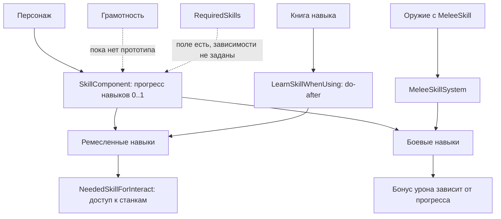

# Навыки персонажа

Навыки отделяют мастера от случайного человека с инструментом. Кузнец нужен кузнице, травник
работает с лекарствами, боец лучше владеет своим оружием. При этом это не MMO-прокачка ради цифры:
новичок может помогать, носить материалы, держать оборону и ошибаться вживую.

В коде уже есть прототипы навыков, прогресс от `0` до `1`, книги обучения и проверки доступа к
отдельным взаимодействиям. Дерева пока нет. Поле `RequiredSkills` существует, но текущие прототипы
его не используют, поэтому все реализованные навыки лежат на одном уровне.

## 1. Текущие навыки

| Ветка | Навык | Статус | Как изучается сейчас | Что открывает / усиливает |
| :--- | :--- | :--- | :--- | :--- |
| Общие | Грамотность | Дизайн, прототип не найден | Не реализовано | Чтение, письмо, книги, документы |
| Ремесло | Обработка дерева | Прототип есть | Книга навыка | Деревообработка и связанные станки |
| Ремесло | Обработка камня | Прототип есть | Книга навыка | Камень, каменные детали и связанные станки |
| Ремесло | Основы кузнечного дела | Прототип есть | Книга навыка | Плавка, ковка, наковальня, металлические изделия |
| Ремесло | Портное дело | Прототип есть | Книга навыка | Ткань, кожа, одежда, мягкое снаряжение |
| Ремесло | Алхимия | Прототип есть | Книга навыка | Алхимический стол и реагенты |
| Ремесло | Ювелирное дело | Прототип есть | Книга навыка | Самоцветы, украшения, дорогие изделия |
| Бой | Одноручный клинок | Прототип есть | Практика в бою | Урон одноручным клинком |
| Бой | Кинжал | Прототип есть | Практика в бою | Урон кинжалом |
| Бой | Булава / дубина | Прототип есть | Практика в бою | Урон дробящим оружием |
| Бой | Кулачный бой | Прототип есть | Практика в бою | Урон без оружия |
| Бой | Плеть | Прототип есть | Практика в бою | Урон плетью |
| Бой | Древковое оружие | Прототип есть | Практика в бою | Урон копьями, алебардами и похожим оружием |

## 2. Как это работает сейчас

Сейчас картина такая:

1. Ремесленные навыки в основном учатся через книги.
2. Боевые навыки учатся через попадания по живым целям.
3. Доступ к некоторым станкам можно закрывать через требуемые навыки.
4. В коде уже есть поле для зависимостей между навыками, но текущие прототипы его не используют.
5. Грамотность описана в GDD, но как отдельный навык в прототипах пока не найдена.

## 3. Целевое древо навыков

Ниже не текущее состояние кода, а рабочая структура для GDD и будущих задач. Она показывает, какие
навыки базовые, где начинается специализация и какие узлы завязаны на несколько систем сразу.

```mermaid
flowchart TB
    Root["Навыки персонажа"]

    Root --> Common["Общие"]
    Root --> Craft["Ремесленные"]
    Root --> Combat["Боевые"]
    Root --> Knowledge["Знание и письмо"]

    Common --> Survival["Базовое выживание"]
    Common --> TradeBasics["Основы торговли"]
    Common --> Labor["Физический труд"]

    Knowledge --> Literacy["Грамотность"]
    Literacy --> Documents["Документы и письма"]
    Literacy --> SkillBooks["Учебники навыков"]
    Literacy --> ForbiddenTexts["Запретные тексты"]

    Craft --> Wood["Обработка дерева"]
    Craft --> Stone["Обработка камня"]
    Craft --> Blacksmith["Основы кузнечного дела"]
    Craft --> Tailor["Портное дело"]
    Craft --> Alchemy["Алхимия"]
    Craft --> Jewelry["Ювелирное дело"]

    Wood --> Carpentry["Плотницкие изделия"]
    Wood --> ConstructionWood["Деревянное строительство"]

    Stone --> Masonry["Каменная кладка"]
    Stone --> ConstructionStone["Каменное строительство"]

    Blacksmith --> Smelting["Плавка"]
    Blacksmith --> Forging["Ковка"]
    Blacksmith --> Locks["Замки и ключи"]

    Tailor --> Cloth["Ткань и одежда"]
    Tailor --> Leather["Кожа и мягкая броня"]

    Alchemy --> Reagents["Реагенты"]
    Alchemy --> MedicineCraft["Лекарства и яды"]

    Jewelry --> Gems["Самоцветы"]
    Jewelry --> Luxury["Украшения и ценности"]

    Combat --> Unarmed["Кулачный бой"]
    Combat --> OneSword["Одноручный клинок"]
    Combat --> Dagger["Кинжал"]
    Combat --> Mace["Булава / дубина"]
    Combat --> Whip["Плеть"]
    Combat --> Polearms["Древковое оружие"]

    OneSword --> GuardStyle["Стража и дуэли"]
    Dagger --> Concealed["Скрытое оружие"]
    Mace --> ArmorBreak["Пробитие брони"]
    Polearms --> Formation["Удержание дистанции"]
```

## 4. Ветки

### 4.1. Общие навыки

Общие навыки не стоит вешать на каждое действие. Они нужны там, где появляется игра между людьми:
прочитать приказ, оценить товар, договориться о работе, объяснить новичку, что делать.

| Навык | Нужен для | Статус |
| :--- | :--- | :--- |
| Грамотность | Чтение, письмо, книги, документы, обучение | Описана в GDD, прототип не найден |
| Основы торговли | Торговые подсказки, оценка цены, работа с долгами | План |
| Базовое выживание | Простые действия с едой, водой, укрытием | План, осторожно |
| Физический труд | Переноска, добыча, грубая работа | План, осторожно |

Первой сюда просится грамотность. Она сразу цепляет языки, книги, законы, экономику и власть.

### 4.2. Ремесленные навыки

Ремесленный навык должен открывать работу и качество результата. Без навыка игрок таскает материалы,
помогает у станка, делает простые вещи. Полностью заменить мастера он не может.

| Навык | Базовая роль | Что должен ограничивать |
| :--- | :--- | :--- |
| Обработка дерева | Плотник, инженер | Пилорама, стол плотника, деревянные детали |
| Обработка камня | Каменщик, строитель | Каменоломня, каменные блоки, кладка |
| Основы кузнечного дела | Кузнец | Плавильня, наковальня, ковка, закалка |
| Портное дело | Портной, корчмарь по быту | Одежда, кожа, ткань, мягкая броня |
| Алхимия | Травник, алхимик | Алхимический стол, сложные реагенты |
| Ювелирное дело | Ювелир, казначей по ценностям | Самоцветы, украшения, дорогие изделия |

### 4.3. Боевые навыки

Боевой навык усиливает конкретный тип оружия. Новичок все еще опасен, особенно толпой или из засады,
но мастер стабильнее попадает в свою роль. Текущая логика уже рядом: прогресс влияет на бонус урона,
обучение идет через практику.

| Навык | Роль в бою | Риск дизайна |
| :--- | :--- | :--- |
| Кулачный бой | Последний шанс без оружия, драки, задержание | Не должен заменять оружие |
| Одноручный клинок | Стража, рыцари, дуэли | Не должен быть универсально лучшим |
| Кинжал | Скрытое оружие, добивание, ближняя угроза | Опасен для баланса скрытых убийств |
| Булава / дубина | Простое силовое оружие, контроль брони | Может стать слишком дешевым решением |
| Плеть | Дистанция, контроль, наказание | Нужна понятная контригра |
| Древковое оружие | Дистанция, строй, удержание проходов | Требует места и правил позиционирования |

## 5. Зависимости

Для MVP зависимости лучше делать мягкими. Жесткий замок быстро убивает игру: нет нужного мастера,
значит половина цеха стоит и ждет.

| Зависимость | Как использовать |
| :--- | :--- |
| Грамотность → учебники | Без грамотности нельзя учиться по книгам, но можно учиться у наставника |
| Обработка дерева → часть строительства | Плотник нужен для деталей, но помощники носят материалы |
| Обработка камня → каменное строительство | Каменщик отвечает за качество стен и блоков |
| Кузнечное дело → замки и оружие | Кузнец делает сложные металлические предметы |
| Алхимия → лекарства и яды | Травник/алхимик нужен для сложных смесей |
| Боевой навык → эффективность оружия | Оружие работает у всех, но мастер заметно лучше |

## 6. Что нужно добавить в задачи программистам

| Задача | Результат |
| :--- | :--- |
| Добавить `MedievalLiteracy` | Грамотность появляется как обычный навык |
| Заполнить `RequiredSkills` там, где зависимость утверждена | Дерево становится частью прототипов, а не только GDD |
| Разделить стартовые навыки по ролям | Кузнец стартует кузнецом, а не человеком без доступа к работе |
| Проверить все станки на `NeededSkillForInteract` | Роли и навыки начинают реально ограничивать рабочие места |
| Связать книги навыков с грамотностью | Учеба по книге требует чтения, но наставник может быть альтернативой |
| Отразить дерево в UI навыков | Игрок видит ветки, прогресс и закрытые зависимости |

## 7. Реализация

- Прототипы навыков: [Resources/Prototypes/_Respiral/Skill/skill.yml](https://github.com/respiral-tree/ss14-respiral/blob/master/Resources/Prototypes/_Respiral/Skill/skill.yml)
- Книги навыков: [Resources/Prototypes/_Respiral/Skill/book.yml](https://github.com/respiral-tree/ss14-respiral/blob/master/Resources/Prototypes/_Respiral/Skill/book.yml)
- Формат прототипа навыка: [Content.Shared/_Respiral/Skill/Prototypes/SkillPrototype.cs](https://github.com/respiral-tree/ss14-respiral/blob/master/Content.Shared/_Respiral/Skill/Prototypes/SkillPrototype.cs)
- Компонент навыков персонажа: [Content.Shared/_Respiral/Skill/Components/SkillComponent.cs](https://github.com/respiral-tree/ss14-respiral/blob/master/Content.Shared/_Respiral/Skill/Components/SkillComponent.cs)
- Серверная система навыков: [Content.Server/_Respiral/Skill/SkillSystem.cs](https://github.com/respiral-tree/ss14-respiral/blob/master/Content.Server/_Respiral/Skill/SkillSystem.cs)
- Клиентская система навыков: [Content.Client/_Respiral/Skill/SkillSystem.cs](https://github.com/respiral-tree/ss14-respiral/blob/master/Content.Client/_Respiral/Skill/SkillSystem.cs)
- Обучение через предметы: [Content.Server/_Respiral/Skill/LearnSkillWhenUsingSystem.cs](https://github.com/respiral-tree/ss14-respiral/blob/master/Content.Server/_Respiral/Skill/LearnSkillWhenUsingSystem.cs)
- Боевые навыки: [Content.Server/_Respiral/Skill/MeleeSkillSystem.cs](https://github.com/respiral-tree/ss14-respiral/blob/master/Content.Server/_Respiral/Skill/MeleeSkillSystem.cs)
- Проверка навыка при взаимодействии: [Content.Server/_Respiral/Skill/NeededSkillForInteractSystem.cs](https://github.com/respiral-tree/ss14-respiral/blob/master/Content.Server/_Respiral/Skill/NeededSkillForInteractSystem.cs)
- Проверка навыка при взаимодействии предметом: [Content.Server/_Respiral/Skill/NeededSkillForInteractUsingSystem.cs](https://github.com/respiral-tree/ss14-respiral/blob/master/Content.Server/_Respiral/Skill/NeededSkillForInteractUsingSystem.cs)

Пока не найдено:

- отдельный прототип грамотности;
- заполненные зависимости `RequiredSkills` у навыков;
- отдельные группы навыков в прототипах;
- стартовая выдача навыков по профессиям;
- графическое дерево навыков в игровом UI.

