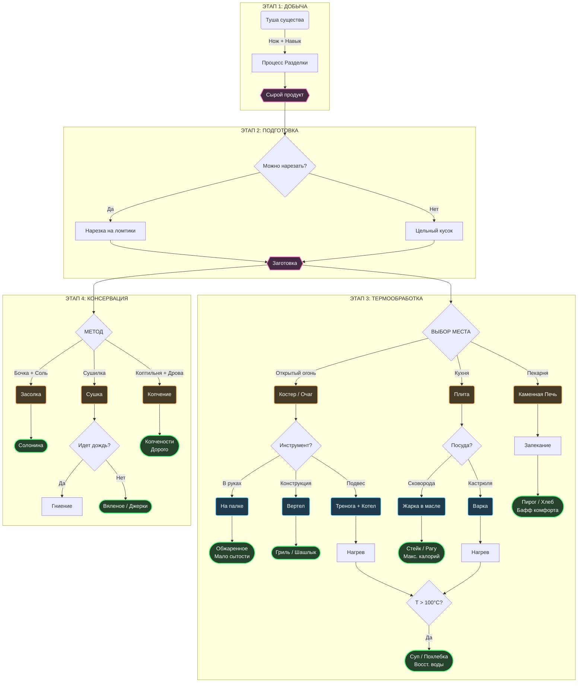

## 1. Концепция
Система полного цикла обработки пищи: от добычи сырья до сервировки. Мы не создаем мгновенно предметы через меню. Упор делается на физическое взаимодействие с объектами.

---

## 2. Игровой цикл

### Этап 1: Разделка
*Получение ресурсов из туш животных.*

1.  Игрок держит **режущий инструмент** в активной руке.
2.  Клик инструментом по туше существа.
3.  Появляется прогресс-бар (зеленый который).
    * Длительность зависит от размера существа.
    * Под тушей появляется пятно крови.
4.  **Результат:**
    * Туша исчезает.
    * Появляются ресурсы (мясо, шкура, кости, органы и т.д).

#### Формула качества разделки
`Качество = Инструмент + Навык игрока + Место разделки`

| Качество | Результат | Пример |
| :--- | :--- | :--- |
| **Высокое** | **Идеальный** | Целая шкура, максимум мяса, редкие органы. |
| **Среднее** | **Норма** | Поврежденная шкура, стандартное количество мяса. |
| **Низкое** | **Плохой** | Шкуры нет, мясо повреждено (обрезки). |
| **Критическое** | **Брак** | Ничего полезного, только кости|

---

### Этап 2: Нарезка
*Измельчение продуктов.*

1.  Проверям имеет ли предмет свойство **нарезки**.
2.  Игрок с ножом кликает по предмету.
3.  Короткий прогресс-бар.
4.  Предмет заменяется на несколько кусков/ломтиков.

---

### Этап 3: Обработка (Приготовление)
*Результат зависит от оборудования и среды.*

#### А. Открытый огонь (Жарка без посуды)
*Требует: Место с огнем (Костер/Очаг) + Инструмент удержания.*

1.  **На палке:** Игрок держит предмет в руках над огнем. Долгий прогресс-бар
2.  **На вертеле:** Игрок закрепляет мясо/рыбу на конструкцию над огнем. Можно отойти пока готовится.

#### Б. Готовка в посуде (жарка и варка)
*Требует: Источник тепла (плита или костер с треногой).*

1.  **Сковорода (Жарка):**
    * Ставится на плиту
    * Позволяет использовать масло/жир (высокая сытость).
    * Можно смешивать ингредиенты.
2.  **Котел/Кастрюля (Варка):**
    * Ставится на плиту **или** подвешивается на **треногу/крюк** над костром.
    * Требует жидкости (вода/бульон).
    * Позволяет варить супы, каши и похлебки.
    * *Температура:* Если температура жидкости > 100°C, ингредиенты начинают готовиться и смешиваться. Иначе нет.

#### В. Выпекание (Печь)
*Требует: Разогретая каменная печь.*

1.  Игрок закладывает топливо и прогревает печь.
2.  Помещает внутрь сырую заготовку (тесто, мясо в горшочке, овощную запеканку).
3.  Процесс идет медленнее, чем жарка, но прогрев равномерный (без подгорания корочки).
4.  Предмет заменяется на *печеное блюдо*.

---

### Этап 4: Консервация (Длительное хранение)

#### Г. Засолка
*Требует: Бочка + Соль.*

1.  Игрок помещает продукты и соль в бочку. Прогресс-бар.
2.  **Обязательно:** плотно закрыть крышку. Открыть можно только отдельным действием.
3.  Процесс идет пассивно и долго.
4.  По завершении таймера содержимое заменяется на *соленое* (солонина, соленья).

#### Д. Сушка
*Требует: Сушилка (стойка с крюками/сетка) + сухое место.*

1.  Игрок вешает/кладет сырой продукт на **сушилку**. Прогресс-бар.
2.  Процесс идет пассивно и очень долго.
    * **Условие среды:** Если на сушилку попадает дождь — процесс останавливается, начинается гниение.
3.  По завершении таймера предмет заменяется на *вяленый/сушеный*.

#### Е. Копчение
*Требует: Коптильня + топливо.*

1.  Игрок помещает продукты и топливо внутрь коптильни.
2.  Игрок поджигает топливо и закрывает дверцу.
3.  Топливо медленно тлеет, создавая дым. Если топливо закончится раньше времени — процесс встанет на паузу.
4.  Предмет заменяется на *копченый* (самый дорогой и питательный вариант).

---

## 3. Расширенный Аудио-дизайн (SFX)
*Звук является основным индикатором прогресса, так как игроки часто переключают внимание на другие окна.*

### А. Динамика звуков приготовления (Варка/Жарка)
Звук меняется в зависимости от температуры и стадии готовности.
Loop - постоянный, Once - разовый.

| Процесс | Стадия / Триггер | Тип звука | Описание (Референс) |
| :--- | :--- | :--- | :--- |
| **Варка** | **Нагрев** (<100°C) | Loop (Тихий) | Редкое, глухое побулькивание воды. |
| **Варка** | **Кипение** (>100°C) | Loop (Громкий) | Активное, бурлящее кипение. Звук пузырей. |
| **Варка** | **Выкипание** (Воды нет) | Loop (Тревожный) | Шипение пустой горячей посуды, звук пригорающей органики. |
| **Жарка** | **Старт** (Положили еду) | Once | Громкий "Пшшш!", резкий выброс пара при контакте. |
| **Жарка** | **Процесс** (Сырое) | Loop | Равномерное, влажное шкворчание масла. |
| **Жарка** | **Корочка** (Готово) | Loop (Измененный) | Звук становится более "сухим" и трескучим (меньше влаги). |
| **Жарка** | **Подгорание** (Передержка) | Loop | Что-то типо больше треска огня. Не знаю. |
| **Жарка** | **Сгорание** (Передержка) | Once | Дефолт звук сгорания или че там в сске, я не помню. |

### Б. Обработка и взаимодействие
Звуки физического взаимодействия

| Действие | Объект | Описание звука |
| :--- | :--- | :--- |
| **Разделка** | Животные | да |
| **Разделка** | Монстры | да |
| **Нарезка** | Продукты | Глухой "Тюк-тюк". |
| **Засолка** | Бочка | Звук пересыпания чего-нибудь (шуршание соли). |
| **Крышка** | Бочка/Кастрюля | Тяжелый стук дерева о дерево. |
| **Сушилка** | Вешаем мясо | да |

---

## 4. Визуальные эффекты и Анимации

### 4. Анимации процессов
Не анимируем сам предмет, а накладываем поверх него эффект.

| Объект | Состояние | Визуализация (Для художника) | Примечание |
| :--- | :--- | :--- | :--- |
| **Кастрюля** | Нагрев | — | Статичный спрайт. |
| **Кастрюля** | Кипение | **Оверлей:** Анимированные белые пузыри на поверхности жидкости.  **Частицы:** Редкие облачка пара, летящие вверх (fade out). | Важно, чтобы пузыри не выходили за границы спрайта кастрюли. |
| **Сковорода** | Жарка | **Частицы:** Мелкие желтые/белые пиксели (брызги масла), разлетающиеся в стороны. | Эффект "Popcorn", но мелко. |
| **Сковорода** | Сгорание | **Частицы:** Густой черный дым (медленный подъем). | Сигнал игроку о проблеме. |
| **Коптильня** | Работает | **Анимация:** Из щелей конструкции идет тонкая струйка серого дыма. | Дым должен быть не густым, "ленивым". |
| **Туша** | Разделка | **Декаль (Decal):** При каждом успешном цикле разделки под тушей расширяется спрайт лужи крови (Blood Floor). | |
| **Бочка** | Процесс засолки | **Стейт:** Крышка закрыта.  **Индикатор:** Если навести курсор — всплывающая иконка "песочных часов" или соли. | Внешне бочка статична, чтобы не нагружать движок. |

---

## 5. Таблицы Оборудования и Инструментов

### Таблица 1: Кухонная утварь 

| Предмет | Слот | Источник тепла | Назначение |
| :--- | :--- | :--- | :--- |
| **Чугунная сковорода** | Плита | Плита | **Жарка.** Требует масло/жир.|
| **Глиняный горшок** | Печь | Печь | **Тушение.** Герметичен. Идеален для овощных рагу. Медленно нагревается, но долго держит тепло. |
| **Котел** | Плита, тренога | Плита, остер | **Варка.** Вмещает много жидкости. Используется для массового производства супов. Можно мыть в реке. |
| **Вертел** | Костер | Костер | **Запекание.** Еда нанизывается. Нужно закрепить над огнем. |

### Таблица 2: Стационарные станции

| Станция | Топливо / Ресурс | Вместимость | Особенности и Эффекты |
| :--- | :--- | :--- | :--- |
| **Очаг / Костер** | Дрова, Уголь | 1 Тренога / 1 Решетка | Базовый источник тепла. Дает свет.  **Риск:** Может поджечь игрока, если подойти вплотную. Дым в помещении без вытяжки вызывает кашель. |
| **Каменная печь** | Дрова (много) | 4 предмета (Противни/Горшки) | Требует предварительного прогрева. Имеет инерцию тепла (остывает 10 минут). Идеально для хлеба и пирогов. |
| **Кухонная плита** | Уголь / Магия (?) | 2 предмета (Кастрюли/Сковороды) | Регулируемый нагрев (Слабый/Сильный). Безопасна (не поджигает игрока). Нет дыма. |
| **Коптильня** | Опилки, Щепа | 10 предметов (Крюки) | Самый долгий процесс (игровые сутки). Консервирует еду надолго. Дым остается внутри конструкции. |
| **Бочка для засолки**| Соль (Ресурс) | 20 единиц еды (Стак) | Не требует тепла. Работает только при закрытой крышке. Еда внутри не гниет, пока есть соль. |
| **Сушильная стойка** | Ветер (Пассивно) | 5 предметов (Крюки) | Зависит от погоды. В подземельях работает хуже (нет ветра). Рядом с огнем работает быстрее. |
| **Разделочный стол**| — | 1 Туша / 1 Предмет | Дает бонус к качеству разделки (+20%). Предотвращает разлив крови на пол (гигиена). |

### Таблица 3: Инструменты обработки (Tools)
*Чем игрок воздействует на предметы.*

| Инструмент | Функция | Описание |
| :--- | :--- | :--- |
| **Тесак (Cleaver)** | Разделка (Butchering) | Высокий шанс получить все ресурсы. Бонус к скорости разделки больших туш. |
| **Нож (Knife)** | Нарезка / Разделка | Универсален. Нарезка хлеба, сыра, овощей. Штраф к скорости при разделке больших туш. |
| **Ступка и пестик** | Измельчение | Превращает травы/зерно в порошок/муку. |
| **Скалка** | Раскатка | Превращает ком теста в основу для пиццы/пирога. |

# Библиотека ингредиентов (Данные)
## 1. Домашний скот
*Доступны в поселениях. Высокий выход ресурсов, мирные.*

| Животное | Тип мяса | Запчасти (Лут) | Кулинарные особенности |
| :--- | :--- | :--- | :--- |
| **Корова** | Говядина | Шкура, Жир, Кости, Молоко | Лучшее мясо для Стейков (**Жарка**). Жир перерабатывается в свечи/смазку. |
| **Свинья** | Свинина | Сало, Кишки, Шкура | Идеально для **Засолки** (Бекон/Ветчина). Кишки обязательны для крафта колбас. |
| **Овца** | Баранина | Шерсть, Рога, Курдючный жир | Специфический вкус. Лучше всего раскрывается в Рагу (**Варка**), жареная дает мало сытости. |
| **Коза** | Козлятина | Рога, Молоко, Жесткая шкура | Жесткое мясо. Требует долгой варки, иначе штраф к настроению. |
| **Курица** | Птица | Перья, Яйца | Базовый ресурс. Готовится очень быстро. |
| **Гусь** | Жирная птица | Пух, Гусиный жир | Деликатес. Жир используется в медицине (мази от ожогов). |
| **Кролик** | Крольчатина | Заячья лапка, Шкурка | Мало калорий. Жареный почти не дает сытости, нужно тушить с овощами. |

## 2. Дичь
*Требует охоты. Ценные трофеи.*

| Животное | Тип мяса | Запчасти | Кулинарные особенности |
| :--- | :--- | :--- | :--- |
| **Благородный олень** | Благородное мясо | Рога (огромные), Шкура | Королевская еда. Высокая стоимость при продаже NPC. |
| **Вепрь** | Вепрятина | Клыки, Жесткая щетина | Очень сытное мясо, но долго готовится. |
| **Медведь** | Медвежатина | Мех, Желчь, Жир | Мясо нужно **очень** долго варить (риск паразитов). Желчь — ингредиент алхимии. |
| **Волк** | Волчатина | Волчья шкура, Клыки | Жесткое, жилистое мясо. Только на вяление или в суп с кучей специй (иначе рвота). |
| **Лиса** | Лисье мясо | Рыжий мех (Ценный) | Невкусное. Если съесть жареным — тошнота. Нужно сильно солить. |
| **Утка (Дикая)** | Утятина | Перья | Жестче курицы, но сытнее. |
| **Косуля** | Оленина | — | Стандартное мясо, аналог говядины, но быстрее готовится. |

## 3. Рыба и прочее
*Рыба и т.п*

| Существо | Мясо | Особенности кулинарии |
| :--- | :--- | :--- |
| **Речная рыба (Окунь)** | Сырая рыба | Портится быстро. Нужно сразу пускать в обработку или солить на месте. |
| **Угорь** | Мясо угря | Очень жирное. Идеально для копчения |
| **Щука** | Филе щуки | Костлявое. |
| **Болотная жаба** | Лягушачьи лапки | Деликатес, но очень мало сытости |
| **Крыса (Гигантская)** | Тушка крысы | Еда отчаяния. |
| **Ворона** | Мясо ворона | Горькое мясо. |
| **Летучая мышь** | Крылья мыши | Почти нет мяса. Используется для супов "сомнительного содержания". |
| **Змея (Гадюка)** | Змеиное филе | Деликатес, если правильно удалить яд. Иначе отравление. |
