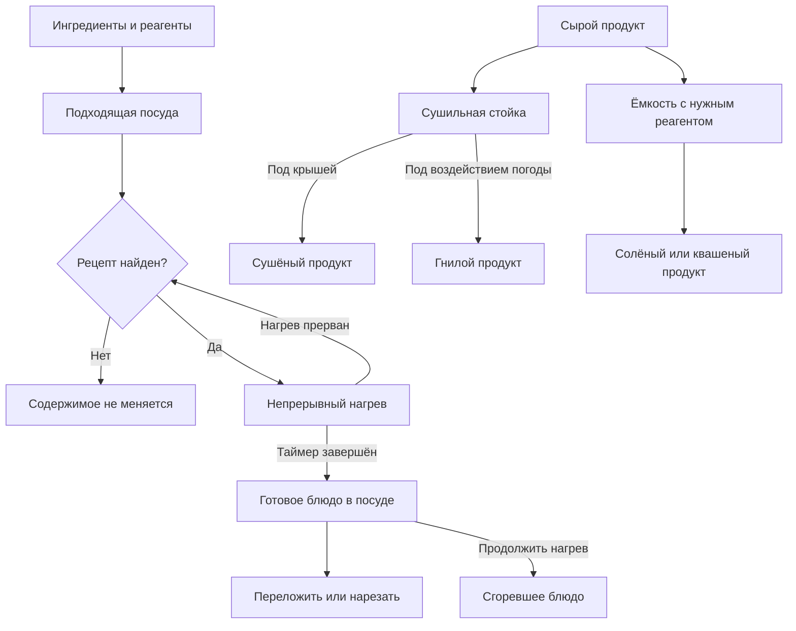

# Готовка

Готовка строится вокруг физических ингредиентов, посуды и источника тепла. Игрок складывает
продукты в подходящую посуду, добавляет жидкие ингредиенты, нагревает её и получает блюдо внутри
той же ёмкости. Готовую еду можно переложить в тарелку или миску, нарезать либо испортить, если
продолжить нагрев.

Код из PR #52 задаёт основу этой системы, но пока не добавляет готовый набор посуды, станций,
рецептов и блюд. Ниже сначала описано требуемое поведение в игре, затем состояние реализации.

## 1. Место в раунде

Кухня принимает продукты от фермеров, лесничего, торговца и других добывающих ролей. Корчмарь
превращает их в порционные блюда, которые можно продать, выдать работникам или оставить в запасе.

Готовка должна создавать следующие задачи:

- поиск недостающего продукта или замены;
- выбор посуды и способа обработки;
- контроль непрерывного нагрева;
- раскладывание блюда по порциям;
- заготовка сушёных и солёных продуктов на случай перебоев со снабжением.

Система не выдаёт блюдо через меню и не создаёт ингредиенты из ничего. Все предметы и реагенты
должны физически находиться в посуде.

## 2. Приготовление блюда

### 2.1. Порядок действий

1. Игрок выбирает посуду, подходящую для нужного рецепта.
2. Складывает в неё предметы-ингредиенты.
3. При необходимости наливает воду, масло или другой реагент.
4. Ставит посуду на источник тепла.
5. Если содержимое соответствует рецепту, приготовление начинается автоматически.
6. Посуду нужно продолжать нагревать до завершения таймера рецепта.
7. Готовое блюдо остаётся в посуде.
8. Игрок снимает посуду с огня и перекладывает еду в совместимую тарелку или миску.

При прекращении нагрева текущий процесс отменяется. После возвращения на огонь таймер начинается
заново. Частично приготовленного состояния в PR нет.

### 2.2. Выбор рецепта

Рецепт проверяет посуду, предметы внутри неё и реагенты в растворе.

| Условие | Что проверяется |
| :--- | :--- |
| Тип посуды | Все требуемые рецептом теги должны поддерживаться посудой |
| Количество ингредиентов | Минимальное и максимальное число предметов |
| Разрешённый ингредиент | Наличие хотя бы одного предмета из заданного списка |
| Запрещённый ингредиент | В готовом варианте рецепт должен отклоняться при наличии запрещённого предмета |
| Реагент | Наличие одного из заданных реагентов в нужном количестве |

Если подходит несколько рецептов, сначала проверяется рецепт с большей вычисленной сложностью.
Это позволяет поставить точное блюдо выше общего рецепта вроде похлёбки из любых овощей.

Подходящего рецепта может не быть. В таком случае содержимое не готовится. Для игрока нужна
понятная обратная связь через осмотр посуды, всплывающее сообщение или внешний вид. В PR такой
обратной связи пока нет.

### 2.3. Результат

Рецепт задаёт:

| Данные | Использование |
| :--- | :--- |
| Название и описание | Появляются у готового блюда или посуды |
| Визуальные слои | Показывают содержимое с учётом заполнения ёмкости |
| Пищевая ценность | Добавляется в раствор готового блюда |
| Вкус | Наследуется от ингредиентов и дополняется рецептом |
| Остатки | Кости, огрызки и другой мусор после еды |
| Результат нарезки | Определяет, какие порции появятся после работы ножом |
| Время приготовления | Длительность непрерывного нагрева |

Реагенты из ингредиентов переходят в раствор посуды. Сами предметы после завершения рецепта
удаляются. За счёт этого суп сохраняет воду и питательные вещества продуктов, а пустые оболочки
ингредиентов не остаются внутри котла.

## 3. Посуда и источники тепла

В PR жарка, варка и выпекание используют один механизм. Разница задаётся тегами посуды,
рецептами, временем и визуальным оформлением, а не отдельными системами.

| Объект | Требуемая роль в системе |
| :--- | :--- |
| Котёл или кастрюля | Жидкие блюда, каши и похлёбки |
| Сковорода | Небольшие блюда без большого объёма жидкости |
| Горшок | Блюда для печи и длительного приготовления |
| Каменная печь | Источник тепла для выпечки и горшков |
| Плита или очаг | Источник тепла для котла и сковороды |
| Тарелка и миска | Принимают готовую еду совместимого типа |

Конкретных прототипов этих предметов в PR нет. Их вместимость, теги, растворы, контейнеры и
источники нагрева нужно настроить отдельно.

### 3.1. Нагрев

Приготовление запускается от положительного изменения температуры посуды. Код не требует
достижения 100 °C и не различает температуру кипения, жарки и выпекания.

Источник должен обновлять нагрев не реже интервала, заданного посуде. Значение по умолчанию
составляет 2 секунды. Если новые события нагрева перестают поступать, приготовление и подгорание
отменяются.

Это значит, что температура пока работает как сигнал «посуду продолжают греть», а не как
полноценный режим приготовления.

### 3.2. Подгорание

После приготовления дальнейший непрерывный нагрев запускает отдельный таймер подгорания.
В текущем коде он длится 20 секунд.

После подгорания:

- название и описание меняются на сгоревшее блюдо;
- визуальные слои затемняются;
- часть содержимого удаляется и заменяется пеплом;
- с вероятностью 20 процентов рядом появляется дополнительный пепел.

Стадии «сырой», «почти готово» и «корочка» отдельно не хранятся. Есть только приготовление,
готовое блюдо и сгоревшее блюдо.

## 4. Подача и порции

Готовое блюдо хранится в объекте с компонентом держателя еды. Котёл, миска и тарелка могут быть
такими держателями одновременно с обычным раствором SS14.

Для перекладывания игрок взаимодействует одной ёмкостью с другой. Передача происходит, если:

1. Исходная ёмкость разрешает отдавать еду.
2. Целевая ёмкость разрешает принимать еду.
3. У ёмкостей есть хотя бы один общий тег еды.
4. Целевая ёмкость пуста.
5. В ней достаточно места для раствора.

Вместе с раствором передаются название, описание, вкус, визуальные слои, остатки и настройка
нарезки. После опустошения исходная посуда снова становится свободной.

Одна операция должна либо перенести всю предусмотренную порцию, либо оставить остаток корректным
блюдом. Частичный перенос в меньшую ёмкость нужно отдельно проверить: текущий код может очистить
данные блюда у источника, даже если весь раствор не поместился.

### 4.1. Нарезка

PR не добавляет новую механику ножа. Рецепт может записать в готовое блюдо результат нарезки, а
сервер передаёт его существующему компоненту обработки инструментом. Поэтому хлеб, пирог или
запечённое мясо смогут выдавать разные порции после настройки прототипов.

## 5. Сушка

Сушильная стойка содержит несколько предметов с признаком возможности сушки. Для каждого предмета
задаются длительность и прототип результата.

1. Игрок помещает продукт на стойку.
2. Под крышей прогресс сушки растёт.
3. Снятие продукта сбрасывает весь прогресс.
4. После завершения исходный предмет заменяется сушёным прямо в стойке.

Если стойка доступна погоде, сушка прекращается и начинается гниение. Прогресс сушки сбрасывается.
После завершения гниения предмет превращается в результат обычного компонента порчи либо удаляется.

Поля компонента предусматривают четыре места на стойке и проверку погоды раз в 5 секунд, однако
ограничение вместимости в системе пока не применяется. Способ положить предмет на стойку также
нужно обеспечить прототипом или отдельным взаимодействием.

## 6. Засолка и квашение

Засаливаемый продукт имеет собственные настройки: требуемый реагент, его количество, время и
прототип результата.

1. Игрок наливает рассол или другой нужный реагент в подходящую ёмкость.
2. Помещает внутрь продукт.
3. Пока реагента достаточно, прогресс растёт, а реагент постепенно расходуется.
4. При нехватке реагента или извлечении продукта прогресс полностью сбрасывается.
5. Готовый продукт появляется в той же ёмкости.

Значения по умолчанию: 30 секунд обработки и расход 0,1 единицы реагента в секунду. Реальные
значения должны задаваться отдельно для каждого продукта.

Код не проверяет тип ёмкости и закрытие крышки. Без дополнительной настройки продукт можно будет
засаливать в любом контейнере с подходящим раствором.

## 7. Схема

```mermaid
flowchart TD
    A[Ингредиенты и реагенты] --> B[Подходящая посуда]
    B --> C{Рецепт найден?}
    C -->|Нет| D[Содержимое не меняется]
    C -->|Да| E[Непрерывный нагрев]
    E -->|Нагрев прерван| C
    E -->|Таймер завершён| F[Готовое блюдо в посуде]
    F --> G[Переложить или нарезать]
    F -->|Продолжить нагрев| H[Сгоревшее блюдо]

    I[Сырой продукт] --> J[Сушильная стойка]
    J -->|Под крышей| K[Сушёный продукт]
    J -->|Под воздействием погоды| L[Гнилой продукт]

    I --> M[Ёмкость с нужным реагентом]
    M --> N[Солёный или квашеный продукт]
```

## 8. Что нужно для первой игровой версии

Код PR сам по себе не создаёт доступного игрового процесса. Для первого плейтеста нужны:

| Контент | Минимальный результат |
| :--- | :--- |
| Посуда | Хотя бы котёл, сковорода, миска и тарелка с контейнерами и растворами |
| Источники тепла | Один кухонный и один походный источник, которые стабильно нагревают посуду |
| Теги | Разделение рецептов и совместимой посуды |
| Рецепты | Простое жареное блюдо, жидкое блюдо, выпечка и один общий резервный рецепт |
| Ингредиенты | Продукты с тегами, реагентами, вкусами и пищевой ценностью |
| Сушка | Стойка и хотя бы один сырой продукт с сушёным результатом |
| Засолка | Ёмкость с раствором и хотя бы один продукт с солёным результатом |
| Визуал | Слои еды, маски заполнения, состояния приготовления и подгорания |
| Звук | Начало нагрева, приготовление, завершение и подгорание |
| Локализация | Названия блюд, описания, осмотр и сообщения об ошибках |
| Карта | Рабочая кухня с местом для посуды, хранения, подачи и консервации |

Рецепты нужно проверять от более точных к общим. Иначе универсальная похлёбка будет перехватывать
ингредиенты сложного блюда.

## 9. Проверки на плейтесте

| Ситуация | Ожидаемый результат |
| :--- | :--- |
| Подходящие ингредиенты нагреваются | Таймер завершается, предметы расходуются, блюдо остаётся в посуде |
| Нагрев прекращён до готовности | Приготовление останавливается и не завершается само |
| Рецепт не найден | Ингредиенты сохраняются, игрок понимает причину |
| Готовое блюдо продолжают греть | Через заданное время оно сгорает |
| Блюдо переливают в тарелку | Данные и допустимый объём переходят без потери остатка |
| Тарелка уже занята | Перекладывание отменяется |
| Продукт снят с сушилки | Прогресс сушки сбрасывается |
| Открытая стойка попала под погоду | Продукт начинает гнить вместо сушки |
| Для засолки не хватает реагента | Процесс не начинается или сбрасывается |
| Продукт вынут из рассола | Прогресс засолки сбрасывается |
| Два рецепта подходят одновременно | Выбирается более точный рецепт |

## 10. Зависимости

| Система SS14 | Использование |
| :--- | :--- |
| Контейнеры | Хранение предметов в посуде и на сушильной стойке |
| Растворы и реагенты | Жидкие ингредиенты, питание, рассол и перенос блюда |
| Температура | Запуск и поддержание приготовления |
| Отложенные действия | Таймер приготовления и подгорания |
| Еда и вкусы | Пищевая ценность, вкусовой профиль и остатки |
| Теги и списки сущностей | Подбор посуды и ингредиентов к рецепту |
| Обработка инструментом | Нарезка готового блюда |
| Погода, крыши и карта | Сушка либо гниение на открытом месте |
| Внешний вид | Слои блюда, заполнение посуды, приготовление и подгорание |
| Локализация | Названия, описания, осмотр и сообщения игроку |

Навыки персонажа, качество инструмента и рабочее место в расчёте результата не участвуют.

## 11. Отличия от предыдущей версии

Предыдущая страница сохранена в [архиве](../archive/cooking_before_pr52.md).

| Ранее в GDD | Состояние в PR #52 |
| :--- | :--- |
| Качество разделки зависит от ножа, навыка и стола | Разделки туш и качества нет |
| Нож разрезает любые подготовленные продукты | Есть только передача результата рецепта существующей обработке инструментом |
| Отдельные системы жарки, варки и выпекания | Используется одна система нагрева; методы разделяются рецептами и тегами |
| Для варки нужно больше 100 °C | Порог температуры не проверяется |
| Палка, вертел и тренога над костром | Отдельных механик нет |
| Печь требует топлива и предварительного прогрева | Отдельной логики печи нет |
| Масло обязательно для сковороды | Может быть условием рецепта, но готового рецепта нет |
| Бочка работает только с закрытой крышкой | Крышка не проверяется |
| Дождь останавливает сушку и запускает гниение | Реализовано через доступность стойки погоде; прогресс сразу переключается на гниение |
| Рядом с огнём сушилка работает быстрее | Ускорения от огня нет |
| Коптильня расходует топливо | Копчения нет |
| Звуки меняются по температуре и стадии | Аудиосистема и звуковой контент не добавлены |
| Анимации кипения, жира, дыма и крышки | Есть только флаги приготовления и подгорания, а также слои готовой еды |
| Подробные параметры всей кухонной утвари | Прототипов утвари нет |
| Большая библиотека животных и видов мяса | Контента животных, мяса и блюд нет |
| Разделочный стол повышает качество | Разделочного стола и качества нет |
| Засолка, сушка и копчение образуют три ветки консервации | Реализуются только сушка и засолка |
| Подача блюда почти не описана | Добавлена отдельная модель переноса еды между посудой |
| Блюдо имеет фиксированный результат | Результат хранит визуал, вкус, питание, остатки и нарезку |

## 12. Неопределённости и проблемы PR

Перед переносом механики в основной код нужно решить:

1. Как игрок кладёт ингредиенты в каждую посуду и видит её содержимое.
2. Как сообщается, что рецепт не найден.
3. Нужны ли реальные температурные пороги для разных методов.
4. Должен ли прогресс полностью сбрасываться при кратком прекращении нагрева.
5. Как делить блюдо на несколько порций без потери данных у остатка.
6. Как ограничивается вместимость сушильной стойки.
7. Должна ли засолка требовать закрытой бочки.
8. Как отличить дождь от самого факта нахождения под открытым небом.
9. Какие рецепты и предметы войдут в первый плейтест.
10. Как готовка связывается с навыками и профессией корчмаря.

В коде также требуют проверки поля и условия рецептов:

- `IngredientTags` объявлено, но не участвует в поиске рецепта;
- `AllowOther` у разрешённых ингредиентов не меняет результат проверки;
- условие запрещённых ингредиентов сейчас выглядит как положительная проверка и может выбирать
  рецепт именно при наличии запрещённого предмета;
- `MaxItems` сушильной стойки не ограничивает контейнер;
- частичный перенос в маленькую посуду может очистить данные блюда у источника.

PR находится в черновике. Проверки сборки и тестов для него пропущены, поэтому документ описывает
заложенное поведение, а не подтверждённую готовую функцию.

## Реализация

- PR: [Future: Готовка #52](https://github.com/respiral-tree/ss14-respiral/pull/52)
- Данные результата блюда: [FoodData.cs](https://github.com/respiral-tree/ss14-respiral/blob/a327216ac261c5eabc72412f635446560e6b6f51/Content.Shared/_Respiral/Cooking/FoodData.cs)
- Прототип рецепта и его условия: [CookingRecipePrototype.cs](https://github.com/respiral-tree/ss14-respiral/blob/a327216ac261c5eabc72412f635446560e6b6f51/Content.Shared/_Respiral/Cooking/Prototypes/CookingRecipePrototype.cs)
- Поиск рецепта и создание блюда: [SharedCookingSystem.cs](https://github.com/respiral-tree/ss14-respiral/blob/a327216ac261c5eabc72412f635446560e6b6f51/Content.Shared/_Respiral/Cooking/Systems/SharedCookingSystem.cs)
- Нагрев, приготовление и подгорание: [SharedCookingSystem.DoAfter.cs](https://github.com/respiral-tree/ss14-respiral/blob/a327216ac261c5eabc72412f635446560e6b6f51/Content.Shared/_Respiral/Cooking/Systems/SharedCookingSystem.DoAfter.cs)
- Перекладывание еды между ёмкостями: [SharedCookingSystem.Transfer.cs](https://github.com/respiral-tree/ss14-respiral/blob/a327216ac261c5eabc72412f635446560e6b6f51/Content.Shared/_Respiral/Cooking/Systems/SharedCookingSystem.Transfer.cs)
- Посуда для приготовления: [FoodCookerComponent.cs](https://github.com/respiral-tree/ss14-respiral/blob/a327216ac261c5eabc72412f635446560e6b6f51/Content.Shared/_Respiral/Cooking/Components/FoodCookerComponent.cs)
- Посуда для хранения и подачи: [FoodHolderComponent.cs](https://github.com/respiral-tree/ss14-respiral/blob/a327216ac261c5eabc72412f635446560e6b6f51/Content.Shared/_Respiral/Cooking/Components/FoodHolderComponent.cs)
- Сушка и гниение: [DryingSystem.cs](https://github.com/respiral-tree/ss14-respiral/blob/a327216ac261c5eabc72412f635446560e6b6f51/Content.Shared/_Respiral/Cooking/Systems/DryingSystem.cs)
- Засолка и расход реагента: [PicklingSystem.cs](https://github.com/respiral-tree/ss14-respiral/blob/a327216ac261c5eabc72412f635446560e6b6f51/Content.Shared/_Respiral/Cooking/Systems/PicklingSystem.cs)
- Клиентские слои еды: [CookingSystem.cs](https://github.com/respiral-tree/ss14-respiral/blob/a327216ac261c5eabc72412f635446560e6b6f51/Content.Client/_Respiral/Cooking/CookingSystem.cs)
- Серверная настройка нарезки: [CookingSystem.cs](https://github.com/respiral-tree/ss14-respiral/blob/a327216ac261c5eabc72412f635446560e6b6f51/Content.Server/_Respiral/Cooking/CookingSystem.cs)
