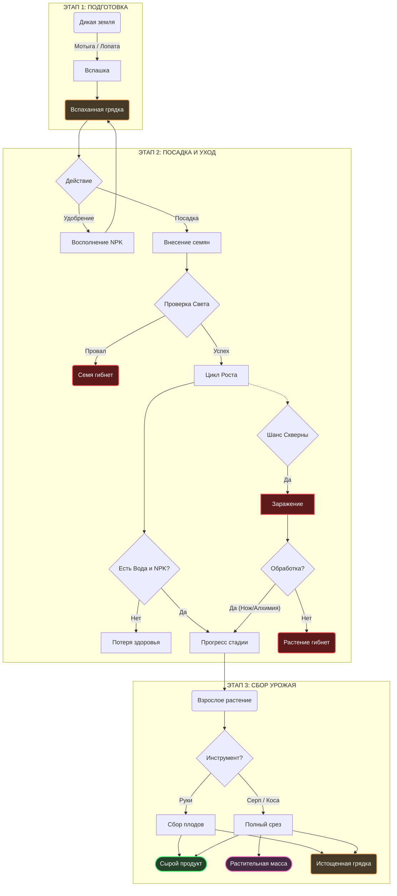

## 1. Концепция
Система полного цикла земледелия, основанная на физическом взаимодействии с окружением и менеджменте ресурсов почвы (система NPK — Азот, Фосфор, Калий). Растения делятся на выращиваемые (требуют грядок и истощают почву) и дикорастущие (собираются в мире). Упор делается на планирование севооборота и защиту урожая от негативных факторов сеттинга темного фэнтези.

---

## 2. Игровой цикл

### Этап 1: Подготовка почвы
*Создание пригодной среды для посева.*

1.  Игрок держит **земледельческий инструмент** (мотыга/лопата) в активной руке.
2.  Клик инструментом по подходящему тайлу земли (грунт, грязь).
3.  Появляется короткий прогресс-бар.
4.  **Результат:**
    * Тайл превращается во вспаханную грядку (Farmable Soil).
    * Грядка получает базовый запас минералов (N, P, K) и уровень влажности 0.

### Этап 2: Посадка и Удобрение
*Внесение семян и корректировка химического состава почвы.*

1.  **Удобрение (Опционально):** Игрок применяет реагент (зола, костная мука, селитра) на грядку. Почва поглощает минералы.
2.  **Посадка:** Игрок кликает семенами по вспаханной грядке.
3.  **Проверка условий:** Если уровень освещения не соответствует требованиям семени (например, злакам нужен свет, а могильному мху — тьма), семя не прорастает или получает дебафф к скорости роста.

### Этап 3: Рост и Уход (Терраформирование)
*Процесс выживания растения.*

1.  **Потребление (Тик роста):** На каждом этапе роста растение забирает из почвы нужное количество влаги и специфичных минералов (N, P, K).
2.  **Дефицит:** Если нужного минерала или воды нет, растение теряет здоровье.
3.  **Угрозы (Скверна/Вредители):** С определенным шансом на грядке может появиться визуальный эффект "Гнили". Требует ручной обработки (срезание больных листьев ножом или обработка алхимическим раствором). Без лечения гниль уничтожает урожай и перекидывается на соседние тайлы.

### Этап 4: Сбор урожая
*Получение конечного продукта.*

1.  Растение достигает финальной стадии (Mature).
2.  Игрок использует пустые руки или **серп/косу**.
3.  **Результат:**
    * Растение исчезает (или возвращается на стадию плодоношения, если это куст/дерево).
    * Появляются продукты (овощи, злаки, травы).
    * Грядка остается вспаханной, но с измененным (истощенным) пулом минералов.

#### Формула качества урожая
`Урожайность = Базовое значение + (Здоровье растения * Коэффициент почвы)`

| Состояние грядки | Результат | Пример |
| :--- | :--- | :--- |
| **Идеальное (Все NPK в норме, полито)** | **Богатый урожай** | Максимум плодов, шанс дропа дополнительных семян, шанс мутации. |
| **Норма (Небольшой дефицит)** | **Норма** | Стандартное количество плодов, 1 семя. |
| **Истощение (Нет NPK или воды)** | **Бедный урожай** | 1 плод, низкого качества, без семян. |
| **Больное (Скверна/Гниль)** | **Брак** | Гнилая биомасса, мертвые корни. |

---

---

## 3. Расширенный Аудио-дизайн (SFX)

### А. Динамика звуков земледелия
| Процесс | Стадия / Триггер | Тип звука | Описание (Референс) |
| :--- | :--- | :--- | :--- |
| **Вспашка** | **Удар мотыгой** | Once | Глухой звук удара металла о плотную землю, хруст корней. |
| **Посадка** | **Семя в грунт** | Once | Легкое шуршание рассыпаемой земли или песка. |
| **Полив** | **Процесс** | Loop | Журчание льющейся воды, звук впитывания влаги (всасывающий звук). |
| **Удобрение**| **Рассыпание** | Once | Сухой, сыпучий звук (как пересыпание гравия или песка). |
| **Удобрение**| **Кровь/Органика** | Once | Влажный, чавкающий звук шлепка. |
| **Скверна** | **Появление** | Once | Тихий, зловещий шепот или звук лопающегося пузыря слизи. |
| **Скверна** | **Заражение соседей**| Once (Тревожный) | Треск сухих веток, шипение кислоты. |
| **Сбор** | **Руками (овощи)** | Once | Звук выдергивания корня из земли (плотный хруст). |
| **Сбор** | **Серпом (злаки)** | Once | Резкий, свистящий звук рассекания воздуха и шелест падающих стеблей. |

---

## 4. Визуальные эффекты и Анимации

| Объект | Состояние | Визуализация | Примечание |
| :--- | :--- | :--- | :--- |
| **Грядка** | Сухая | Светло-коричневый/Серый спрайт грунта. | |
| **Грядка** | Политая | Темно-коричневый, блестящий спрайт (эффект влажности). | Постепенно светлеет по мере высыхания. |
| **Растение** | Мутация | Легкое неестественное свечение (например, красное или фиолетовое) вокруг стебля. | Указывает на алхимические свойства. |
| **Растение** | Скверна | **Оверлей:** Черная гниль, пульсирующие фиолетовые споры или паутина. | |
| **Удобрение**| Применение | Партиклы соответствующего цвета (Белые - костная мука, Серые - зола, Зеленые - селитра). | |

---

## 5. Таблицы оборудования и инструментов

### Таблица 1: Инструменты фермера

| Инструмент | Функция | Описание |
| :--- | :--- | :--- |
| **Мотыга** | Вспашка | Превращает тайл грунта в грядку. |
| **Лопата** | Копка / Перенос | Позволяет выкопать растение целиком (для пересадки) или уничтожить грядку. |
| **Лейка** | Полив | Вмещает жидкость (воду, кровь, алхимию). Обеспечивает точечный полив тайла. |
| **Серп** | Сбор (Злаки/Травы) | Увеличивает радиус сбора урожая (AOE). Повышает шанс выпадения семян и растительной массы. |
| **Садовый нож** | Лечение / Сбор | Позволяет точечно срезать пораженные скверной участки без уничтожения растения. |

### Таблица 2: Станции и Оборудование

| Станция | Входной ресурс | Выходной продукт | Особенности |
| :--- | :--- | :--- | :--- |
| **Компостная яма** | Растительная масса, Гниль, Органика | Гуано / Компост | Медленная пассивная переработка. Генерирует тепло и запах. Восполняет **Азот (N)**. |
| **Ступка алхимика**| Кости, Рога | Костная мука | Ручное измельчение. Восполняет **Фосфор (P)**. |
| **Печь / Очаг** | Дрова, Уголь | Древесная зола | Побочный продукт кулинарии/отопления. Восполняет **Калий (K)**. |
| **Экстрактор семян**| Плоды, Овощи | Семена | Позволяет получить семена из урожая для продолжения цикла. |

---

# Библиотека растений

## 1. Огородные культуры (Севооборот)
*Выращиваются на грядках. Подчиняются механике NPK. Требуют света (кроме специфических).*

| Категория | Растения | Потребление (N / P / K) | Кулинарные/Игровые особенности |
| :--- | :--- | :--- | :--- |
| **Злаки** | Рожь, Овес, Пшеница, Кукуруза | 3 / 2 / 2 (Истощают почву) | База для муки и пивоварения. Требуют переработки в ступке. |
| **Сидераты (Бобовые)**| Горох, Соя, Бобы | **-2** / 2 / 2 (Обогащают Азотом) | Важнейший элемент севооборота. Сажаются для восстановления почвы после злаков и листовых. |
| **Корнеплоды** | Морковь, Свекла, Пастернак, Картофель | 1 / 3 / 2 | Высокая сытность при запекании. Картофель можно сажать частями клубня. |
| **Листовые/Стеблевые**| Капуста, Лук, Лен, Хмель | 3 / 1 / 1 | Капуста и лук идут в супы. Лен — техническая культура (ткань). Хмель — для алкоголя. |
| **Плодовые/Ягоды** | Огурец, Помидор, Клубника, Виноград | 2 / 2 / 3 | Истощают калий. Идеальны для засолки и создания вина. |

## 2. Дикорастущие (Фураж)
*Генерируются в мире. Не требуют ухода. Не истощают почву.*

| Категория | Растения | Среда обитания | Особенности |
| :--- | :--- | :--- | :--- |
| **Дикие плоды** | Черника, Клюква, Оливы | Леса, Болота | Можно пересадить лопатой, но растут крайне медленно. Оливы дают масло. |
| **Луговые травы** | Клевер, Одуванчик, Мята, Крапива | Открытые поля | Крапива используется как дешевый аналог ниток или сырье для грубых супов. |
| **Деревья** | Яблоня, Груша | Дикие сады, Леса | Многолетние. Урожай появляется циклично. Древесина рубится на доски/дрова. |

## 3. Алхимия и Дарк Фэнтези
*Специфические растения с особыми свойствами.*

| Растение | Тип выращивания | Среда / Требования | Алхимические / Игровые особенности |
| :--- | :--- | :--- | :--- |
| **Полынь, Зверобой, Валериана, Подорожник** | Дикорастущее | Лесные поляны, Тень | Базовые ингредиенты для обеззараживающих мазей, бинтов и успокоительных чаев. |
| **Мандрагора** | Огородное (Сложное) | Высокое потребление P и K | При неправильном выкапывании издает крик (наносит урон по площади/оглушает). Сильнейший реагент. |
| **Белладонна, Аконит** | Огородное (Ядовитое) | Стандартная грядка | Ядовиты при употреблении в сыром виде. Используются для создания оружейных ядов. |
| **Могильный мох** | Грядка / Дикорастущее | Кладбища / **Только в темноте** | Не потребляет Азот. Питается только Фосфором (костями). Гибнет при ярком свете. Ресурс для некромантии. |
