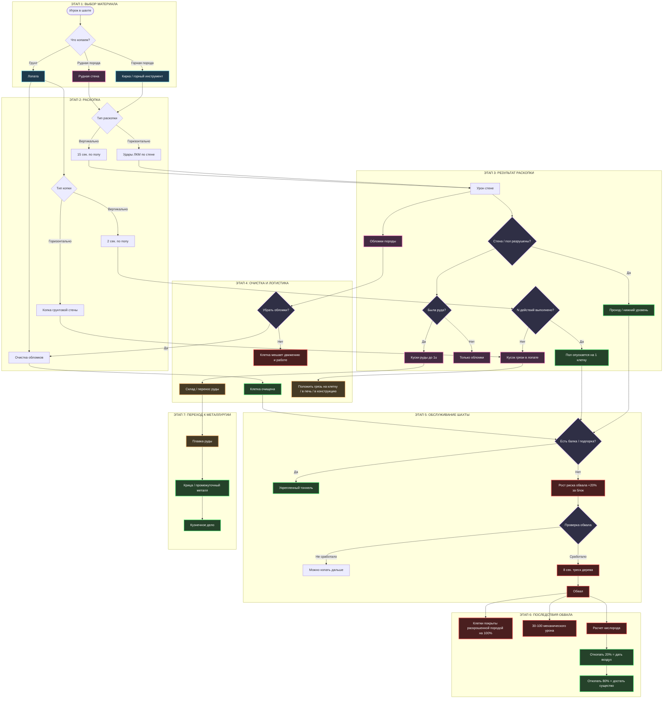
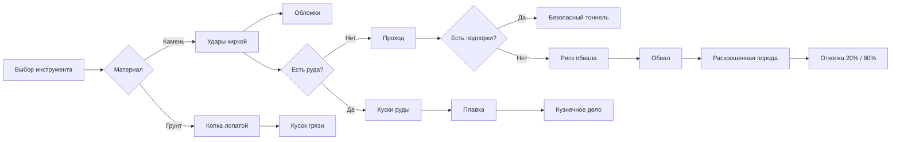

# Шахтерское дело

## 1. Концепция

Система шахтерского дела описывает полный цикл добычи подземных ресурсов: от разрушения горной породы и грунта до получения кусков руды, обслуживания шахт, предотвращения обвалов и передачи добытого сырья в металлургию.

Главная идея — игрок физически работает с породой, инструментами, обломками, подпорками и добытыми материалами. Шахта должна ощущаться как опасная рабочая зона, где важно не только копать, но и поддерживать проходы в безопасном состоянии.

---

## 2. Игровой цикл

### Этап 1: Подготовка

*Игрок выбирает инструмент и способ раскопки.*

1. Игрок определяет материал:
   * горная порода;
   * рудная горная порода;
   * грунт.
2. Для горной породы нужен **горный инструмент**.
3. Для грунта нужна **лопата**.
4. Инструмент берется в **две руки**.
5. Игрок выбирает направление работы:
   * горизонтальная раскопка стены;
   * вертикальная раскопка пола;
   * очистка клетки от обломков.

Инструмент в двух руках нужен для того, чтобы показать физическую тяжесть действия. Шахтер не должен одновременно полноценно копать и вести бой.

---

### Этап 2.1: Горизонтальная раскопка горной породы

*Основной способ проходки тоннелей и добычи руды из каменных стен.*

1. Игрок берет **горный инструмент** в две руки.
2. Наносит ЛКМ удары по стене.
3. Стена получает урон.
4. В зависимости от **нанесенного урона** рядом со стеной появляется зона обломков. !!!!!!!!!!!!!!!!!!!!!!!!!!!!!!!!!!!!!!!!!!!!!
На урон стави триггера. Например 5 ударов до фулл слома и при определнном дается камен
Жикости как песочек, камушки и грунт
Куски камня как объекты, которы надо перетаскивать 
5. Обломки находятся в клетке и мешают: !!!!!!!!!!!!!!!!!!!!!!!!!!!!!!!!!!!!!!!!!!!!!
   * передвижению;
   * работе;
   * свободному проходу через клетку.
6. После полного разрушения стены клетка освобождается.
7. После разрушения стены обломки равномерно покрывают ближайшие клетки радиусом в **1 клетку**. !!!!!!!!!!!!!!!!!!!!!!!!!!!!!!!!!!!!!!!!!!!!!
8. Обломки можно вынести или убрать лопатой. !!!!!!!!!!!!!!!!!!!!!!!!!!!!!!!!!!!!!!!!!!!!!
9. Если стена содержала руду, дополнительно появляются несколько кусков руды. !!!!!!!!!!!!!!!!!!!!!!!!!!!!!!!!!!!!!!!!!!!!!

#### Обломки при раскопке

Обломки — побочный результат разрушения породы. Они не являются просто визуальным эффектом, а реально влияют на движение и работу в клетке.

| Состояние | Что происходит |
| :--- | :--- |
| **Стена повреждена** | Возле стены появляется зона обломков. |
| **Стена разрушена** | Обломки распределяются по ближайшим клеткам радиусом 1 клетка. |
| **Клетка с обломками** | Передвижение и работа затрудняются. |
| **Очистка лопатой** | Обломки можно убрать или вынести. |

---

### Этап 2.2: Вертикальная раскопка горной породы !!!!!!!!!!!!!!!!!!!!!!!!!!!!!!!!!!!!!!!!!!!!! ГЛУБИНА?

*Способ опуститься на уровень ниже через каменный пол.*

1. Игрок берет кирку или другой горный инструмент.
2. Кликает ЛКМ по полу вне боевого режима.
3. Запускается действие с зеленой плашкой прогресса.
4. Длительность действия — **15 секунд**.
5. После завершения действия пол разрушается.
6. Клетка смещается на **один уровень вниз**.
7. Далее применяются правила горизонтальной раскопки:
   * появляются обломки;
   * проход нужно очищать;
   * если в породе была руда, появляются куски руды.

Вертикальная раскопка опаснее обычной, потому что она меняет структуру шахты и может повышать риск обвала.

---

### Этап 3.1: Раскопка грунта

*Грунт копается иначе, чем камень: вместо тяжелых обломков игрок получает переносимый кусок грязи.*

1. Игрок берет лопату в две руки.
2. Наносит ЛКМ удары по грунтовой стене.
3. После удара в лопате появляется кусок грязи, соответствующий породе. !!!!!!!!!!!!!!!!!!!!!!!!!!!!!!!!!!!!!!!!!!!!!
4. Если кликнуть ЛКМ, кусок грязи можно положить:
   * на свободное место;
   * в печь;
   * в другую подходящую конструкцию;
   * в место хранения.

Грунт не создает тяжелые каменные обломки, как горная порода. Вместо этого он превращается в отдельный переносимый материал.

---

### Этап 3.2: Вертикальная раскопка грунта

*Способ постепенно опустить грунтовый пол на уровень ниже.*

1. Игрок берет лопату.
2. Кликает ЛКМ по полу вне боевого режима.
3. Запускается действие с зеленой плашкой прогресса.
4. Длительность действия — **2 секунды**.!!!!!!!!!!!!!!!!!!!!!!!!!!!!!!!!!!!!!!!!!!!!!
5. После завершения действия в лопате появляется кусок грязи.!!!!!!!!!!!!!!!!!!!!!!!!!!!!!!!!!!!!!!!!!!!!!
6. После **N** таких действий пол опускается на **1 клетку вниз**.

Значение **N** в исходном файле не указано, поэтому оно остается параметром баланса. Его нельзя заменять произвольным числом без отдельного решения геймдизайна.

---

## 3. Основные материалы

| Материал | Как появляется | Что делает |
| :--- | :--- | :--- |
| **Обломки породы** | При повреждении и разрушении горной породы | Мешают движению и работе, убираются лопатой |
| **Раскрошенная порода** | После обвала | На 100% покрывает затронутые клетки |
| **Кусок грязи** | При копке грунта лопатой | Переносимый материал, можно положить на клетку или в конструкцию |
| **Кусок руды** | При разрушении стены с рудой | Сырье для дальнейшей плавки |
| **Бревна** | Добываются вне шахтерского цикла | Используются для строительства подпорок |
| **Балка** | Конструкция обслуживания шахты | Нужна для снижения риска обвала |

---

## 4. Генерация руды

Руда появляется не одиночными случайными блоками, а месторождениями.

### Центр месторождения

1. В определенной точке мира проверяется возможность генерации месторождения.
2. Проверяется, подходит ли местность.
3. Проверяется шанс генерации.
4. Если шанс срабатывает, создается центр месторождения.
5. От центра месторождения во все стороны начинают появляться блоки с рудой.
6. Блоки руды заменяют обычные блоки окружения.

---

### Распространение руды

Механика работает волной распространения.

1. Каждый блок руды за один тик генерации проверяет соседние твердые блоки.
2. С шансом **N%** он превращает твердые нерудные блоки вокруг себя в блоки с рудой.
3. Новые рудные блоки могут продолжить распространение по тем же правилам.
4. Так формируется жила или скопление руды.

Итог — в мире образуется не равномерная россыпь, а месторождение, похожее на естественную жилу.

---

### Схема генерации месторождения

| Шаг | Действие |
| :--- | :--- |
| **1** | Выбирается потенциальная точка генерации. |
| **2** | Проверяется пригодность местности. |
| **3** | Проверяется шанс генерации. |
| **4** | Создается центр месторождения. |
| **5** | Рудные блоки распространяются от центра. |
| **6** | Соседние твердые нерудные блоки могут стать рудными. |

---

### Цвет и визуальное отличие руды

1. Каждый тип руды должен иметь собственный окрас.
2. Рудная стена должна визуально отличаться от обычной породы.
3. После разрушения стены выпавшие куски руды должны иметь цвет, соответствующий этой руде.

---

## 5. Добыча руды

*Руда не превращается сразу в металл. Игрок получает сырой кусок руды, который затем идет в плавку.*

1. Игрок разрушает стену с рудой горным инструментом.
2. После разрушения стены появляются обычные обломки.
3. Дополнительно появляются несколько кусков руды.
4. Каждый кусок содержит **N** количество руды.
5. Один кусок не должен содержать больше **1u** руды.
6. Куски руды имеют окрас, соответствующий своей руде.
7. Полученная руда идет в дальнейшую переработку.

#### Таблица рудного выхода

| Объект | Результат |
| :--- | :--- |
| **Обычная горная порода** | Обломки породы. |
| **Рудная порода** | Обломки породы + куски руды. |
| **Кусок руды** | Содержит N руды, но не больше 1u. |
| **Цвет куска** | Соответствует типу руды. |

---

## 6. Обслуживание шахт

Шахта должна обслуживаться. Если игрок просто копает тоннели без укреплений, увеличивается риск обвала.

### Основное правило

Во время раскопок под землей необходимо ставить подпорки и балки. В исходной задумке указано, что подпорки и балки нужно ставить **каждую клетку**, чтобы избежать обвала.

Если продолжить раскопку без балки, шанс обвала растет на **20% за каждый блок**.

| Условие | Эффект |
| :--- | :--- |
| **Раскопка блока** | Базовый шанс обвала — 1%. |
| **Продолжение без балки** | Шанс обвала растет на 20% за каждый блок. |
| **Установленная подпорка/балка** | Шахта считается укрепленной в зоне конструкции. |
| **Длинный тоннель без укреплений** | Риск обвала быстро становится критическим. |

---

### Зачем нужно обслуживание

1. Заставляет игроков планировать шахту.
2. Не дает бесконечно копать прямой тоннель без подготовки.
3. Создает роль крепильщика/строителя внутри шахты.
4. Добавляет риск при ускоренной добыче.
5. Связывает шахтерское дело со строительством и лесозаготовкой.

---

## 7. Подпорки

Подпорки — строительная конструкция для защиты шахты от обвала.

### Строительство подпорки

1. Игрок размещает призрак конструкции.
2. В призрак конструкции нужно добавить **4 бревна**.
3. Каждое бревно добавляется **5 секунд**.
4. После внесения всех материалов подпорка становится активной.

#### Стоимость и время

| Параметр | Значение |
| :--- | :--- |
| **Материал** | 4 бревна |
| **Время добавления одного бревна** | 5 секунд |
| **Общее минимальное время сборки** | 20 секунд |
| **Назначение** | Снижение риска обвала |

---

### Использование подпорок

1. Подпорки ставятся в раскопанных проходах.
2. Особенно важны в длинных тоннелях.
3. Особенно важны при вертикальной раскопке.
4. Их отсутствие увеличивает риск обвала.
5. При начале обвала подпорки могут быть источником предупреждающего треска.

---

## 8. Механика обвалов

Обвал — ключевая опасность шахтерского дела. Он возникает при раскопке и распространяется по подземным клеткам, если шахта плохо укреплена.

### А. Запуск обвала

1. При раскопке блока проверяется шанс обвала.
2. Базовый шанс обвала при раскопке блока составляет **1%**.
3. Если раскопка продолжается без балки, шанс увеличивается на **20% за каждый блок**.
4. При успешной проверке начинается обвал.

---

### Б. Распространение обвала

Механика распространения обвала похожа на генерацию руды.

1. Обвал распространяется по раскопанным клеткам.
2. Распространение идет только по раскопанным клеткам, над которыми есть блоки породы.
3. Шанс распространения на соседний блок обвала составляет **80%**.
4. Каждая затронутая клетка становится заваленной.
5. После обвала затронутые клетки покрываются на **100%** раскрошенной породой.

Это делает обвал не точечным событием, а цепной реакцией.

---

### В. Предупреждение перед обвалом

Перед обвалом игрок получает звуковое предупреждение.

1. При начале обвала за **8 секунд** начинается звук треска дерева.
2. После этого звучит сокрушительный грохот камней.
3. Затем происходит сам обвал.

Игроку дается короткое время, чтобы выйти из опасной зоны или попытаться предупредить других.

---

### Г. Последствия обвала

После обвала:

1. Затронутые клетки покрываются на 100% раскрошенной породой.
2. Сущности, попавшие под обвал, получают случайно от **30 до 100** единиц механических повреждений.
3. После урона случайным образом определяется запас кислорода.
4. Сущность под завалом не может ничего делать.
5. Под завалом доступно только тихое общение.

#### Формула кислорода под завалом

`Запас кислорода = случайное значение от 0 до 100 / расстояние до ближайшего блока воздуха`

Формула оставлена как параметр из исходной задумки. Точный способ округления, единицы расстояния и порядок расчета нужно уточнять отдельно при балансировке.

---

### Д. Спасение из-под завала

Чтобы спасти существо, нужно откопать клетку с ним.

| Степень откопки клетки | Результат |
| :--- | :--- |
| **20%** | Существу можно дать доступ к воздуху и спасти от удушения. |
| **80%** | Существо можно достать из-под завала. |

Это создает два уровня спасения: сначала не дать существу задохнуться, затем полностью освободить его.

---

## 9. Раскрошенная порода и завалы

Раскрошенная порода выполняет роль физического препятствия.

| Источник | Поведение |
| :--- | :--- |
| **Удары по стене** | Возле стены появляется зона обломков. |
| **Разрушение стены** | Обломки покрывают клетки радиусом 1. |
| **Обвал** | Затронутые клетки покрываются раскрошенной породой на 100%. |
| **Очистка** | Обломки и завалы убираются лопатой. |

---

## 10. Mermaid-схема игрового цикла

---

## 11. Расширенный аудио-дизайн (SFX)

Звук должен быть основным индикатором состояния шахты. Игрок должен понимать по звукам, что происходит: обычная добыча, разрушение породы, перегруженная шахта или начало обвала.

### А. Звуки раскопки

| Действие | Объект | Тип звука | Описание |
| :--- | :--- | :--- | :--- |
| **Удар киркой** | Каменная стена | Once | Глухой металлический удар по камню. |
| **Повреждение стены** | Камень | Once / вариативный | Треск, скол, мелкая осыпь. |
| **Разрушение стены** | Камень | Once | Тяжелое осыпание породы. |
| **Вертикальная раскопка** | Каменный пол | Loop + Once | Стук кирки, затем пролом пола. |
| **Копка лопатой** | Грунт | Once | Мягкий звук срезаемой земли. |
| **Получение грязи** | Лопата | Once | Плотный шорох земли на лопате. |
| **Очистка клетки** | Обломки | Loop | Сгребание камней и пыли. |

---

### Б. Звуки руды

| Событие | Тип звука | Описание |
| :--- | :--- | :--- |
| **Удар по рудной стене** | Once | Каменный удар с металлическим оттенком. |
| **Выпадение кусков руды** | Once | Тяжелое падение кусков на землю. |
| **Подбор руды** | Once | Звук тяжелого предмета в руках или сумке. |
| **Перенос руды** | Loop / шаги | Приглушенный тяжелый звук груза. |

---

### В. Звуки подпорок

| Действие | Тип звука | Описание |
| :--- | :--- | :--- |
| **Размещение призрака конструкции** | Once | Тихий строительный звук размещения. |
| **Добавление бревна** | Once | Тяжелый деревянный стук. |
| **Завершение подпорки** | Once | Плотная фиксация дерева. |
| **Нагрузка на подпорку** | Ambient / редкий | Скрип дерева под давлением. |
| **Опасная подпорка** | Loop / тревожный | Частый сухой треск дерева. |

---

### Г. Звуки обвала

| Стадия | Тип звука | Описание |
| :--- | :--- | :--- |
| **Предупреждение** | Loop, 8 секунд | Треск дерева, напряжение конструкции. |
| **Начало обвала** | Once | Резкий перелом балки или раскол породы. |
| **Основной обвал** | Once / громкий | Сокрушительный грохот камней. |
| **После обвала** | Ambient | Пыль, осыпающиеся мелкие камни. |
| **Под завалом** | Muffled | Приглушенный звук, слабый голос, тяжелое дыхание. |
| **Откопка сущности** | Loop | Сгребание породы, стук камней, короткие приглушенные реплики. |

---

## 12. Визуальные эффекты и анимации

### А. Раскопка горной породы

| Объект | Состояние | Визуализация | Примечание |
| :--- | :--- | :--- | :--- |
| **Каменная стена** | Повреждается | Трещины и сколы. | Усиливаются с каждым ударом. |
| **Каменная стена** | Разрушена | Исчезновение стены, появление обломков. | Обломки распределяются рядом. |
| **Клетка с обломками** | Частично завалена | Камни на полу. | Мешает движению и работе. |
| **Клетка с обломками** | Очищается | Постепенное уменьшение слоя. | Лопата убирает мусор. |
| **Вертикальная раскопка** | Пол поврежден | Трещины на полу. | После 15 секунд пол смещается вниз. |

---

### Б. Раскопка грунта

| Объект | Состояние | Визуализация | Примечание |
| :--- | :--- | :--- | :--- |
| **Грунтовая стена** | Копается | Срез земли или углубление. | Не как каменные трещины. |
| **Лопата** | Содержит грязь | На лопате виден кусок грунта. | Можно положить на клетку. |
| **Грунтовый пол** | Копается | Слой грунта постепенно уменьшается. | Каждое действие длится 2 секунды. |
| **Грунтовый пол** | Опускается | Изменение уровня клетки. | После N действий. |

---

### В. Руда

| Объект | Состояние | Визуализация | Примечание |
| :--- | :--- | :--- | :--- |
| **Рудная стена** | Целая | Цветные вкрапления в породе. | Цвет зависит от типа руды. |
| **Рудная стена** | Повреждена | Трещины + видимые рудные жилы. | Можно понять, что блок почти сломан. |
| **Кусок руды** | Лежит на земле | Цветной каменный кусок. | Цвет соответствует металлу. |
| **Месторождение** | Сгенерировано | Группа связанных рудных блоков. | Не одиночная равномерная россыпь. |

---

### Г. Подпорки и обвалы

| Объект | Состояние | Визуализация | Примечание |
| :--- | :--- | :--- | :--- |
| **Призрак подпорки** | Строительство | Полупрозрачная конструкция. | Требует 4 бревна. |
| **Подпорка** | Строится | Бревна добавляются по одному. | Каждое добавление занимает 5 секунд. |
| **Подпорка** | Готова | Деревянные балки в клетке. | Зона считается укрепленной. |
| **Подпорка** | Под нагрузкой | Легкая дрожь или скрип. | Предупреждение о риске. |
| **Обвал** | Начинается | Пыль, дрожание, трещины. | Перед основным событием. |
| **Обвал** | Произошел | Клетки покрыты породой. | Существо может оказаться под завалом. |
| **Существо под завалом** | Заблокировано | Скрыто под породой или видно частично. | Можно откопать на 20% или 80%. |

---

## 13. Таблицы оборудования и инструментов

### Таблица 1: Инструменты шахтера

| Инструмент | Использование | Назначение |
| :--- | :--- | :--- |
| **Кирка** | Горная порода, вертикальная раскопка камня | Основной инструмент для разрушения каменных стен и пола. |
| **Горный инструмент** | Горная порода | Обобщенная категория инструментов для камня. |
| **Лопата** | Грунт, очистка обломков | Копает землю и убирает завалы/обломки. |
| **Молот** | Связь с металлургией | Может использоваться дальше при отбивке крицы. |
| **Клешни** | Связь с металлургией | Нужны для извлечения горячей крицы из печи. |

---

### Таблица 2: Конструкции шахты

| Конструкция | Ресурсы | Время | Назначение |
| :--- | :--- | :--- | :--- |
| **Подпорка** | 4 бревна | 5 сек. на каждое бревно | Укрепляет шахту и снижает риск обвала. |
| **Балка** | Дерево / бревна | Не указано | Используется для предотвращения обвалов. |
| **Раскопанная клетка** | — | — | Проход, который может стать зоной обвала. |
| **Заваленная клетка** | Раскрошенная порода | Требует откопки | Блокирует действие сущности и движение. |

---

### Таблица 3: Типы раскопки

| Тип раскопки | Инструмент | Цель | Время / условие | Результат |
| :--- | :--- | :--- | :--- | :--- |
| **Горизонтальная порода** | Кирка / горный инструмент | Стена | Удары ЛКМ | Проход, обломки, возможно руда. |
| **Вертикальная порода** | Кирка / горный инструмент | Пол | 15 секунд | Опускание на уровень ниже. |
| **Горизонтальный грунт** | Лопата | Грунтовая стена | Удары ЛКМ | Кусок грязи в лопате. |
| **Вертикальный грунт** | Лопата | Грунтовый пол | 2 секунды за действие, N действий | Пол опускается на уровень ниже. |
| **Очистка обломков** | Лопата | Заваленная/засыпанная клетка | Не указано | Удаление мешающих обломков. |

---

### Таблица 4: Материалы добычи

| Материал | Источник | Хранение / перенос | Использование |
| :--- | :--- | :--- | :--- |
| **Обломки породы** | Повреждение и разрушение камня | Клетка | Мешают движению, убираются лопатой. |
| **Раскрошенная порода** | Обвал | Клетка | Завал, препятствие, блокировка сущностей. |
| **Кусок грязи** | Копка грунта | Лопата / клетка / конструкция | Можно положить на свободное место или в печь. |
| **Кусок руды** | Рудная стена | Руки / склад / контейнер | Плавка и металлургия. |
| **Бревна** | Лесозаготовка | Руки / склад | Подпорки и балки. |

---

## 14. Таблица опасностей

| Опасность | Причина | Последствие | Как предотвратить |
| :--- | :--- | :--- | :--- |
| **Обломки** | Разрушение породы | Замедляют движение и работу | Убирать лопатой. |
| **Обвал** | Раскопка без подпорок | Заваливает клетки, наносит урон | Ставить балки и подпорки. |
| **Удушение под завалом** | Существо оказалось под породой | Ограниченный запас кислорода | Откопать клетку минимум на 20%. |
| **Полная блокировка сущности** | Заваленная клетка | Нельзя действовать, только тихо говорить | Откопать клетку на 80%. |
| **Потеря прохода** | Распространение обвала | Шахта становится непроходимой | Регулярно обслуживать тоннели. |
| **Застревание логистики** | Обломки не убраны | Руда и грязь плохо выносятся наружу | Делать регулярную очистку проходов. |

---

## 15. Связь с плавкой

В исходном Word-файле после шахтерского дела идет раздел **«Плавка»**. Полностью переносить его в эту страницу не нужно, потому что он относится к металлургии и кузнечному делу, но связь должна быть явно зафиксирована.

Шахтерское дело заканчивается не готовым металлом, а получением сырья.

1. Игрок добывает куски руды.
2. Руда переносится к печам.
3. В печь закладывается руда и топливо.
4. После плавки получается крица или другой промежуточный продукт.
5. Далее начинается металлургия и кузнечное дело.

Цепочка:

`Шахта → Руда → Плавка → Крица / металл → Кузнечное дело → Инструменты / оружие / детали`

---

### Краткая выжимка плавки из Word

| Элемент | Что указано в Word | Где раскрывать полностью |
| :--- | :--- | :--- |
| **Сыродутный горн** | Простейшая печь размером 1 клетка | `smithing.md` / металлургия |
| **Шуткофен** | Печь 2×2, плавит непрерывно, раз в день забирают крицу | `smithing.md` / металлургия |
| **Купелярная печь** | Используется для выплавки драгметаллов, отделяет серебро от свинца | `smithing.md` / металлургия |
| **Сыродутный метод** | Руда и уголь закладываются поочередно | `smithing.md` / металлургия |
| **Меха** | Повышают температуру и сокращают время плавки | `smithing.md` / металлургия |
| **Отбивка крицы** | Крица достается клешнями и отбивается молотом | `smithing.md` / металлургия |

---

## 16. Балансные параметры из исходного файла

| Параметр | Значение |
| :--- | :--- |
| **Вертикальная раскопка горной породы** | 15 секунд |
| **Вертикальная раскопка грунта** | 2 секунды за действие |
| **Количество действий для опускания грунта** | N, не указано |
| **Базовый шанс обвала** | 1% |
| **Рост шанса обвала без балки** | +20% за каждый блок |
| **Шанс распространения обвала** | 80% |
| **Предупреждение перед обвалом** | 8 секунд треска дерева |
| **Покрытие клеток после обвала** | 100% раскрошенной породой |
| **Урон от обвала** | 30–100 механического урона |
| **Формула кислорода** | `0..100 / расстояние до ближайшего блока воздуха` |
| **Откопать для доступа воздуха** | 20% |
| **Откопать для извлечения сущности** | 80% |
| **Вместимость одного куска руды** | Не больше 1u |
| **Строительство подпорки** | 4 бревна, по 5 секунд каждое |

---

## 18. Итоговая логика системы

Шахтерское дело строится на пяти основных принципах.

### 1. Физическое взаимодействие

Игрок не получает ресурсы через меню. Он бьет стену, копает грунт, переносит грязь, убирает обломки и ставит конструкции.

### 2. Материалы ведут себя по-разному

Камень дает обломки и может содержать руду. Грунт копается лопатой и превращается в кусок грязи.

### 3. Руда является сырьем, а не готовым металлом

Добытая руда требует плавки. Это связывает шахту с металлургией и кузнечным делом.

### 4. Шахта требует обслуживания

Если не ставить подпорки и балки, растет шанс обвала. Чем дальше игрок копает без укреплений, тем опаснее становится тоннель.

### 5. Обвал — не мгновенная смерть, а игровое событие

Обвал предупреждает игрока звуком, распространяется по клеткам, наносит урон, ограничивает кислород и создает задачу спасения.

---

# Библиотека руд и пород

## 1. Горные породы

| Порода | Особенности | Возможное использование |
| :--- | :--- | :--- |
| **Обычная каменная порода** | Базовый материал шахты | Проходка, обломки |
| **Рудная порода** | Содержит рудные вкрапления | Добыча кусков руды |
| **Грунт** | Копается лопатой | Куски грязи, изменение уровня пола |
| **Раскрошенная порода** | Возникает после обвала | Завалы, блокировка клеток |

---

## 2. Руды

Конкретные типы руды в исходном файле не перечислены, но указано, что каждый тип должен иметь собственный цвет и соответствующие куски после добычи.

| Тип руды | Визуальное отличие | Результат добычи |
| :--- | :--- | :--- |
| **Железная руда** | Темные/рыжие вкрапления | Куски железной руды |
| **Медная руда** | Зеленоватые/медные вкрапления | Куски медной руды |
| **Серебросодержащая руда** | Светлые металлические вкрапления | Руда для дальнейшей купеляции |
| **Другая руда** | Цвет зависит от материала | Куски соответствующей руды |

> Типы руд выше оформлены как библиотека для страницы. Если в Miro уже есть точный список руд, эту таблицу нужно заменить на него.

---

## 3. Возможные роли игроков

| Роль | Задача |
| :--- | :--- |
| **Шахтер** | Копает породу и добывает руду |
| **Металлург** | Принимает руду и запускает плавку |

---

## 4. Короткая итоговая схема

