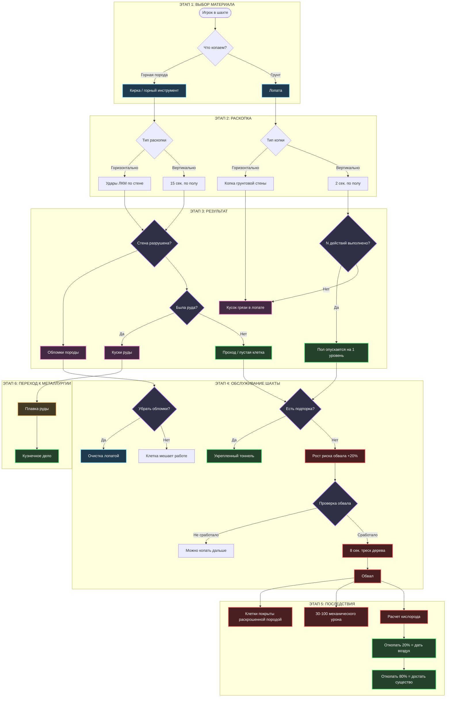
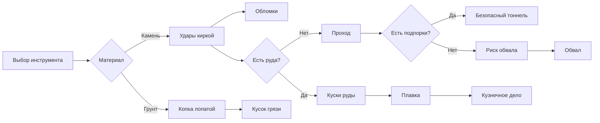

# Шахтерское дело

## 1. Концепция

Система шахтерского дела описывает полный цикл добычи подземных ресурсов: от разрушения породы и грунта до получения руды, обслуживания шахт, предотвращения обвалов и передачи добытых материалов в металлургию.

Главная идея — добыча не должна быть мгновенным действием через меню. Игрок физически работает с породой, создает завалы, очищает проходы, ставит подпорки и рискует получить обвал при нарушении техники безопасности.

Шахта — это не просто источник ресурсов, а опасная рабочая зона, где важны инструменты, порядок действий, логистика и подготовка.

---

## 2. Игровой цикл

### Этап 1: Подготовка

*Игрок выбирает инструмент в зависимости от материала, который собирается копать.*

1. Для горной породы нужен **горный инструмент**.
2. Для грунта нужна **лопата**.
3. Инструмент берется в две руки.
4. Игрок выбирает направление раскопки:
   * горизонтальная раскопка стены;
   * вертикальная раскопка пола;
   * очистка клетки от обломков.

Инструмент в двух руках нужен для того, чтобы показать физическую тяжесть действия. Шахтер не должен одновременно полноценно копать и вести бой.

---

### Этап 2.1: Горизонтальная раскопка горной породы

*Основной способ проходки тоннелей и добычи руды из каменных стен.*

1. Игрок берет горный инструмент в две руки.
2. Наносит ЛКМ удары по стене.
3. Стена получает урон.
4. В зависимости от нанесенного урона рядом со стеной появляется зона обломков.
5. После полного разрушения стены клетка освобождается.
6. Если стена содержала руду, дополнительно появляются куски руды.

#### Обломки при раскопке

Обломки — побочный результат разрушения породы.

1. Обломки находятся в клетке.
2. Они мешают передвижению.
3. Они мешают работе, если игрок стоит в этой клетке.
4. После разрушения стены обломки равномерно покрывают ближайшие клетки радиусом в 1 клетку.
5. Обломки можно убрать лопатой.

> Логика из исходного файла: во время повреждения стены обломки появляются рядом со стеной, а после разрушения стены распределяются по соседним клеткам.

---

### Этап 2.2: Вертикальная раскопка горной породы

*Способ опуститься на уровень ниже через каменный пол.*

1. Игрок кликает киркой ЛКМ по полу вне боевого режима.
2. Запускается действие с зеленой плашкой прогресса.
3. Длительность действия — **15 секунд**.
4. После завершения действия пол разрушается.
5. Клетка смещается на один уровень вниз.
6. Далее применяются те же правила, что и при горизонтальной раскопке горной породы:
   * появляются обломки;
   * при наличии руды появляются куски руды;
   * клетку может потребоваться очистить.

Вертикальная раскопка опаснее обычной, потому что она меняет структуру шахты и может сильнее влиять на риск обвала.

---

### Этап 3.1: Раскопка грунта

*Грунт копается не так, как камень: вместо обломков игрок получает переносимый кусок грязи.*

1. Игрок берет лопату в две руки.
2. Наносит ЛКМ удары по грунтовой стене.
3. После удара в лопате появляется кусок грязи соответствующей породы.
4. Кусок грязи можно положить:
   * на свободное место;
   * в печь;
   * в другую подходящую конструкцию.

Грунт не создает тяжелых каменных обломков, но превращается в отдельный переносимый материал.

---

### Этап 3.1: Вертикальная раскопка грунта

*Способ опустить грунтовый пол на один уровень ниже.*

1. Игрок кликает лопатой ЛКМ по полу вне боевого режима.
2. Запускается действие с зеленой плашкой прогресса.
3. Длительность действия — **2 секунды**.
4. После завершения действия в лопате появляется кусок грязи.
5. После **N** таких действий пол опускается на одну клетку вниз.

Значение **N** в исходном файле не указано, поэтому оно остается настраиваемым параметром баланса.

---

## 3. Основные материалы

| Материал | Как появляется | Что делает |
| :--- | :--- | :--- |
| **Обломки породы** | При повреждении и разрушении каменной стены | Мешают движению и работе, убираются лопатой |
| **Кусок грязи** | При копке грунта лопатой | Переносимый материал, можно положить на клетку или в конструкцию |
| **Кусок руды** | При разрушении стены с рудой | Сырье для дальнейшей плавки |
| **Раскрошенная порода** | После обвала | Полностью покрывает затронутые клетки |
| **Бревна** | Добываются вне шахтерского цикла | Используются для строительства подпорок |

---

## 4. Генерация руды

Руда появляется не отдельными случайными блоками, а месторождениями.

### Центр месторождения

1. В определенной точке мира проверяется возможность генерации месторождения.
2. Проверяется, подходит ли местность.
3. Если шанс срабатывает, создается центр месторождения.
4. От центра месторождения во все стороны начинают генерироваться блоки с рудой.
5. Блоки руды заменяют обычные блоки окружения.

---

### Распространение руды

Механика работает волной распространения.

1. Каждый блок руды за один тик генерации проверяет соседние блоки.
2. С шансом **N%** он превращает твердые нерудные блоки вокруг себя в блоки с рудой.
3. Новые рудные блоки могут продолжить распространение по тем же правилам.

Итог — в мире образуется не одиночная руда, а жила или скопление, которое выглядит как естественное месторождение.

---

### Цвет и визуальное отличие руды

1. Каждый тип руды имеет собственный окрас.
2. Рудная стена должна визуально отличаться от обычной породы.
3. После разрушения стены выпавшие куски руды должны иметь цвет, соответствующий этой руде.

---

## 5. Добыча руды

*Руда не превращается сразу в слиток. Игрок получает сырой кусок руды, который затем идет в плавку.*

1. Игрок разрушает стену с рудой.
2. После разрушения стены появляются куски руды.
3. Каждый кусок содержит **N** количество руды.
4. В одном куске не должно быть больше **1u** руды.
5. Куски руды сохраняют цвет своего типа.

Это связывает шахтерское дело с металлургией и кузнечным делом.

---

## 6. Обслуживание шахт

Шахта должна обслуживаться. Если игрок просто копает тоннели без укреплений, увеличивается риск обвала.

### Основное правило

Во время подземных раскопок необходимо ставить подпорки и балки.

Если игрок продолжает раскопку без установки балки, шанс обвала увеличивается.

| Условие | Эффект |
| :--- | :--- |
| Базовая раскопка блока | 1% шанс обвала |
| Продолжение раскопки без балки | +20% шанс обвала за каждый блок |
| Установленные подпорки | Снижают риск обвала в зоне действия |
| Длинный тоннель без укреплений | Становится опасной зоной |

---

## 7. Подпорки

Подпорки — строительная конструкция для защиты шахты от обвалов.

### Строительство подпорки

1. Игрок размещает призрак конструкции.
2. В призрак нужно добавить **4 бревна**.
3. Каждое бревно добавляется **5 секунд**.
4. После внесения всех материалов подпорка становится активной.

Подпорки должны ставиться регулярно, особенно в длинных тоннелях и местах активной добычи.

---

## 8. Обвалы

Обвал — ключевая опасность шахтерского дела.

Он возникает при раскопке и распространяется по подземным клеткам, если шахта плохо укреплена.

### Запуск обвала

1. При раскопке блока проверяется шанс обвала.
2. Базовый шанс составляет **1%**.
3. Если раскопка продолжается без балки, шанс увеличивается на **20% за каждый блок**.
4. При успешной проверке начинается обвал.

---

### Распространение обвала

Механика распространения обвала похожа на генерацию руды.

1. Обвал распространяется по раскопанным клеткам.
2. Распространение идет только по клеткам, над которыми есть блоки породы.
3. Шанс распространения на соседнюю клетку — **80%**.
4. Каждая затронутая клетка становится заваленной.

Это делает обвал не точечным событием, а цепной реакцией.

---

### Предупреждение перед обвалом

Перед обвалом игрок получает звуковое предупреждение.

1. За **8 секунд** до обвала начинается звук треска дерева.
2. После этого звучит сокрушительный грохот камней.
3. Затем клетки, затронутые обвалом, покрываются раскрошенной породой.

Игроку дается короткое время, чтобы выйти из опасной зоны.

---

### Последствия обвала

После обвала:

1. Затронутые клетки на 100% покрываются раскрошенной породой.
2. Сущности, попавшие под обвал, получают случайно от **30 до 100** единиц механического урона.
3. Для заваленной сущности случайным образом определяется запас кислорода.
4. Заваленная сущность не может ничего делать.
5. Разрешено только тихое общение.

#### Формула кислорода под завалом

`Запас кислорода = случайное значение от 0 до 100 / расстояние до ближайшего блока воздуха`

Формула в исходном файле требует уточнения при балансировке, но общий принцип понятен: чем дальше ближайший воздух, тем хуже ситуация для заваленного существа.

---

### Спасение из-под завала

Чтобы спасти существо, нужно откопать клетку с ним.

| Степень откопки | Результат |
| :--- | :--- |
| **20%** | Существо получает доступ к воздуху |
| **80%** | Существо можно достать из-под завала |

Это создает два уровня спасения: сначала не дать задохнуться, потом полностью освободить.

---

## 9. Mermaid-схема игрового цикла

---

## 10. Расширенный аудио-дизайн (SFX)

Звук должен быть основным индикатором состояния шахты. Игрок должен понимать по звукам, что происходит: обычная добыча, разрушение породы, перегруженная шахта или начало обвала.

### А. Звуки раскопки

| Действие | Объект | Тип звука | Описание |
| :--- | :--- | :--- | :--- |
| Удар киркой | Каменная стена | Once | Глухой металлический удар по камню |
| Повреждение стены | Камень | Once / вариативный | Треск, скол, мелкая осыпь |
| Разрушение стены | Камень | Once | Тяжелое осыпание породы |
| Вертикальная раскопка | Каменный пол | Loop + Once | Стук кирки, затем пролом пола |
| Копка лопатой | Грунт | Once | Мягкий звук срезаемой земли |
| Получение грязи | Лопата | Once | Плотный шорох земли на лопате |
| Очистка клетки | Обломки | Loop | Сгребание камней и пыли |

---

### Б. Звуки руды

| Событие | Тип звука | Описание |
| :--- | :--- | :--- |
| Удар по рудной стене | Once | Каменный удар с металлическим оттенком |
| Выпадение кусков руды | Once | Тяжелое падение кусков на землю |
| Подбор руды | Once | Звук тяжелого предмета в руках/сумке |

---

### В. Звуки подпорок

| Действие | Тип звука | Описание |
| :--- | :--- | :--- |
| Размещение призрака конструкции | Once | Тихий строительный звук размещения |
| Добавление бревна | Once | Тяжелый деревянный стук |
| Завершение подпорки | Once | Плотная фиксация дерева |
| Нагрузка на подпорку | Ambient / редкий | Скрип дерева под давлением |

---

### Г. Звуки обвала

| Стадия | Тип звука | Описание |
| :--- | :--- | :--- |
| Предупреждение | Loop, 8 секунд | Треск дерева, напряжение конструкции |
| Начало обвала | Once | Резкий перелом балки / раскол породы |
| Основной обвал | Once / громкий | Сокрушительный грохот камней |
| После обвала | Ambient | Пыль, осыпающиеся мелкие камни |
| Под завалом | Muffled | Приглушенный звук, слабый голос |

---

## 11. Визуальные эффекты и анимации

### А. Раскопка горной породы

| Объект | Состояние | Визуализация | Примечание |
| :--- | :--- | :--- | :--- |
| Каменная стена | Повреждается | Трещины / сколы | Усиливаются с каждым ударом |
| Каменная стена | Разрушена | Исчезновение стены, появление обломков | Обломки распределяются рядом |
| Клетка с обломками | Частично завалена | Камни на полу | Мешает движению и работе |
| Клетка с обломками | Очищается | Постепенное уменьшение слоя | Лопата убирает мусор |

---

### Б. Раскопка грунта

| Объект | Состояние | Визуализация | Примечание |
| :--- | :--- | :--- | :--- |
| Грунтовая стена | Копается | Срез земли / углубление | Не как каменные трещины |
| Лопата | Содержит грязь | На лопате виден кусок грунта | Можно положить на клетку |
| Грунтовый пол | Опускается | Изменение уровня клетки | После N действий |

---

### В. Руда

| Объект | Состояние | Визуализация | Примечание |
| :--- | :--- | :--- | :--- |
| Рудная стена | Целая | Цветные вкрапления в породе | Цвет зависит от типа руды |
| Рудная стена | Повреждена | Трещины + видимые рудные жилы | Можно понять, что блок почти сломан |
| Кусок руды | Лежит на земле | Цветной каменный кусок | Цвет соответствует металлу |

---

### Г. Подпорки и обвалы

| Объект | Состояние | Визуализация | Примечание |
| :--- | :--- | :--- | :--- |
| Призрак подпорки | Строительство | Полупрозрачная конструкция | Требует 4 бревна |
| Подпорка | Готова | Деревянные балки в клетке | Зона считается укрепленной |
| Подпорка | Под нагрузкой | Легкая дрожь / скрип | Предупреждение о риске |
| Обвал | Начинается | Пыль, дрожание, трещины | Перед основным событием |
| Обвал | Произошел | Клетки покрыты породой | Существо может оказаться под завалом |

---

## 12. Таблицы оборудования и инструментов

### Таблица 1: Инструменты шахтера

| Инструмент | Использование | Назначение |
| :--- | :--- | :--- |
| **Кирка** | Горная порода, вертикальная раскопка камня | Основной инструмент для разрушения каменных стен и пола |
| **Горный инструмент** | Горная порода | Обобщенная категория инструментов для камня |
| **Лопата** | Грунт, очистка обломков | Копает землю и убирает завалы/обломки |
| **Молот** | Связь с металлургией | Может использоваться дальше при отбивке крицы |
| **Клешни** | Связь с металлургией | Нужны для извлечения горячей крицы из печи |

---

### Таблица 2: Конструкции шахты

| Конструкция | Ресурсы | Время | Назначение |
| :--- | :--- | :--- | :--- |
| **Подпорка** | 4 бревна | 5 сек. на каждое бревно | Укрепляет шахту и снижает риск обвала |
| **Балка** | Дерево / бревна | Не указано | Используется для предотвращения обвалов |
| **Раскопанная клетка** | — | — | Проход, который может стать зоной обвала |
| **Заваленная клетка** | Раскрошенная порода | Требует откопки | Блокирует действие сущности и движение |

---

### Таблица 3: Типы раскопки

| Тип раскопки | Инструмент | Цель | Время / условие | Результат |
| :--- | :--- | :--- | :--- | :--- |
| **Горизонтальная порода** | Кирка / горный инструмент | Стена | Удары ЛКМ | Проход, обломки, возможно руда |
| **Вертикальная порода** | Кирка | Пол | 15 секунд | Опускание на уровень ниже |
| **Горизонтальный грунт** | Лопата | Грунтовая стена | Удары ЛКМ | Кусок грязи в лопате |
| **Вертикальный грунт** | Лопата | Грунтовый пол | 2 секунды за действие, N действий | Пол опускается на уровень ниже |
| **Очистка обломков** | Лопата | Заваленная/засыпанная клетка | Не указано | Удаление мешающих обломков |

---

## 13. Таблица опасностей

| Опасность | Причина | Последствие | Как предотвратить |
| :--- | :--- | :--- | :--- |
| **Обломки** | Разрушение породы | Замедляют движение и работу | Убирать лопатой |
| **Обвал** | Раскопка без подпорок | Заваливает клетки, наносит урон | Ставить балки и подпорки |
| **Удушение под завалом** | Существо оказалось под породой | Ограниченный запас кислорода | Откопать клетку минимум на 20% |
| **Полная блокировка сущности** | Заваленная клетка | Нельзя действовать, только тихо говорить | Откопать клетку на 80% |
| **Потеря прохода** | Распространение обвала | Шахта становится непроходимой | Регулярно обслуживать тоннели |

---

## 14. Связь с другими системами

| Система | Как связана с шахтерским делом |
| :--- | :--- |
| **Металлургия** | Куски руды идут в плавку |
| **Кузнечное дело** | Металл после плавки используется для ковки |
| **Строительство** | Подпорки требуют дерева и размещения конструкций |
| **Лесозаготовка** | Бревна нужны для подпорок и балок |
| **Медицина** | Обвалы наносят механические повреждения |
| **Выживание / атмосфера** | Под завалом важен запас кислорода |
| **Логистика** | Руду, грязь и обломки нужно переносить или убирать |
| **Экономика** | Руда и металлы становятся ценными ресурсами поселения |

---

## 15. Переход к плавке

Шахтерское дело заканчивается не получением готового металла, а получением сырья.

1. Игрок добывает куски руды.
2. Руда переносится к печам.
3. В печь закладывается руда и топливо.
4. После плавки получается крица или другой промежуточный продукт.
5. Далее начинается металлургия и кузнечное дело.

Таким образом, шахтерское дело является первой частью цепочки:

`Шахта → Руда → Плавка → Крица / металл → Кузнечное дело → Инструменты / оружие / детали`

---

## 16. Балансные параметры из исходного файла

| Параметр | Значение |
| :--- | :--- |
| Вертикальная раскопка горной породы | 15 секунд |
| Вертикальная раскопка грунта | 2 секунды за действие |
| Количество действий для опускания грунта | N, не указано |
| Базовый шанс обвала | 1% |
| Рост шанса обвала без балки | +20% за каждый блок |
| Шанс распространения обвала | 80% |
| Предупреждение перед обвалом | 8 секунд треска дерева |
| Урон от обвала | 30–100 механического урона |
| Откопать для доступа воздуха | 20% |
| Откопать для извлечения сущности | 80% |
| Вместимость одного куска руды | Не больше 1u |
| Строительство подпорки | 4 бревна, по 5 секунд каждое |

---

## 17. Итоговая логика системы

Шахтерское дело строится на пяти основных принципах.

### 1. Физическое взаимодействие

Игрок не получает ресурсы через меню. Он бьет стену, копает грунт, переносит грязь, убирает обломки и ставит конструкции.

### 2. Материалы ведут себя по-разному

Камень дает обломки и может содержать руду. Грунт копается лопатой и превращается в кусок грязи.

### 3. Руда является сырьем, а не готовым металлом

Добытая руда требует плавки. Это связывает шахту с кузнечным делом.

### 4. Шахта требует обслуживания

Если не ставить подпорки, растет шанс обвала. Чем дальше игрок копает без укреплений, тем опаснее становится тоннель.

### 5. Обвал — не мгновенная смерть, а игровое событие

Обвал предупреждает игрока звуком, распространяется по клеткам, наносит урон, ограничивает кислород и создает задачу спасения.

---

# Библиотека руд и пород

## 1. Горные породы

| Порода | Особенности | Возможное использование |
| :--- | :--- | :--- |
| **Обычная каменная порода** | Базовый материал шахты | Проходка, обломки |
| **Рудная порода** | Содержит рудные вкрапления | Добыча кусков руды |
| **Грунт** | Копается лопатой | Куски грязи, изменение уровня пола |
| **Раскрошенная порода** | Возникает после обвала | Завалы, блокировка клеток |

---

## 2. Руды

Конкретные типы руды в исходном файле не перечислены, но указано, что каждый тип должен иметь собственный цвет и соответствующие куски после добычи.

| Тип руды | Визуальное отличие | Результат добычи |
| :--- | :--- | :--- |
| **Железная руда** | Темные/рыжие вкрапления | Куски железной руды |
| **Медная руда** | Зеленоватые/медные вкрапления | Куски медной руды |
| **Серебросодержащая руда** | Светлые металлические вкрапления | Руда для дальнейшей купеляции |
| **Другая руда** | Цвет зависит от материала | Куски соответствующей руды |

> Типы руд выше оформлены как библиотека для страницы. Если в Miro уже есть точный список руд, эту таблицу нужно заменить на него.

---

## 3. Возможные роли игроков

| Роль | Задача |
| :--- | :--- |
| **Шахтер** | Копает породу и добывает руду |
| **Проходчик** | Делает тоннели и вертикальные спуски |
| **Крепильщик** | Ставит подпорки и балки |
| **Грузчик** | Выносит руду, грязь и обломки |
| **Спасатель** | Откопывает заваленных существ |
| **Металлург** | Принимает руду и запускает плавку |

---

## 4. Короткая итоговая схема

