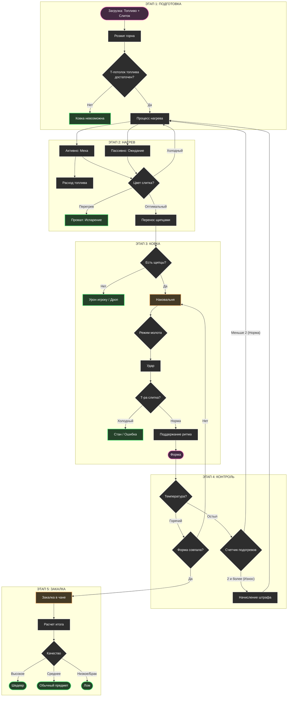

# Кузнечное дело (Механика и UX)

## 1. Концепция
Иммерсивная ритм-игра, в отказ от интерфейсных окон.
Игрок взаимодействует с физикой игры напрямую: оценивает температуру металла по цвету слитка, наносит удары в ритм и т.д.

Цель: Создать предмет, попав в "окно" идеальной формы, соблюдая температурный режим и ритм ударов.

---

## 2. Игровой цикл

### Этап 1: Подготовка и топливо
1. Игрок помещает топливо и слиток в **горн**.
2. Игрок активирует **горн**, разжигая его.

* **[Типы топлива:](../content/smithing_data.md)** Топливо определяет **температурный потолок**. Если температурный потолок ниже требуемого для рецепта — ковка невозможна.
* **Расход:** Топливо сгорает со временем. Если топливо заканчивается, температура горна начинает экспоненциально падать.

### Этап 2: Нагрев
1. Игрок использует **меха**, нагнетая воздух для раздува. Это резко повышает температуру горения, но ускоряет сгорание топлива.
2. Игрок наблюдает за температурой слитка по цвету. При нужном цвете переходит к ковке.

* **Визуальный контроль:** игрок ориентируется на [цвета](../content/smithing_data.md) слитка.
* **Пассивный рост:** без мехов температура растёт медленно (до предела топлива).

### Этап 3: Ковка
1. Игрок переносит горячий слиток **щипцами** на наковальню. Если взять горячий слиток без щипцов — получение урона и выпадение предмета.
2. Игрок выбирает режим удара **молота** (Лёгкий/Средний/Тяжёлый).
3. Игрок наносит удары, где каждый удар фиксируется как отдельное событие.

* **Ритм:** оценивается интервал между ударами игрока. Хороший ритм даёт бонусы к качеству, плохой дает дебаффы. Серии удачных ритмов расширяют допустимое окно тайминга.
* **Температура:** Каждый удар оценивается относительно идеального диапазона рецепта.
    * *Ошибка:* Удар по холодному слитку вызывает отдачу (стан) и порчу инструмента. Форма не меняется.

### Этап 4: Контроль остывания
1. Так как металл быстро остывает на наковальне (быстрее, чем в воздухе), игрок должен следить за цветом.
2. Возврат к **этапу 2** (подогрев) или переход к **этапу 5**.

* **Лимит:** Допускается **максимум 2 подогрева** за один цикл крафта. На 3-й раз итоговое качество предмета начинает падать из-за "усталости металла".

### Этап 5: Закалка
1. Игрок опускает предмет в бочку с жидкостью.
В этот момент происходит фиксация состояния:
* Форма: должно быть совпадение последовательности типов ударов с рецептом.
* Ритм: анализ интервалов между ударами. Начисление бонусов за стабильность и серии.
* Температура: оценка каждого удара относительно идеального диапазона. Бонусы за стабильную идеальную температуру.
* Подогревы: штраф при превышении допустимого числа пауз.

2. Спавнится предмет определенного [качества]().

---

### 3. Графическое представление

## 4. Аудио-дизайн (SFX)
*Звуковая обратная связь для подтверждения действий и ритма.*

| Событие | Условие | Описание |
| :--- | :--- | :--- |
| **Удар молота** | Попадание в ритм | Чистый, звонкий металлический звон |
| **Удар молота** | Обычный удар | Стандартный лязг металла |
| **Удар молота** | Промах / Плохой ритм | Глухой звук, будто удар по дереву/камню |
| **Ошибка** | Холодный слиток | Неприятный, режущий скрежет |
| **Горн** | Работа мехов | Звук всасывания воздуха и раздувания пламени |
| **Закалка** | Погружение в воду | Резкое шипение |

## 5. Визуальные эффекты (VFX)
*Визуализация физических процессов.*

### 5.1. Частицы и Свет
| Источник | Эффект | Описание |
| :--- | :--- | :--- |
| **Наковальня** | **Искры (золотые)** | Только при ударе с идеальным ритмом |
| **Наковальня** | **Искры (тусклые)** | Обычный удар. Малое количество |
| **Горн** | **Динамический свет** | При использовании мехов яркость увеличивается на 1.5 сек, затем затухают |
| **Чан** | **Облако пара** | При закалке. Белое облако вокруг на 2-3 секунды |

### 5.2. Анимации спрайта
| Объект | Описание |
| :--- | :--- |
| **Слиток** | Спрайт слитка должен менять свой цвет в зависимости от температуры |
| **Игрок** | Игрока недолго трясет при ударе по холодному слитку |

## 6. Текстовая индикация
*Всплывающий текст над персонажем*

* **Ритм (Успех):** Небольшой всплывающий текст `*ДЗЫНЬ!*`.
* **Ритм (Крит. успех):** Жирный текст `*КЛАНГ!*`.
* **Ошибка (Холодный):** Текст `*ТУК*` 

### 7 Утилизация брака
* **Лом:** Результат ошибки в крафте.
* **Переплавка:** Лом можно положить обратно в горн. Он плавится быстрее руды, но возвращает меньше материала.