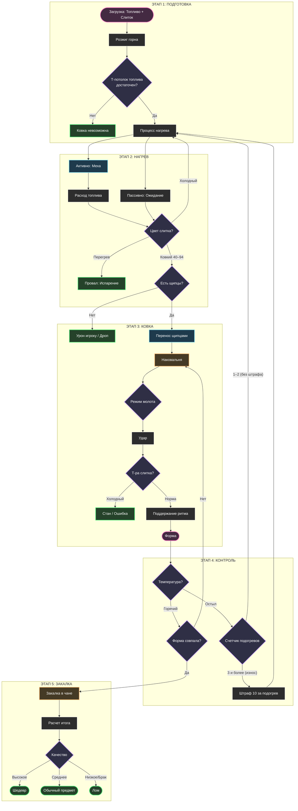

> **ПЕРЕРАБОТАНО** — исправлено после системной проверки GDD.

# Кузнечное дело (Механика и UX)

## 1. Концепция
Иммерсивная ритм-игра, в отказ от интерфейсных окон.
Игрок взаимодействует с физикой игры напрямую: оценивает температуру металла по цвету слитка, наносит удары в ритм и т.д.

Цель: Создать предмет, попав в "окно" идеальной формы, соблюдая температурный режим и ритм ударов.

---

## 2. Игровой цикл

### Этап 1: Подготовка и топливо
1. Игрок помещает топливо и слиток в **горн**.
2. Игрок активирует **горн**, разжигая его.

* **[Типы топлива и числовые параметры](../content/smithing_data.md):** топливо определяет **температурный потолок**. Если температурный потолок ниже требуемого для рецепта — ковка невозможна.
* **Расход:** Топливо сгорает со временем. Если топливо заканчивается, температура горна начинает экспоненциально падать.

### Этап 2: Нагрев
1. Игрок использует **меха**, нагнетая воздух для раздува. Это резко повышает температуру горения, но ускоряет сгорание топлива.
2. Игрок наблюдает за температурой слитка по цвету. При нужном цвете переходит к ковке.

* **Визуальный контроль:** игрок ориентируется на [числовые температурные окна и цвета](../content/smithing_data.md#1-температурная-шкала-слитков) слитка. Стартовое идеальное окно — `T = 60–79` по шкале `0–100`.
* **Пассивный рост:** без мехов температура растёт медленно (до предела топлива).

### Этап 3: Ковка
1. Игрок переносит горячий слиток **щипцами** на наковальню. Если взять горячий слиток без щипцов — получение урона и выпадение предмета.
2. Игрок выбирает режим удара **молота** (Лёгкий/Средний/Тяжёлый).
3. Игрок наносит удары, где каждый удар фиксируется как отдельное событие.

* **Ритм:** оценивается интервал между ударами игрока. Стартовый целевой интервал — `1.00 с`: идеальная ошибка не больше `0.10 с`, допустимая — не больше `0.25 с`. Серия из трех идеальных интервалов временно расширяет идеальное окно до `0.15 с`; полные правила приведены в [канонической таблице](../content/smithing_data.md#2-окна-ритма).
* **Температура:** каждый удар оценивается относительно идеального диапазона рецепта. Стартовое окно — `60–79`, допустимая ковка — `40–94`.
    * *Ошибка:* Удар по холодному слитку вызывает отдачу (стан) и порчу инструмента. Форма не меняется.

### Этап 4: Контроль остывания
1. Так как металл быстро остывает на наковальне (быстрее, чем в воздухе), игрок должен следить за цветом.
2. Возврат к **этапу 2** (подогрев) или переход к **этапу 5**.

* **Лимит без штрафа:** допускается **2 подогрева** за один цикл крафта. На 3-м и каждом следующем подогреве итоговое качество снижается на 10 баллов из-за "усталости металла".

### Этап 5: Закалка
1. Игрок опускает предмет в бочку с жидкостью.
В этот момент происходит фиксация состояния:
* Форма: должно быть совпадение последовательности типов ударов с рецептом.
* Ритм: анализ интервалов между ударами. Начисление бонусов за стабильность и серии.
* Температура: оценка каждого удара относительно идеального диапазона. Бонусы за стабильную идеальную температуру.
* Подогревы: штраф при превышении допустимого числа пауз.

2. Спавнится предмет определенного [качества](../content/smithing_data.md#3-формула-качества). Итог однозначно вычисляется по форме, температуре, ритму и числу подогревов:

`Quality = clamp(round(100 * (0.50 * S + 0.25 * T_score + 0.25 * R_score) - 10 * max(0, reheatCount - 2)), 0, 100)`

---

## 3. Графическое представление

```mermaid
graph TD
    %% --- СТИЛИ (Dracula / Selective Coloring) ---
    
    %% 0. Дефолт (Серый) - Обычные действия (Розжиг, Удар, Процессы)
    classDef default fill:#2d2d2d,stroke:#fff,stroke-width:1px,color:#fff;

    %% 1. Ресурс (Фиолетовый) - Слитки, Формы
    classDef resource fill:#442a42,stroke:#ff79c6,stroke-width:2px,color:#fff;
    
    %% 2. Станция (Коричневый) - Места (Горн, Наковальня, Чан)
    classDef station fill:#453a25,stroke:#ffb86c,stroke-width:2px,color:#fff;

    %% 3. Инструмент и проверка
    classDef tool fill:#1e3a4c,stroke:#8be9fd,stroke-width:2px,color:#fff;
    classDef check fill:#2f2f45,stroke:#bd93f9,stroke-width:2px,color:#fff;

    %% 4. Результат (Зеленый) - Итог (Предмет, Лом, Стан)
    classDef result fill:#25422a,stroke:#50fa7b,stroke-width:2px,color:#fff;
    


    %% --- ГРАФ ---

    subgraph P1["ЭТАП 1: ПОДГОТОВКА"]
        Start([Загрузка: Топливо + Слиток]):::resource --> Ignite[Розжиг горна]
        Ignite --> FuelCheck{Т-потолок топлива <br/>достаточен?}:::check
        FuelCheck -- "Нет" --> Impossible[Ковка невозможна]:::result
        FuelCheck -- "Да" --> Heating
    end

    subgraph P2["ЭТАП 2: НАГРЕВ"]
        Heating[Процесс нагрева] --> Bellows[Активно: Меха]:::tool
        Heating --> Passive[Пассивно: Ожидание]
        Bellows --> FuelBurn[Расход топлива]
        FuelBurn --> ColorCheck{Цвет слитка?}:::check
        Passive --> ColorCheck
        
        ColorCheck -- "Перегрев" --> Destroy[Провал: Испарение]:::result
        ColorCheck -- "Холодный" --> Heating
        ColorCheck -- "Ковкий 40–94" --> EnvCheck{Есть щипцы?}:::check
    end

    subgraph P3["ЭТАП 3: КОВКА"]
        EnvCheck -- "Нет" --> Damage[Урон игроку / Дроп]:::result
        EnvCheck -- "Да" --> Tongs[Перенос щипцами]:::tool
        Tongs --> Anvil[Наковальня]:::station
        
        Anvil --> HammerMode{Режим молота}:::check
        HammerMode --> Strike[Удар]
        
        Strike --> TempStrikeCheck{Т-ра слитка?}:::check
        TempStrikeCheck -- "Холодный" --> Stun[Стан / Ошибка]:::result
        TempStrikeCheck -- "Норма" --> RhythmCheck[Поддержание ритма]
        
        RhythmCheck --> Deform([Форма]):::resource
    end

    subgraph P4["ЭТАП 4: КОНТРОЛЬ"]
        Deform --> TempCheck{Температура?}:::check
        
        TempCheck -- "Остыл" --> ReheatCount{Счетчик подогревов}:::check
        ReheatCount -- "1–2 (без штрафа)" --> Heating
        ReheatCount -- "3 и более (износ)" --> QualityPenalty[Штраф 10 за подогрев] --> Heating
        
        TempCheck -- "Горячий" --> ShapeCheck{Форма совпала?}:::check
        ShapeCheck -- "Нет" --> Anvil
    end

    subgraph P5["ЭТАП 5: ЗАКАЛКА"]
        ShapeCheck -- "Да" --> Quench[Закалка в чане]:::station
        
        Quench --> FinalCalc[Расчет итога]
        
        FinalCalc --> Result{Качество}:::check
        Result -- "Высокое" --> Masterpiece([Шедевр]):::result
        Result -- "Среднее" --> Item([Обычный предмет]):::result
        Result -- "Низкое/Брак" --> Scrap([Лом]):::result
    end
```

## 4. Аудио-дизайн (SFX)
*Звуковая обратная связь для подтверждения действий и ритма.*

| Событие | Условие | Описание |
| :--- | :--- | :--- |
| **Удар молота** | Попадание в ритм | Чистый, звонкий металлический звон |
| **Удар молота** | Обычный удар | Стандартный лязг металла |
| **Удар молота** | Промах / Плохой ритм | Глухой звук, будто удар по дереву/камню |
| **Ошибка** | Холодный слиток | Неприятный, режущий скрежет |
| **Горн** | Работа мехов | Звук всасывания воздуха и раздувания пламени |
| **Закалка** | Погружение в воду | Резкое шипение |

## 5. Визуальные эффекты (VFX)
*Визуализация физических процессов.*

### 5.1. Частицы и Свет
| Источник | Эффект | Описание |
| :--- | :--- | :--- |
| **Наковальня** | **Искры (золотые)** | Только при ударе с идеальным ритмом |
| **Наковальня** | **Искры (тусклые)** | Обычный удар. Малое количество |
| **Горн** | **Динамический свет** | При использовании мехов яркость увеличивается на 1.5 сек, затем затухают |
| **Чан** | **Облако пара** | При закалке. Белое облако вокруг на 2-3 секунды |

### 5.2. Анимации спрайта
| Объект | Описание |
| :--- | :--- |
| **Слиток** | Спрайт слитка должен менять свой цвет в зависимости от температуры |
| **Игрок** | Игрока недолго трясет при ударе по холодному слитку |

## 6. Текстовая индикация
*Всплывающий текст над персонажем*

* **Ритм (Успех):** Небольшой всплывающий текст `*ДЗЫНЬ!*`.
* **Ритм (Крит. успех):** Жирный текст `*КЛАНГ!*`.
* **Ошибка (Холодный):** Текст `*ТУК*` 

## 7. Утилизация брака
* **Лом:** Результат ошибки в крафте.
* **Переплавка:** Лом можно положить обратно в горн. Он плавится быстрее руды, но возвращает меньше материала.

## 8. Канонические данные

Температурные окна, ритм, формула качества, режимы молота, инструменты и оборудование поддерживаются в единственном источнике: [Кузнечное дело (Данные)](../content/smithing_data.md).

## Реализация

- Прототип рецепта ковки: [Content.Shared/_Respiral/Blacksmithing/ForgingRecipePrototype.cs](https://github.com/respiral-tree/ss14-respiral/blob/master/Content.Shared/_Respiral/Blacksmithing/ForgingRecipePrototype.cs)
- Система процесса ковки: [Content.Server/_Respiral/Blacksmithing/ForgingSystem.cs](https://github.com/respiral-tree/ss14-respiral/blob/master/Content.Server/_Respiral/Blacksmithing/ForgingSystem.cs)
- Система горна: [Content.Server/_Respiral/Blacksmithing/ForgeSystem.cs](https://github.com/respiral-tree/ss14-respiral/blob/master/Content.Server/_Respiral/Blacksmithing/ForgeSystem.cs)
- Система закалки: [Content.Server/_Respiral/Blacksmithing/QuenchingSystem.cs](https://github.com/respiral-tree/ss14-respiral/blob/master/Content.Server/_Respiral/Blacksmithing/QuenchingSystem.cs)
- Тексты ковки: [Resources/Locale/ru-RU/_respiral/blacksmithing/blacksmithing.ftl](https://github.com/respiral-tree/ss14-respiral/blob/master/Resources/Locale/ru-RU/_respiral/blacksmithing/blacksmithing.ftl)
- Звуки ковки: [Resources/Prototypes/_Respiral/SoundCollections/blacksmithing.yml](https://github.com/respiral-tree/ss14-respiral/blob/master/Resources/Prototypes/_Respiral/SoundCollections/blacksmithing.yml)
- Прототипы станков: [Resources/Prototypes/_Respiral/Entities/Structures/Machine/lathe.yml](https://github.com/respiral-tree/ss14-respiral/blob/master/Resources/Prototypes/_Respiral/Entities/Structures/Machine/lathe.yml)
- Рецепты производства: [Resources/Prototypes/_Respiral/Recipe/recipe.yml](https://github.com/respiral-tree/ss14-respiral/blob/master/Resources/Prototypes/_Respiral/Recipe/recipe.yml)

## 9. Ожидаемое поведение

- Mermaid-диаграмма рендерится без неизвестных классов и показывает последовательность от загрузки до результата.
- Ветвь штрафа доступна только для 3-го и последующих подогревов; 1-й и 2-й подогревы возвращают заготовку к нагреву без штрафа.
- Температура и ритм имеют числовые окна, а ссылка качества ведет на однозначную формулу.
- При одинаковых входных событиях формула возвращает одинаковое целое значение `Quality` в диапазоне `0–100`.
- В этом документе нет копии канонических таблиц из `content/smithing_data.md`.
