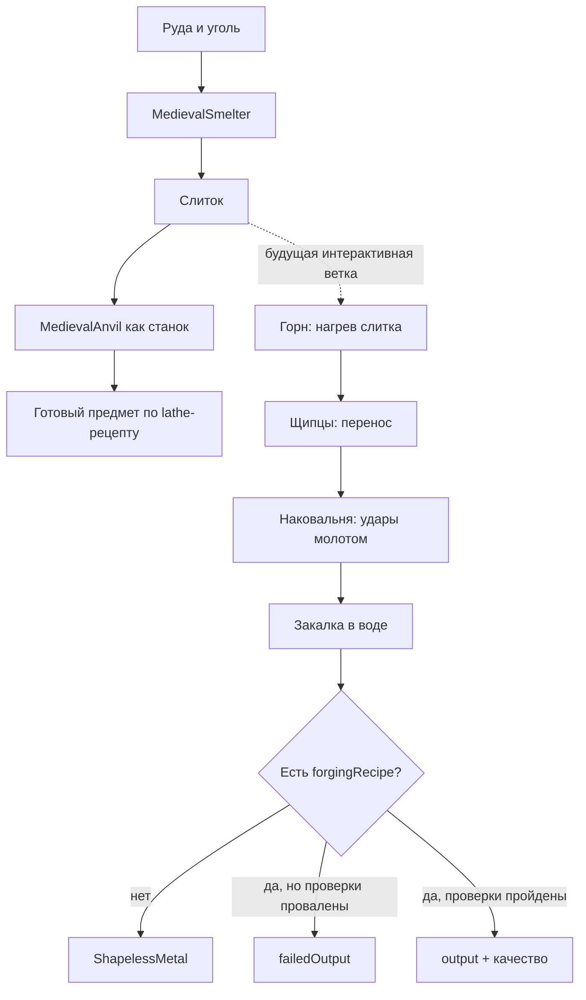

# Кузнечное дело

## 1. Роль системы

Кузнечное дело сейчас надо описывать как две связанные, но разные системы.

Первая уже работает как производственная линия SS14: игрок приносит материалы, открывает станок, выбирает рецепт и получает предмет. Так работают `MedievalSmelter` и `MedievalAnvil`.

Вторая лежит в коде как интерактивная ковка: нагрев слитка, перенос щипцами, удары молотом, закалка и расчет качества. Эта часть не должна описываться как готовый игровой контент, пока для нее не заведены прототипы предметов, горна, щипцов, молота, чана и `forgingRecipe`.

Главная задача GDD: не смешивать эти уровни. То, что игрок уже может делать через станок, описывается как текущая реализация. То, что есть только в системах, описывается как основа для будущей интерактивной ковки.

---

## 2. Текущий игровой цикл

### 2.1. Плавка

Игрок работает с плавильней как с производственным станком.

1. Собрать руду и уголь.
2. Положить материалы в `MedievalSmelter`.
3. Иметь навык `MedievalBasicBlacksmithing`.
4. Выбрать рецепт слитка.
5. Получить слиток или иной предмет из пака плавильни.

Плавильня сейчас не является отдельной физической мини-игрой. Она не требует вручную поддерживать температуру, пользоваться мехами или ждать изменения цвета металла. Это обычный станок с набором рецептов.

### 2.2. Наковальня

Наковальня сейчас тоже работает как `Lathe`, а не как интерактивная наковальня из системы ударов.

1. Игрок приносит обработанные материалы.
2. Кладет их в `MedievalAnvil`.
3. Имеет навык `MedievalBasicBlacksmithing`.
4. Выбирает рецепт оружия, брони, инструмента, ключа, замка, монеты или утвари.
5. Получает готовый предмет.

С точки зрения текущей игры это ремесленный терминал, оформленный как наковальня. Визуально и тематически это кузница, но механически это меню производства.

---

## 3. Что производит кузница

| Станок | Что делает | Примеры результата |
| :--- | :--- | :--- |
| `MedievalSmelter` | Перерабатывает руду и уголь в слитки | Железо, сталь, серебро, золото, мифрил, адамантит |
| `MedievalSmelter` | Делает простые стеклянные предметы | Цветные бутыли |
| `MedievalAnvil` | Делает оружие | Мечи, кинжалы, копья, алебарды, булавы, ножи, кастеты, плети |
| `MedievalAnvil` | Делает броню и одежду с металлическими деталями | Доспехи, шлемы, цепные перчатки, пояса, корона |
| `MedievalAnvil` | Делает утварь и инструменты | Кружки, кубки, ножницы, строительные инструменты |
| `MedievalAnvil` | Делает замочно-денежный контент | Ключи, замки, отмычки, дубликатор ключей, монеты |
| `MedievalAnvilCandel` | Отдельный пак для металлического света | Канделябры, металлический факел |

---

## 4. Интерактивная ковка в коде

Эта часть уже написана системами, но не найдена как готовый контент в прототипах. Ее стоит держать в документе как направление реализации, потому что код задает конкретные правила.

### 4.1. Нагрев

Слиток с `HeatedComponent` и `HeatedIngotComponent` может нагреваться на сущности с `ForgeComponent`, `FuelBurnerComponent` и `ItemPlacerComponent`.

Горн передает температуру через `HeatObject` с коэффициентом `0.1`. Если слиток не находится на нагревателе, он остывает через `CoolObject`.

Цвет слитка зависит от фактической температуры:

| Температура | Цвет |
| :--- | :--- |
| `< 700` | Без свечения |
| `700-799` | Темно-красный |
| `800-899` | Красный |
| `900-999` | Ярко-красный |
| `1000-1099` | Оранжево-красный |
| `1100-1199` | Светло-желтый |
| `>= 1200` | Бело-серый |

Ковка начинается только с `700`. Перегрев проверяется через `heated.OverheatThreshold`; при ударе по перегретому слитку заготовка удаляется.

### 4.2. Меха

Меха работают только с горелкой, у которой `PassiveVentilation` выключена.

При использовании:

- добавляют вентиляцию к `FuelBurnerComponent`;
- по умолчанию дают `AirFlow = 12.5`;
- тратят `10` стамины;
- используют задержку применения предмета.

В GDD это значит: меха не должны быть декоративной кнопкой. Их функция - временно усилить горение и помочь дойти до рабочей температуры.

### 4.3. Щипцы

Щипцы имеют контейнер `tongs` и могут держать один горячий слиток.

Игровое поведение:

1. Если щипцы пустые и игрок кликает по горячему слитку, слиток помещается в щипцы.
2. Если в щипцах есть слиток и игрок кликает по цели, слиток выкладывается на позицию цели.
3. Если цель имеет `QuenchingComponent`, щипцы пытаются выполнить закалку.
4. Если игрок убирает щипцы из руки, слиток выгружается из контейнера.

В коде не найдено отдельного наказания за попытку взять горячий слиток руками. Если оно нужно, его надо проектировать отдельно.

### 4.4. Удары молотом

Молот имеет три режима:

| Режим | Тип удара | Расход стамины |
| :--- | :--- | :--- |
| Легкий | `Light` | `0` |
| Средний | `Medium` | `5` |
| Тяжелый | `Heavy` | `10` |

Режим выбирается через verb-меню или переключается использованием молота в руке. Удар возможен по слитку на наковальне или по слитку с маркером `HeatedIngotPlacedComponent`.

Каждый удар записывает:

- тип удара;
- игровое время;
- температуру слитка;
- интервал от прошлого удара.

Ограничение: максимум `64` удара на один процесс.

При каждом ударе меняется визуальная деформация слитка. Система берет первые `32` удара и постепенно сжимает спрайт по оси `Y` до `0.6`.

---

## 5. Закалка и итог

Закалка запускается щипцами по объекту с `QuenchingComponent`.

Обязательные условия:

| Проверка | Значение |
| :--- | :--- |
| Слиток нагрет | `CurrentTemperature >= 700` |
| Есть раствор | По умолчанию `drink` |
| Нужный реагент | По умолчанию `Water` |
| Расход реагента | `5` единиц |

После успешной попытки система ищет подходящий `forgingRecipe`.

Если рецепт найден, проверяется:

1. Входной прототип слитка совпадает с `input`.
2. Последовательность ударов точно совпадает с развернутой `RequiredSequence`.
3. Достаточно хороших и идеальных ударов.
4. Плохих ударов не больше лимита рецепта.

Если рецепт не найден, появляется `ShapelessMetal`. Если рецепт найден, но качество не прошло проверку, появляется `failedOutput`. Если все проверки пройдены, появляется `output` с компонентом качества.

---

## 6. Расчет качества

Качество не считается по старой шкале `0-100`. В коде используется enum:

| Итог | Когда выдается |
| :--- | :--- |
| `Rough` | итоговый счет `< 15` |
| `Normal` | итоговый счет `15-24` |
| `Good` | итоговый счет `25-34` |
| `Master` | итоговый счет `35-44` |
| `Masterpiece` | итоговый счет `>= 45` |

Базовый счет складывается из ударов:

| Оценка удара | Множитель по умолчанию |
| :--- | :--- |
| `Perfect` | `1.5` |
| `Good` | `1.0` |
| `Bad` | `0.3` |

Дополнительно учитываются:

- бонус ритма из `StrikePattern` или `StrikeTypePrototype`;
- `+15`, если все удары были в идеальной температуре;
- `+8`, если идеальными по температуре были хотя бы 70% ударов;
- `+10` за серию из 5 хороших ритмов подряд;
- `+5` за серию из 3 хороших ритмов подряд.

Для успеха процесса нужно, чтобы идеальных и хороших ударов было заметно больше плохих:

`PerfectStrikes + GoodStrikes > BadStrikes * 2`

Отдельно рецепт может задать:

- `MinPerfectStrikes`;
- `MaxBadStrikes`;
- `IdealTemperature`;
- свои множители качества.

В коде есть штраф за большое число пауз на подогрев, но он применяется к `analysis.QualityScore`, который дальше не участвует в финальном `CalculateFinalQuality`. Это надо решить при доработке: либо подключить штраф к итоговому качеству, либо удалить мертвый счетчик.

---

## 7. Ритм и паузы

Ритм сравнивается не с одной жесткой секундой, а с окном рецепта.

По умолчанию окно удара:

`0.8-1.8` секунды между ударами

Рецепт может переопределить окно через `timeWindow`. Также можно завести `strikeType`, где у удара есть тип, окно ритма и бонус.

Если пауза между ударами больше `10` секунд, код считает это паузой на подогрев. Такая пауза может быть нормальной до `60` секунд. Дольше - плохое качество ритма.

---

## 8. Схема

```mermaid
flowchart TD
    Ore["Руда и уголь"] --> Smelter["MedievalSmelter"]
    Smelter --> Ingot["Слиток"]
    Ingot --> CurrentAnvil["MedievalAnvil как станок"]
    CurrentAnvil --> CurrentItem["Готовый предмет по lathe-рецепту"]

    Ingot -. "будущая интерактивная ветка" .-> Forge["Горн: нагрев слитка"]
    Forge --> Tongs["Щипцы: перенос"]
    Tongs --> Anvil["Наковальня: удары молотом"]
    Anvil --> Quench["Закалка в воде"]
    Quench --> RecipeCheck{"Есть forgingRecipe?"}
    RecipeCheck -- "нет" --> Shapeless["ShapelessMetal"]
    RecipeCheck -- "да, но проверки провалены" --> Failed["failedOutput"]
    RecipeCheck -- "да, проверки пройдены" --> Output["output + качество"]
```

---

## 9. Что надо добавить для полноценной интерактивной ковки

| Нужно | Зачем |
| :--- | :--- |
| Прототип горна с `ForgeComponent` | Чтобы слитки реально нагревались в игровом мире |
| Прототип наковальни с `AnvilComponent` и `ItemPlacerComponent` | Чтобы работала система ударов, а не только меню станка |
| Прототипы щипцов, молота, мехов и чана | Чтобы игрок мог пройти весь цикл руками |
| Прототипы нагреваемых слитков | Сейчас обычные слитки из плавильни не найдены как `HeatedIngot` |
| `forgingRecipe` для оружия и инструментов | Без них закалка не знает, какой предмет создавать |
| `strikeType` для шаблонов ударов | Чтобы рецепты не дублировали одни и те же окна ритма |
| Решение по качеству | Подключить штраф пауз к финальному качеству или убрать неиспользуемую часть |
| UX для выбора режима молота | Сейчас режим есть через verb/use-in-hand; надо проверить, удобно ли это в бою с таймингом |

---

## Реализация

- Станки плавильни и наковальни: [Resources/Prototypes/_Respiral/Entities/Structures/Machine/lathe.yml](https://github.com/respiral-tree/ss14-respiral/blob/master/Resources/Prototypes/_Respiral/Entities/Structures/Machine/lathe.yml)
- Паки рецептов плавильни и наковальни: [Resources/Prototypes/_Respiral/Recipe/packs.yml](https://github.com/respiral-tree/ss14-respiral/blob/master/Resources/Prototypes/_Respiral/Recipe/packs.yml)
- Рецепты слитков и предметов: [Resources/Prototypes/_Respiral/Recipe/recipe.yml](https://github.com/respiral-tree/ss14-respiral/blob/master/Resources/Prototypes/_Respiral/Recipe/recipe.yml)
- Прототип рецепта интерактивной ковки: [Content.Shared/_Respiral/Blacksmithing/ForgingRecipePrototype.cs](https://github.com/respiral-tree/ss14-respiral/blob/master/Content.Shared/_Respiral/Blacksmithing/ForgingRecipePrototype.cs)
- Система нагрева, щипцов и мехов: [Content.Server/_Respiral/Blacksmithing/ForgeSystem.cs](https://github.com/respiral-tree/ss14-respiral/blob/master/Content.Server/_Respiral/Blacksmithing/ForgeSystem.cs)
- Система ударов молотом: [Content.Server/_Respiral/Blacksmithing/ForgingSystem.cs](https://github.com/respiral-tree/ss14-respiral/blob/master/Content.Server/_Respiral/Blacksmithing/ForgingSystem.cs)
- Система закалки и качества: [Content.Server/_Respiral/Blacksmithing/QuenchingSystem.cs](https://github.com/respiral-tree/ss14-respiral/blob/master/Content.Server/_Respiral/Blacksmithing/QuenchingSystem.cs)
- Компоненты кузнечки: [Content.Shared/_Respiral/Blacksmithing/Components](https://github.com/respiral-tree/ss14-respiral/tree/master/Content.Shared/_Respiral/Blacksmithing/Components)
- Звуки ударов: [Resources/Prototypes/_Respiral/SoundCollections/blacksmithing.yml](https://github.com/respiral-tree/ss14-respiral/blob/master/Resources/Prototypes/_Respiral/SoundCollections/blacksmithing.yml)
- Тексты сообщений: [Resources/Locale/ru-RU/_respiral/blacksmithing/blacksmithing.ftl](https://github.com/respiral-tree/ss14-respiral/blob/master/Resources/Locale/ru-RU/_respiral/blacksmithing/blacksmithing.ftl)

## Проверка документа

- В документе не используется старая формула `Quality = 0-100`, потому что она не соответствует коду.
- Ожоги, стан, искры и ручная порча инструмента не описаны как готовые механики, потому что в найденной реализации их нет.
- `MedievalAnvil` описан как текущий станок, а `AnvilComponent` - как часть будущей интерактивной ветки.
