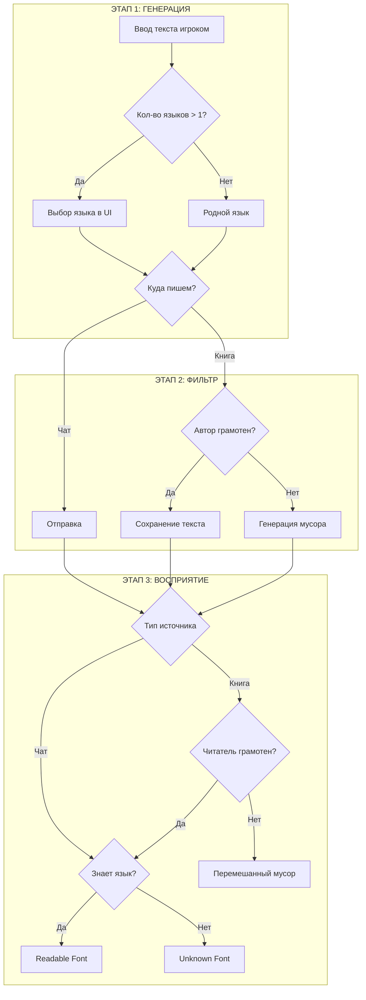

# Лингвистика (Механика и UX)

## 1. Концепция
Иммерсивная система динамической подмены шрифтов. Я хз че тут написать и надо ли.

---

## 2. Игровой цикл

### Этап 1: Источник
1. **Выбор языка:**
    * Если персонаж знает >1 языка, в UI чата/книги появляется **переключатель языка**. У каждого языка есть свой тег, который присваевается отправленному тексту игроком
    * Если персонаж знает 1 язык, выбор заблокирован (используется родной язык и его тег).
2. Игрок вводит текст.

### Этап 2: Фильтрация
Система проверяет отправителя.

* **Текст в чат (Речь):**
  1. Отправляется без изменений с тегом выбранного языка

* **Письмо в книгу:**
  1. Проверяется грамотен ли персонаж?
       * **Да:** Текст сохраняется как есть с его выбранным **тегом**.
       * **Нет:** Персонаж пытается писать, но результат искажается.
       
            Пишет на стандартном для расы языке, но получается    `_unknown.ttf` для всех, включая автора.

### Этап 3: Восприятие

**А. Восприятие на СЛУХ (Чат):**
1. Знает ли получатель язык X?
   * **Да:** Рендер шрифтом `_readable.ttf` (стандартный читаемый шрифт, стилизованный под язык). 
   * **Нет:** Рендер шрифтом `_unknown.ttf` (глифы, руны, крякозябры).

**Б. Чтение с КНИГИ (Предмет):**
1. Грамотен ли читающий?
    * **Нет:** Рендер `mixed_unknown.ttf` (полная бессмыслица), даже если язык знаком.
    * **Да:** Знает ли читающий язык X?
      * **Да:** Рендер `_readable.ttf`.
      * **Нет:** Рендер `_unknown.ttf`.

---

### 3. Графическое представление

---

## 4. Аудио-дизайн (SFX)

| Событие | Условие | Описание |
| :--- | :--- | :--- |
| **Письмо в книгу** | Грамотный | Уверенный, быстрый скрип пера по бумаге. |
| **Письмо в книгу** | Неграмотный | Прерывистый, грубый звук царапанья, частые макания пера (паузы). |
| **Речь (Чат)** | Язык известен | Обычный звук сообщения.TTS |
| **Речь (Чат)** | Язык неизвестен | БАРК |

---

## 5. Визуальные эффекты (VFX)

### 5.1. Текстовые эффекты
| Состояние | Эффект шрифта | Описание |
| :--- | :--- | :--- |
| **Понимание** | **Чистый** | Четкий текст. Шрифт имеет легкую стилизацию под расу (например, курсив для эльфов) |
| **Незнание** | **Руны** | Текст заменяется на символы 1 к 1. Длина строки сохраняется. |
| **Неграмотность** | **Перемешанные руны** | Текст перемешивается и символы заменяются на случайные |

### 5.2. UI Индикация
| Объект | Описание |
| :--- | :--- |
| **Иконка языка** | Рядом с сообщением в   чате отображается маленькая иконка флага/символа языка, если он известен. Если нет — иконка вопроса `?`. |

---
 

# Лингвистика (Данные)
## 1. База языков и шрифтов
*Привязка ассетов к логике.*

| Язык | Шрифт Readable (Знаю) | Шрифт Unknown (Не знаю) | Характеристика стиля |
| :--- | :--- | :--- | :--- |
| **Людской (Всеобщий)** | `human_read.ttf` | `human_unk.ttf` (просто перемешанный) | Простой текст. |
| **Эльфийский** | `elf_read.ttf` | `elf_unk.ttf` | Изящный, высокий, тонкий. |

## 2. Состояния грамотности
*Модификаторы восприятия книг.*

| Статус | Влияние на книги | Влияние на чат |
| :--- | :--- | :--- |
| **Грамотен** | Может читать и писать на известных языках. Неизвестные языки как каша | Нет влияния. |
| **Неграмотен** | Видит любой текст в книгах как кашу. При попытке писать создает непонятные каракули. | На слух воспринимает речь нормально (если знает язык). |

