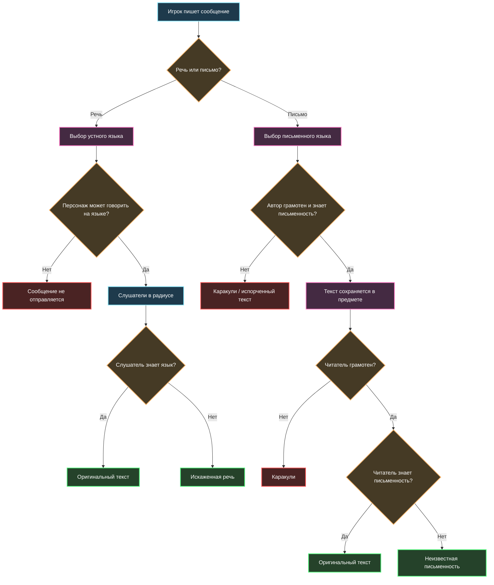

# Языки и грамотность

## 1. Концепция
Система языков работает поверх обычной речи и письма.

У персонажа есть список известных языков. Когда он говорит или пишет, текст получает тег выбранного языка. Дальше игра проверяет каждого получателя отдельно:

1. Знает язык - видит нормальный текст.
2. Не знает язык - видит замененный текст.
3. Не слышит говорящего - не получает сообщение.
4. Неграмотен - не может нормально читать даже знакомый язык.

Язык не должен быть кнопкой "секретный чат". Это обычная часть персонажа, как раса или происхождение. На нем говорят дома, пишут записки, читают объявления и пытаются понять чужаков.

---

## 2. Игровой цикл

### Этап 1: Стартовые языки персонажа
*Языки появляются у персонажа до начала раунда: от расы, происхождения, профессии и образования.*

1. При создании персонажа игра определяет **родной язык**.
2. Затем добавляются дополнительные языки:
    * от расы;
    * от культуры/поселения;
    * от образования;
    * от отдельных особенностей роли, если они нужны.
3. Если персонаж знает только один язык, он говорит на нем по умолчанию.
4. Если персонаж знает несколько языков, в чате появляется выбор языка.

#### Пример
| Персонаж | Родной язык | Дополнительные языки | Почему |
| :--- | :--- | :--- | :--- |
| Человек | Человеческий | — | Базовое общение большинства. |
| Гоблин | Гоблинский | Человеческий, если знает общий | Родная речь гоблинов. |
| Эльф | Эльфийский | Человеческий, если знает общий | Родная речь эльфов. |
| Дворф | Дворфийский (общий) | — | Дворфийский считается вариантом общего человеческого для дворфов. |

---

### Этап 2: Выбор языка в разговоре
*Игрок решает, на каком языке говорит прямо сейчас.*

1. Игрок открывает чат.
2. Рядом с полем ввода выбран текущий язык.
3. Если нужно, игрок меняет язык через переключатель.
4. Игрок отправляет сообщение.
5. Игра показывает сообщение всем, кто его услышал, но текст для каждого слушателя зависит от знания языка.

#### Правила выбора
| Ситуация | Поведение |
| :--- | :--- |
| Персонаж знает 1 язык | Переключатель скрыт или заблокирован. |
| Персонаж знает 2+ языка | Доступен список языков. |
| Игрок пытается выбрать неизвестный язык | Выбор невозможен. |
| Персонаж потерял возможность говорить | Сообщение не отправляется. |
| Персонаж под эффектом немоты/оглушения | Используются обычные правила речи SS14. |

---

### Этап 3: Восприятие речи
*Один говорящий, одно сообщение, но разные слушатели видят разный результат.*

| Слушатель | Что видит в чате |
| :--- | :--- |
| Знает язык | Исходный текст. |
| Не знает язык | Искаженный текст в стиле языка. |
| Стоит за стеной/дверью/шумоизоляцией | Текст дополнительно ухудшается или не доходит. |
| Призрак/наблюдатель | Видит исходный текст, если правила режима это разрешают. |

#### Пример
Фраза говорящего: `Они прячут ключ под алтарем.`

| Слушатель | Знает язык? | Результат |
| :--- | :--- | :--- |
| Союзник | Да | `Они прячут ключ под алтарем.` |
| Случайный крестьянин | Нет | `Ана лоррах келх тад аршем.` |
| Стражник за дверью | Нет + плохо слышит | `Ана ... келх ...` |

---

## 3. Письменность и грамотность

### Этап 1: Письмо
*Текст в книге, записке или на табличке хранит язык, а не просто строку.*

1. Игрок берет предмет для письма.
2. Выбирает язык письма.
3. Игра проверяет, грамотен ли персонаж.
4. Игра проверяет, умеет ли персонаж писать на этом языке.
5. Текст записывается на предмет.

#### Результаты письма
| Автор | Условие | Итог |
| :--- | :--- | :--- |
| Грамотный | Знает язык и письменность | Текст записан нормально. |
| Грамотный | Не знает письменность | Писать нельзя или выходит набор ошибок. |
| Неграмотный | Любой язык | Получаются каракули. |

### Этап 2: Чтение
*Читатель видит текст в зависимости от грамотности и знания языка.*

| Читатель | Знает язык | Грамотен | Что видит |
| :--- | :--- | :--- | :--- |
| Да | Да | Да | Оригинальный текст. |
| Нет | Да | Да | Незнакомую письменность/искаженный текст. |
| Да | Нет | Нет | Каракули, даже если речь языка понятна. |
| Нет | Нет | Нет | Полную кашу. |

#### Важное правило
Понимать устную речь и уметь читать письмо — разные навыки. Персонаж может говорить на человеческом общем, но не уметь читать объявление или записку.

---

## 4. Обучение языкам

### Источники изучения
| Источник | Что дает | Ограничения |
| :--- | :--- | :--- |
| Родная раса/культура | Родной язык | Нельзя убрать без особых эффектов. |
| Профессия | Может давать грамотность или доступ к обучению | Не создает отдельный язык сама по себе. |
| Учитель | Новый язык или письменность | Нужны время, место, оплата. |
| Книга/словарь | Медленное изучение | Требует грамотности. |

### Уровни знания
| Уровень | Речь | Письмо | Игровой смысл |
| :--- | :--- | :--- | :--- |
| Не знает | Видит/слышит искажение. | Не читает. | Барьер. |
| Понимает речь | Понимает разговор. | Не читает. | Можно слушать, но нельзя работать с документами. |
| Говорит | Может говорить. | Не обязательно пишет. | Социальная интеграция. |
| Читает | Понимает книги и записки. | Не обязательно пишет красиво. | Работа с лором, законами, рецептами. |
| Пишет | Может создавать документы. | Да. | Писцы, дипломаты, подделки. |

---

## 5. Графическое представление

```mermaid
graph TD
    classDef actor fill:#1e3a4c,stroke:#8be9fd,stroke-width:2px,color:#fff;
    classDef check fill:#453a25,stroke:#ffb86c,stroke-width:2px,color:#fff;
    classDef result fill:#25422a,stroke:#50fa7b,stroke-width:2px,color:#fff;
    classDef fail fill:#4a2323,stroke:#ff5555,stroke-width:2px,color:#fff;
    classDef item fill:#442a42,stroke:#ff79c6,stroke-width:2px,color:#fff;

    Start["Игрок пишет сообщение"]:::actor --> Mode{"Речь или письмо?"}:::check

    Mode -- "Речь" --> SelectSpeech["Выбор устного языка"]:::item
    SelectSpeech --> CanSpeak{"Персонаж может говорить на языке?"}:::check
    CanSpeak -- "Нет" --> SpeechFail["Сообщение не отправляется"]:::fail
    CanSpeak -- "Да" --> Hearers["Слушатели в радиусе"]:::actor
    Hearers --> KnowSpeech{"Слушатель знает язык?"}:::check
    KnowSpeech -- "Да" --> ClearSpeech["Оригинальный текст"]:::result
    KnowSpeech -- "Нет" --> BadSpeech["Искаженная речь"]:::result

    Mode -- "Письмо" --> SelectWriting["Выбор письменного языка"]:::item
    SelectWriting --> AuthorLit{"Автор грамотен и знает письменность?"}:::check
    AuthorLit -- "Нет" --> BadWriting["Каракули / испорченный текст"]:::fail
    AuthorLit -- "Да" --> Book["Текст сохраняется в предмете"]:::item
    Book --> ReaderLit{"Читатель грамотен?"}:::check
    ReaderLit -- "Нет" --> Scribbles["Каракули"]:::fail
    ReaderLit -- "Да" --> KnowWriting{"Читатель знает письменность?"}:::check
    KnowWriting -- "Да" --> ClearBook["Оригинальный текст"]:::result
    KnowWriting -- "Нет" --> BadBook["Неизвестная письменность"]:::result
```

---

## 6. База языков

### 6.1. Основные языки
*Таблица нужна для контента, баланса и постановки задач программистам.*

| Язык | Кто знает на старте | Где используется | Речь для незнающих | Письменность |
| :--- | :--- | :--- | :--- | :--- |
| **Человеческий (общий)** | Люди, большинство образованных персонажей | Быт, торговля, объявления, общие документы | Базовый читаемый/слышимый язык | Простая письменность. |
| **Гоблинский** | Гоблины, отдельные переводчики | Общение гоблинов, торг, ругань, внутренние разговоры | Резкие короткие слова | Простые угловатые знаки. |
| **Эльфийский** | Эльфы, редкие ученые/переводчики | Общение эльфов, книги, письма, культурные тексты | Мягкие протяжные слоги | Изящная письменность. |
| **Дворфийский (общий)** | Дворфы, персонажи с дворфийским происхождением | Общение дворфов, ремесленные записи, клановые пометки | Считается вариантом человеческого общего; отдельный барьер нужен только если это решено балансом | Письменность близка к общей, но с дворфийским стилем. |

### 6.2. Параметры языка
| Параметр | Для чего нужен |
| :--- | :--- |
| Название | Что показывать знающим язык. |
| Цвет | Быстрая визуальная привязка в чате. |
| Иконка | Маленький знак языка в UI. |
| Набор замен | Как выглядит непонятная речь. |
| Шрифт речи | Легкая стилизация понятного сообщения. |
| Шрифт письма | Вид книг, грамот, табличек. |
| Доступность | Кто может получить язык на старте. |
| Распознавание | Может ли персонаж понять, какой язык слышит, даже если не понимает текст. |

---

## 7. Визуальные эффекты

### 7.1. Чат
| Состояние | Визуал |
| :--- | :--- |
| Язык понятен | Обычный текст, цвет языка, опциональная метка языка. |
| Язык неизвестен | Текст заменен на псевдоязык. Название языка не раскрывается, если персонаж его не узнает. |

### 7.2. Книги и документы
| Состояние | Визуал |
| :--- | :--- |
| Читатель понимает текст | Обычный читаемый текст. |
| Читатель знает язык, но неграмотен | Каракули/пятна/непонятные строки. |
| Читатель грамотен, но не знает язык | Чужая письменность с сохранением структуры строк. |
| Текст испорчен | Пропуски, кляксы, стертые места. |

---

## 8. UI

### 8.1. Переключатель языка в чате
| Элемент | Поведение |
| :--- | :--- |
| Кнопка языка | Показывает текущий язык. |
| Выпадающий список | Показывает языки, на которых персонаж может говорить. |
| Подсказка | Объясняет, почему язык недоступен. |
| Ошибка отправки | Не стирает введенный текст. |

### 8.2. Окно книги
| Элемент | Поведение |
| :--- | :--- |
| Выбор языка письма | Доступен при редактировании текста. |
| Вид текста | Зависит от грамотности и знания письменности. |
| Метка языка | Показывается, если читатель распознает язык. |
| Состояние текста | Чистый, испорченный, каракули, неизвестная письменность. |

---

## 9. Требования к системе

### Обязательные правила
1. Нельзя говорить на языке, который персонаж не знает.
2. Нельзя читать письменность, если персонаж неграмотен.
3. Нельзя читать неизвестный письменный язык без знания языка или письменности.
4. Оригинальный текст неизвестного языка не должен попадать игроку, который его не понимает.
5. Админы и логи должны иметь доступ к оригинальному тексту.
6. Искажение речи должно быть стабильным и узнаваемым для каждого языка.
7. Базовые правила слышимости чата применяются до проверки понимания языка.
8. UI не должен раскрывать название неизвестного языка, если персонаж не может его распознать.

### Проверки приемки
| Проверка | Ожидаемый результат |
| :--- | :--- |
| Игрок говорит на известном языке рядом с союзником | Союзник читает оригинал. |
| Игрок говорит на известном языке рядом с чужаком | Чужак видит искаженный текст. |
| Игрок пытается выбрать неизвестный язык | Сообщение не отправляется. |
| Неграмотный открывает книгу на родном языке | Видит каракули. |
| Грамотный открывает книгу на неизвестном языке | Видит неизвестную письменность. |

---

## 10. Открытые вопросы

1. Человеческий общий знают все игровые расы на старте или только часть?
2. Нужны ли отдельные уровни: понимать, говорить, читать, писать?
3. Можно ли распознать неизвестный язык по звучанию без понимания?
4. Дворфийский технически отдельный язык или вариант человеческого общего?
5. Как долго учится новый язык в рамках раунда?
6. Можно ли подделывать знание языка через словарь?
7. Должны ли животные/монстры иметь свои "языки" или это отдельная система звуков?
8. Нужны ли акценты поверх языков?
9. Какие профессии обязаны быть грамотными на старте?
