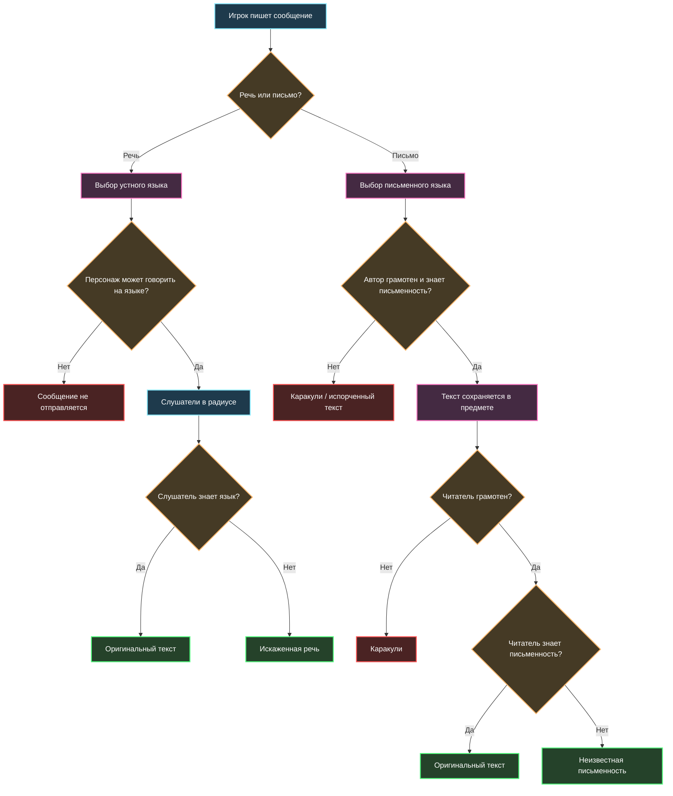

# Языки и грамотность

## 1. Концепция
Языки делят игроков на тех, кто понимает сказанное, и тех, кто слышит чужую речь как набор незнакомых слов, звуков или символов.

Игрок не нажимает кнопку "перевести". Он заранее знает языки своего персонажа, выбирает один из них для речи или письма, а дальше игра сама решает, кто понял сообщение.

Главная польза механики:

1. Закрытые разговоры без отдельного OOC-договора.
2. Расовые, сословные и религиозные различия.
3. Ценность писцов, переводчиков, ученых, жрецов и дипломатов.
4. Смысл для книг, табличек, грамот, тайных культов и старых руин.
5. Дополнительный слой подозрения: игрок видит, что кто-то говорит не на общем языке, но не получает содержание.

---

## 2. Игровой цикл

### Этап 1: Стартовые языки персонажа
*Языки появляются у персонажа до начала раунда: от расы, происхождения, профессии и образования.*

1. При создании персонажа игра определяет **родной язык**.
2. Затем добавляются дополнительные языки:
    * от расы;
    * от культуры/поселения;
    * от профессии;
    * от образования;
    * от религии, ордена или тайной группы.
3. Если персонаж знает только один язык, он говорит на нем по умолчанию.
4. Если персонаж знает несколько языков, в чате появляется выбор языка.

#### Пример
| Персонаж | Родной язык | Дополнительные языки | Почему |
| :--- | :--- | :--- | :--- |
| Крестьянин | Глоса | — | Базовое общение поселения. |
| Дворянин | Глоса | Дворцовый | Образование и статус. |
| Шахтер из клана | Глоса | Подземный | Профессия и клановая среда. |
| Жрец | Глоса | Старорунный, храмовый | Чтение молитв и ритуальных текстов. |
| Культист | Глоса | Запретный | Тайные обряды. |

---

### Этап 2: Выбор языка в разговоре
*Игрок решает, на каком языке говорит прямо сейчас.*

1. Игрок открывает чат.
2. Рядом с полем ввода выбран текущий язык.
3. Если нужно, игрок меняет язык через переключатель.
4. Игрок отправляет сообщение.
5. Игра показывает сообщение всем, кто его услышал, но текст для каждого слушателя зависит от знания языка.

#### Правила выбора
| Ситуация | Поведение |
| :--- | :--- |
| Персонаж знает 1 язык | Переключатель скрыт или заблокирован. |
| Персонаж знает 2+ языка | Доступен список языков. |
| Игрок пытается выбрать неизвестный язык | Выбор невозможен. |
| Персонаж потерял возможность говорить | Сообщение не отправляется. |
| Персонаж под эффектом немоты/оглушения | Используются обычные правила речи SS14. |

---

### Этап 3: Восприятие речи
*Один говорящий, одно сообщение, но разные слушатели видят разный результат.*

| Слушатель | Что видит в чате |
| :--- | :--- |
| Знает язык | Исходный текст. |
| Не знает язык | Искаженный текст в стиле языка. |
| Слышит только шепот издалека | Частично испорченный текст. |
| Стоит за стеной/дверью/шумоизоляцией | Текст дополнительно ухудшается или не доходит. |
| Призрак/наблюдатель | Видит исходный текст, если правила режима это разрешают. |

#### Пример
Фраза говорящего: `Они прячут ключ под алтарем.`

| Слушатель | Знает язык? | Результат |
| :--- | :--- | :--- |
| Союзник | Да | `Они прячут ключ под алтарем.` |
| Случайный крестьянин | Нет | `Ана лоррах келх тад аршем.` |
| Стражник за дверью | Нет + плохо слышит | `Ана ... келх ...` |

---

## 3. Речь, шепот и расстояние

### Обычная речь
*Работает как стандартная локальная речь, но с проверкой языка.*

1. Игрок говорит на выбранном языке.
2. Все в радиусе голоса получают сообщение.
3. Знающие язык получают оригинал.
4. Незнающие получают замененный текст.

### Шепот
*Шепот сохраняет языковые правила, но сильнее зависит от расстояния.*

| Дистанция | Знает язык | Не знает язык |
| :--- | :--- | :--- |
| Рядом | Читает шепот полностью. | Видит тихий искаженный текст. |
| На границе шепота | Видит часть слов. | Видит почти бессвязные обрывки. |
| Дальше радиуса | Не получает сообщение. | Не получает сообщение. |

### Крик
*Крик увеличивает дальность, но не переводит язык.*

Если персонаж кричит на неизвестном языке, его услышат дальше, но понятнее от этого не станет.

---

## 4. Письменность и грамотность

### Этап 1: Письмо
*Текст в книге, записке или на табличке хранит язык, а не просто строку.*

1. Игрок берет предмет для письма.
2. Выбирает язык письма.
3. Игра проверяет, грамотен ли персонаж.
4. Игра проверяет, умеет ли персонаж писать на этом языке.
5. Текст записывается на предмет.

#### Результаты письма
| Автор | Знает письменность? | Итог |
| :--- | :--- | :--- |
| Грамотный и знает язык | Текст записан нормально. |
| Грамотный, но не знает письменность | Писать нельзя или выходит набор ошибок. |
| Неграмотный | Получаются каракули. |
| Под магическим эффектом | Может временно писать/копировать запрещенный язык. |

### Этап 2: Чтение
*Читатель видит текст в зависимости от грамотности и знания языка.*

| Читатель | Знает язык | Грамотен | Что видит |
| :--- | :--- | :--- | :--- |
| Да | Да | Да | Оригинальный текст. |
| Нет | Да | Да | Незнакомую письменность/искаженный текст. |
| Да | Нет | Нет | Каракули, даже если речь языка понятна. |
| Нет | Нет | Нет | Полную кашу. |

#### Важное правило
Понимать устную речь и уметь читать письмо — разные навыки. Крестьянин может говорить на Глосе, но не читать судебную грамоту.

---

## 5. Обучение языкам

### Источники изучения
| Источник | Что дает | Ограничения |
| :--- | :--- | :--- |
| Родная раса/культура | Родной язык | Нельзя убрать без особых эффектов. |
| Профессия | Профессиональный язык | Только при старте или через обучение. |
| Учитель | Новый язык или письменность | Нужны время, место, оплата. |
| Книга/словарь | Медленное изучение | Требует грамотности. |
| Магия | Временное понимание | Может иметь цену или побочный эффект. |
| Ритуал/культ | Тайный язык | Риск, запреты, последствия. |

### Уровни знания
| Уровень | Речь | Письмо | Игровой смысл |
| :--- | :--- | :--- | :--- |
| Не знает | Видит/слышит искажение. | Не читает. | Барьер. |
| Понимает речь | Понимает разговор. | Не читает. | Можно слушать, но нельзя работать с документами. |
| Говорит | Может говорить. | Не обязательно пишет. | Социальная интеграция. |
| Читает | Понимает книги и записки. | Не обязательно пишет красиво. | Работа с лором, законами, рецептами. |
| Пишет | Может создавать документы. | Да. | Писцы, дипломаты, подделки. |

---

## 6. Графическое представление

```mermaid
graph TD
    classDef actor fill:#1e3a4c,stroke:#8be9fd,stroke-width:2px,color:#fff;
    classDef check fill:#453a25,stroke:#ffb86c,stroke-width:2px,color:#fff;
    classDef result fill:#25422a,stroke:#50fa7b,stroke-width:2px,color:#fff;
    classDef fail fill:#4a2323,stroke:#ff5555,stroke-width:2px,color:#fff;
    classDef item fill:#442a42,stroke:#ff79c6,stroke-width:2px,color:#fff;

    Start["Игрок пишет сообщение"]:::actor --> Mode{"Речь или письмо?"}:::check

    Mode -- "Речь" --> SelectSpeech["Выбор устного языка"]:::item
    SelectSpeech --> CanSpeak{"Персонаж может говорить на языке?"}:::check
    CanSpeak -- "Нет" --> SpeechFail["Сообщение не отправляется"]:::fail
    CanSpeak -- "Да" --> Hearers["Слушатели в радиусе"]:::actor
    Hearers --> KnowSpeech{"Слушатель знает язык?"}:::check
    KnowSpeech -- "Да" --> ClearSpeech["Оригинальный текст"]:::result
    KnowSpeech -- "Нет" --> BadSpeech["Искаженная речь"]:::result

    Mode -- "Письмо" --> SelectWriting["Выбор письменного языка"]:::item
    SelectWriting --> AuthorLit{"Автор грамотен и знает письменность?"}:::check
    AuthorLit -- "Нет" --> BadWriting["Каракули / испорченный текст"]:::fail
    AuthorLit -- "Да" --> Book["Текст сохраняется в предмете"]:::item
    Book --> ReaderLit{"Читатель грамотен?"}:::check
    ReaderLit -- "Нет" --> Scribbles["Каракули"]:::fail
    ReaderLit -- "Да" --> KnowWriting{"Читатель знает письменность?"}:::check
    KnowWriting -- "Да" --> ClearBook["Оригинальный текст"]:::result
    KnowWriting -- "Нет" --> BadBook["Неизвестная письменность"]:::result
```

---

## 7. База языков

### 7.1. Основные языки
*Таблица нужна для контента, баланса и постановки задач программистам.*

| Язык | Кто знает на старте | Где используется | Речь для незнающих | Письменность |
| :--- | :--- | :--- | :--- | :--- |
| **Глоса** | Большинство жителей | Быт, торговля, обычные объявления | Не искажается или искажается слабо | Простая, доступная. |
| **Дворцовый** | Дворяне, чиновники, дипломаты | Суд, указы, договоры | Высокие формальные псевдослова | Сложная каллиграфия. |
| **Старорунный** | Жрецы, ученые, хранители архивов | Храмы, руины, молитвы, древние таблички | Тяжелые рунные слоги | Руны, резьба, камень. |
| **Подземный** | Шахтерские кланы, ремесленники | Шахты, кузницы, клановые сделки | Грубые короткие слова | Угловатые знаки. |
| **Лесной** | Лесные общины, травники, часть эльфов | Травы, охота, духи леса | Мягкие протяжные слоги | Тонкие знаки, листья/кора. |
| **Запретный** | Культы, проклятые книги | Ритуалы, жертвы, темная магия | Ломаные звуки, неприятный ритм | Символы, которые нельзя читать без риска. |

### 7.2. Параметры языка
| Параметр | Для чего нужен |
| :--- | :--- |
| Название | Что показывать знающим язык. |
| Цвет | Быстрая визуальная привязка в чате. |
| Иконка | Маленький знак языка в UI. |
| Набор замен | Как выглядит непонятная речь. |
| Шрифт речи | Легкая стилизация понятного сообщения. |
| Шрифт письма | Вид книг, грамот, табличек. |
| Доступность | Кто может получить язык на старте. |
| Запретность | Реагируют ли закон, церковь или NPC на этот язык. |

---

## 8. Визуальные эффекты

### 8.1. Чат
| Состояние | Визуал |
| :--- | :--- |
| Язык понятен | Обычный текст, цвет языка, опциональная метка языка. |
| Язык неизвестен | Текст заменен на псевдоязык. Название языка не раскрывается, если персонаж его не узнает. |
| Шепот | Меньше информации, часть слов теряется. |
| Крик | Сообщение заметнее, но не становится понятнее. |
| Запретный язык | Можно добавить неприятный цвет/эффект, но без перегруза интерфейса. |

### 8.2. Книги и документы
| Состояние | Визуал |
| :--- | :--- |
| Читатель понимает текст | Обычный читаемый текст. |
| Читатель знает язык, но неграмотен | Каракули/пятна/непонятные строки. |
| Читатель грамотен, но не знает язык | Чужая письменность с сохранением структуры строк. |
| Текст испорчен | Пропуски, кляксы, стертые места. |
| Магический текст | Символы могут слегка мерцать или меняться при чтении. |

---

## 9. Аудио-дизайн

| Событие | Условие | Описание |
| :--- | :--- | :--- |
| Обычная речь | Язык понятен | Стандартный звук сообщения/речи. |
| Обычная речь | Язык неизвестен | Тот же речевой сигнал, но без отдельного "перевода". |
| Шепот | Любой язык | Тихий короткий cue. |
| Крик | Любой язык | Более резкий cue, слышимый дальше. |
| Письмо грамотного | Перо/уголь/резец | Ровный звук письма. |
| Письмо неграмотного | Попытка писать | Неровные царапины, паузы. |
| Чтение запретного текста | Магический язык | Тихий низкий звук или шорох страниц. |

---

## 10. UI

### 10.1. Переключатель языка в чате
| Элемент | Поведение |
| :--- | :--- |
| Кнопка языка | Показывает текущий язык. |
| Выпадающий список | Показывает языки, на которых персонаж может говорить. |
| Режим шепота | Переключается отдельно, не меняет язык. |
| Подсказка | Объясняет, почему язык недоступен. |
| Ошибка отправки | Не стирает введенный текст. |

### 10.2. Окно книги
| Элемент | Поведение |
| :--- | :--- |
| Выбор языка письма | Доступен при редактировании текста. |
| Вид текста | Зависит от грамотности и знания письменности. |
| Метка языка | Показывается, если читатель распознает язык. |
| Состояние текста | Чистый, испорченный, каракули, неизвестная письменность. |

---

## 11. Зависимости

### 11.1. Зависимости от других систем
| Система | Зачем нужна |
| :--- | :--- |
| Расы | Родные языки и культурные языки. |
| Профессии | Стартовые языки для жрецов, дворян, шахтеров, писцов. |
| Навыки/образование | Грамотность, чтение, письмо, обучение. |
| Чат | Отправка разного текста разным слушателям. |
| Шепот/звук/препятствия | Дальность речи и ухудшение слышимости. |
| Книги/бумага/таблички | Хранение языка и состояния текста. |
| Магия | Временное понимание, запретные языки, проклятые книги. |
| Закон | Официальные языки, запретные языки, судебные документы. |
| Экономика | Цена переводов, книг, обучения. |
| Админ-логи | Проверка оригинального текста при разборе конфликтов. |

### 11.2. Контентные зависимости
| Что нужно | Пример |
| :--- | :--- |
| Список языков | Глоса, Дворцовый, Старорунный, Подземный, Лесной, Запретный. |
| Списки стартовых языков | По расам, профессиям, культурам. |
| Наборы замен | Слова, слоги, символы для каждого языка. |
| Шрифты | Для письменности и, возможно, для чата. |
| Иконки | Маленькие знаки языков. |
| Локализация | Названия языков, ошибки, подсказки. |
| Предметы обучения | Словари, учебники, свитки, грамоты. |

---

## 12. Требования к системе

### Обязательные правила
1. Нельзя говорить на языке, который персонаж не знает.
2. Нельзя читать письменность, если персонаж неграмотен.
3. Нельзя читать неизвестный письменный язык без обучения или магии.
4. Оригинальный текст неизвестного языка не должен попадать игроку, который его не понимает.
5. Админы и логи должны иметь доступ к оригинальному тексту.
6. Искажение речи должно быть стабильным и узнаваемым для каждого языка.
7. Шепот и звукоизоляция применяются поверх языковой механики.
8. UI не должен раскрывать название неизвестного языка, если персонаж не может его распознать.

### Проверки приемки
| Проверка | Ожидаемый результат |
| :--- | :--- |
| Игрок говорит на известном языке рядом с союзником | Союзник читает оригинал. |
| Игрок говорит на известном языке рядом с чужаком | Чужак видит искаженный текст. |
| Игрок пытается выбрать неизвестный язык | Сообщение не отправляется. |
| Неграмотный открывает книгу на родном языке | Видит каракули. |
| Грамотный открывает книгу на неизвестном языке | Видит неизвестную письменность. |
| Жрец читает старорунную табличку | Видит оригинальный текст. |
| Крик на неизвестном языке слышит толпа | Толпа видит громкое, но непонятное сообщение. |
| Шепот на известном языке слышен издалека | Часть слов теряется. |

---

## 13. Задачи для программистов

| Приоритет | Задача | Результат |
| :--- | :--- | :--- |
| P0 | Добавить хранение известных языков у персонажа. | Персонаж имеет родной и дополнительные языки. |
| P0 | Добавить выбор языка в чате. | Игрок может говорить на выбранном языке. |
| P0 | Сделать разный текст для разных слушателей. | Знающие видят оригинал, незнающие искажение. |
| P0 | Запретить речь на неизвестном языке. | Игрок не может обходить механику. |
| P0 | Добавить 5-6 базовых языков и наборы замен. | Есть контент для проверки механики. |
| P1 | Добавить грамотность и письменность. | Книги и документы начинают зависеть от языка. |
| P1 | Добавить UI выбора языка для книг. | Игрок выбирает язык письма. |
| P1 | Добавить стартовые языки по расам/ролям. | Механика связана с персонажами. |
| P2 | Добавить обучение языкам. | Словари, учителя, книги, магия. |
| P2 | Добавить запретные языки и реакцию закона/церкви. | Язык становится социальным риском. |

---

## 14. Открытые вопросы

1. Глоса полностью универсальна или часть существ ее не знает?
2. Нужны ли отдельные уровни: понимать, говорить, читать, писать?
3. Можно ли распознать неизвестный язык по звучанию без понимания?
4. Должны ли некоторые языки быть запрещены законом?
5. Как долго учится новый язык в рамках раунда?
6. Может ли язык забываться из-за травмы, проклятия или безумия?
7. Можно ли подделывать знание языка через словарь?
8. Должны ли животные/монстры иметь свои "языки" или это отдельная система звуков?
9. Нужны ли акценты поверх языков?
10. Какие профессии обязаны быть грамотными на старте?
