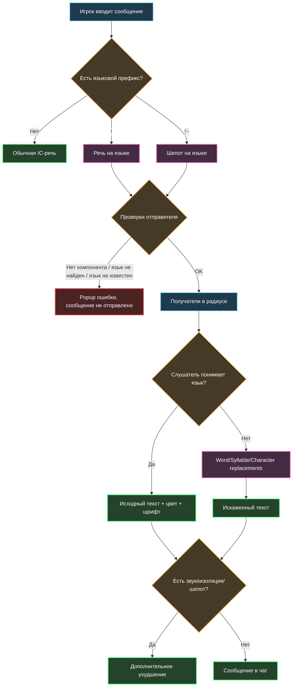

# Языки и грамотность

## 1. Концепция
Система языков нужна не как декоративная подмена шрифта, а как социальная механика доступа к информации. Один и тот же текст должен восприниматься по-разному разными игроками: знающий язык получает исходное сообщение, незнающий получает искаженную речь, а наблюдатель и администратор должны иметь достаточный контекст для разбора ситуации.

Базовая цель MVP: встроить языки в существующий чат SS14 так, чтобы каждое IC-сообщение могло иметь язык, цвет, шрифт и набор правил искажения для слушателей, которые этот язык не знают.

Расширенная цель: связать языки с расами, происхождением, профессиями, грамотностью, книгами, письмом, обучением и магическими/религиозными источниками знания.

---

## 2. Источник реализации: PR #14
Документ переносит и структурирует механику из `respiral-tree/ss14-respiral#14`.

### 2.1. Что уже заложено в PR

| Узел | Назначение | GDD-вывод |
| :--- | :--- | :--- |
| `LanguagePrototype` | Описывает язык как прототип: `id`, `name`, `keyCode`, `color`, `dataset`, `default`, `font`. | Все языки должны быть контентными прототипами, а не хардкодом. |
| `WordReplacementDatasetPrototype` | Хранит словари замен слов, слогов и символов. | Непонятная речь должна генерироваться через управляемые наборы замен. |
| `SpokenLanguageComponent` | Хранит родной язык и известные языки сущности. | Знание языков является компонентом персонажа/существа. |
| `LanguageSystem` | Проверяет понимание и трансформирует текст для незнающих. | Сервер решает, какой текст увидит каждый получатель. |
| `ChatChannel.Language` | Новый канал чата для понятной языковой речи. | Языковую речь можно фильтровать и красить отдельно. |
| `LanguageSayCommand` | Команда `/language`, которая отправляет языковое сообщение. | Нужен явный пользовательский способ говорить на языке. |
| `IlliteracyComponent` | Пустой маркер неграмотности. | Грамотность пока не реализована, но точка расширения уже есть. |

### 2.2. Текущее MVP-поведение из PR

1. При `MapInit`, если у сущности есть `SpokenLanguageComponent`, но нет известных языков, система добавляет ей `DefaultLanguage`.
2. Призраки понимают все языки.
3. Сущность без `SpokenLanguageComponent` не понимает языки.
4. Если слушатель знает язык, он видит исходный текст.
5. Если слушатель не знает язык, текст проходит через dataset языка: сначала замены слов, потом слогов, потом символов.
6. Если у языка нет dataset, текст не меняется.
7. Языковая речь использует префикс `!<key>`.
8. Языковый шепот использует префикс `!~<key>`.
9. Известная слушателю языковая речь отправляется в `ChatChannel.Language`.
10. Неизвестная обычная речь визуально выглядит как локальная речь, но с искаженным текстом.
11. Неизвестный шепот дополнительно учитывает дистанцию, muffled whisper и звукоизоляцию.

### 2.3. Риски текущего PR, которые нужно закрыть

| Риск | Почему важно | Требование |
| :--- | :--- | :--- |
| Нет проверки, что говорящий знает выбранный язык. | Игрок сможет говорить на любом языке по ключу, если знает `keyCode`. | Перед отправкой проверять `KnownLanguages` говорящего. |
| `Common` имеет `dataset: null`. | Если язык не должен быть тайным, это нормально; если должен искажаться для чужих, dataset обязателен. | Явно решить, является ли `Common` универсальным языком. |
| В PR есть только один прототип `Common`. | Механика есть, контента языков нет. | Добавить таблицу языков, ключей, цветов, шрифтов и dataset. |
| `IlliteracyComponent` пока пустой. | Книги и письмо не могут использовать грамотность без правил. | Описать и реализовать чтение/письмо отдельным слоем. |
| Dataset использует loc-id. | Ошибки локализации сломают генерацию непонятной речи. | Добавить валидаторы прототипов и тесты dataset. |
| Шрифт применяется к понятной языковой речи. | Старый GDD ожидал шрифт как главный способ непонимания. | Шрифт считать визуальным слоем, не источником логики. |

---

## 3. Игровой цикл

### Этап 1: Выбор языка
Игрок выбирает способ речи:

1. Обычная локальная речь без языкового префикса.
2. Языковая речь через `!<key> текст`.
3. Языковый шепот через `!~<key> текст`.
4. В будущем: выбор из UI-переключателя рядом с полем ввода.

Если у персонажа известен только один язык, UI может скрывать выбор, но команда должна продолжать работать для тестирования и админских сценариев.

### Этап 2: Проверка отправителя
Сервер проверяет:

1. Персонаж может говорить.
2. Сообщение проходит sanitization чата.
3. У персонажа есть `SpokenLanguageComponent`.
4. Выбранный язык существует.
5. Выбранный язык входит в `KnownLanguages` говорящего.
6. Если это шепот, применяется радиус шепота.
7. Если это обычная речь, применяется радиус голоса.

Если язык не найден или персонаж его не знает, сообщение не отправляется, а игрок получает popup с причиной.

### Этап 3: Доставка слушателям
Для каждого потенциального получателя сервер отдельно решает итоговый текст:

| Слушатель | Итог |
| :--- | :--- |
| Знает язык | Получает исходный текст, цвет и шрифт языка. |
| Не знает язык | Получает трансформированный текст через dataset. |
| Призрак | Получает исходный текст. |
| Администратор | Получает исходный текст в логах; режим отображения в чате уточнить. |
| Слушатель за звукоизоляцией | Получает дополнительно ухудшенный текст или не получает сообщение. |
| Слушатель вне радиуса | Не получает сообщение. |

### Этап 4: Восприятие и UI
Игрок должен понимать не содержание неизвестной речи, а сам факт языкового барьера.

| Состояние | UI-сигнал |
| :--- | :--- |
| Язык понятен | Цвет языка, опционально название языка в tooltip/метке, читаемый текст. |
| Язык неизвестен | Искаженный текст, без точного названия языка либо с нейтральной меткой `Неизвестный язык`. |
| Язык известен, но сообщение шепотом | Обычные правила шепота + язык. |
| Язык выбран неверно | Popup ошибки, текст остается в поле ввода. |

---

## 4. Схема обработки

```mermaid
graph TD
    classDef actor fill:#1e3a4c,stroke:#8be9fd,stroke-width:2px,color:#fff;
    classDef data fill:#442a42,stroke:#ff79c6,stroke-width:2px,color:#fff;
    classDef check fill:#453a25,stroke:#ffb86c,stroke-width:2px,color:#fff;
    classDef result fill:#25422a,stroke:#50fa7b,stroke-width:2px,color:#fff;
    classDef fail fill:#4a2323,stroke:#ff5555,stroke-width:2px,color:#fff;

    Input["Игрок вводит сообщение"]:::actor --> Prefix{"Есть языковой префикс?"}:::check
    Prefix -- "Нет" --> Local["Обычная IC-речь"]:::result
    Prefix -- "!<key>" --> LangKey["Речь на языке"]:::data
    Prefix -- "!~<key>" --> WhisperKey["Шепот на языке"]:::data

    LangKey --> SenderChecks{"Проверки отправителя"}:::check
    WhisperKey --> SenderChecks
    SenderChecks -- "Нет компонента / язык не найден / язык не известен" --> Error["Popup ошибки, сообщение не отправлено"]:::fail
    SenderChecks -- "OK" --> Recipients["Получатели в радиусе"]:::actor

    Recipients --> Understands{"Слушатель понимает язык?"}:::check
    Understands -- "Да" --> Original["Исходный текст + цвет + шрифт"]:::result
    Understands -- "Нет" --> Dataset["Word/Syllable/Character replacements"]:::data
    Dataset --> Distortion["Искаженный текст"]:::result

    Original --> Insulation{"Есть звукоизоляция/шепот?"}:::check
    Distortion --> Insulation
    Insulation -- "Да" --> ExtraObfuscation["Дополнительное ухудшение"]:::result
    Insulation -- "Нет" --> Chat["Сообщение в чат"]:::result
```

---

## 5. Данные и прототипы

### 5.1. `LanguagePrototype`

| Поле | Тип | Обязательность | Назначение |
| :--- | :--- | :--- | :--- |
| `id` | string | Обязательно | Стабильный идентификатор языка. |
| `name` | loc-id | Обязательно | Локализованное имя языка. |
| `keyCode` | char | Для недефолтных | Короткий ключ для `!<key>`. |
| `color` | color | Желательно | Цвет сообщений и UI-индикации. |
| `dataset` | proto-id / null | Обязательно для тайных языков | Набор замен для непонимающих. |
| `default` | bool | Опционально | Язык по умолчанию. |
| `font` | string | Опционально | Визуальный шрифт понятного текста. |

### 5.2. `SpokenLanguageComponent`

| Поле | Назначение |
| :--- | :--- |
| `DefaultLanguage` | Родной/базовый язык сущности. |
| `KnownLanguages` | Набор языков, которые сущность понимает и может использовать. |

Правило инициализации: если `KnownLanguages` пустой, в него добавляется `DefaultLanguage`.

### 5.3. `WordReplacementDatasetPrototype`

| Слой | Когда применять | Пример назначения |
| :--- | :--- | :--- |
| `WordReplacements` | Сначала | Замена частых слов на псевдословарь языка. |
| `SyllableReplacements` | После слов | Создание узнаваемой фонетики. |
| `CharacterReplacements` | В конце | Финальная маскировка букв и алфавитный стиль. |

Правило порядка важно: крупные замены должны происходить раньше мелких, иначе символы сломают поиск слов.

### 5.4. Черновая таблица языков

| Язык | ID | Ключ | Статус | Источник знания | Dataset | Комментарий |
| :--- | :--- | :--- | :--- | :--- | :--- | :--- |
| Глоса | `Common` | нет | MVP | Базовый язык большинства | `null` | Сейчас единственный язык из PR. Нужно решить, универсален ли он. |
| Дворцовый | `Court` | `c` | Нужно добавить | Образование, двор, чиновники | `CourtDataset` | Нужен для бюрократии, законов, документов. |
| Старорунный | `OldRunic` | `r` | Нужно добавить | Жрецы, ученые, древние тексты | `OldRunicDataset` | Хороший кандидат для книг, табличек и ритуалов. |
| Лесной | `Sylvan` | `s` | Нужно добавить | Происхождение/раса/учителя | `SylvanDataset` | Социальная сегрегация и локальные поселения. |
| Подземный | `Deep` | `d` | Нужно добавить | Ремесленники, шахтерские кланы | `DeepDataset` | Связать с шахтами, ремеслом, торговлей. |
| Тайный культовый | `Cultic` | `k` | Нужно добавить | Ритуалы, вера, запретные книги | `CulticDataset` | Не должен быть доступен через обычный стартовый выбор. |

---

## 6. Грамотность, книги и письмо

PR добавляет только маркер `IlliteracyComponent`, поэтому правила ниже являются требованиями следующего слоя.

### 6.1. Состояния грамотности

| Состояние | Чат | Книги | Письмо |
| :--- | :--- | :--- | :--- |
| Грамотен | Понимает речь известных языков. | Читает известные письменные языки. | Может писать на известных письменных языках. |
| Неграмотен | На слух понимает известные языки. | Не может читать даже известный язык. | Создает каракули/испорченный текст. |
| Полуграмотен | Понимает речь известных языков. | Читает медленно, с шансом пропусков. | Пишет с ошибками или задержкой. |

### 6.2. Разделение речи и письма
Язык не обязан иметь одинаковую устную и письменную форму.

| Параметр | Значение |
| :--- | :--- |
| `spokenLanguage` | Проверяется для чата и шепота. |
| `writtenLanguage` | Проверяется для книг, табличек, свитков и заметок. |
| `requiresLiteracy` | Если true, чтение/письмо требуют отсутствия `IlliteracyComponent`. |
| `scriptFont` | Шрифт письменного текста. |
| `unknownScriptDataset` | Dataset для неизвестной письменности. |

### 6.3. Игровой цикл книги

1. Автор выбирает язык письма.
2. Система проверяет грамотность автора.
3. Система проверяет, знает ли автор письменную форму языка.
4. Текст сохраняется с тегом языка, автором, временем и состоянием качества письма.
5. Читатель открывает книгу.
6. Система проверяет грамотность читателя.
7. Система проверяет знание письменного языка.
8. Клиент получает либо оригинал, либо письменное искажение, либо полностью нечитаемую кашу.

---

## 7. UX и управление

### 7.1. MVP-управление

| Действие | Формат | Результат |
| :--- | :--- | :--- |
| Сказать на языке | `!<key> текст` | Сообщение в радиусе голоса. |
| Шепнуть на языке | `!~<key> текст` | Сообщение в радиусе шепота. |
| Отправить через команду | `/language <...>` | То же, что языковая речь. |

### 7.2. Требуемый UI-переключатель
Командные префиксы годятся для MVP, но основная игра должна иметь UI.

| Элемент | Поведение |
| :--- | :--- |
| Переключатель языка | Показывает только известные персонажу языки. |
| Иконка/цвет языка | Повторяет цвет из `LanguagePrototype`. |
| Шепот | Отдельный режим или модификатор текущего языка. |
| Tooltip | Показывает название языка, если персонаж его знает; иначе `Неизвестный язык`. |
| Ошибки | Не очищают поле ввода, чтобы игрок не потерял текст. |

---

## 8. SFX и VFX

### 8.1. Аудио

| Событие | Условие | Звук |
| :--- | :--- | :--- |
| Языковая речь понятна | Слушатель знает язык | Обычный звук сообщения или TTS-профиль языка. |
| Языковая речь непонятна | Слушатель не знает язык | Тот же звук сообщения, без раскрытия смысла. |
| Языковый шепот | Любой язык | Тихий whisper cue. |
| Письмо грамотного автора | Есть письменность | Ровный звук пера/угля/резца. |
| Письмо неграмотного автора | Есть `IlliteracyComponent` | Неровное царапанье, паузы, исправления. |

### 8.2. Визуал

| Состояние | Визуальное правило |
| :--- | :--- |
| Понятный язык | Цвет и шрифт из прототипа. |
| Непонятный язык | Текст уже искажен сервером; клиент не должен хранить оригинал. |
| Письменность | Может использовать отдельный `scriptFont`. |
| Неизвестная письменность | Искажение должно сохранять примерную длину и структуру строк. |

---

## 9. Зависимости для постановки задач

### 9.1. Кодовые зависимости

| Система | Что требуется |
| :--- | :--- |
| `SharedChatSystem` | Парсинг `!<key>` и `!~<key>`, кеширование языковых ключей. |
| `ChatSystem` | Доставка разного текста разным слушателям. |
| `LanguageSystem` | Проверка понимания, проверка права говорить, трансформация текста. |
| `ChatUIController` | Выбор канала, отображение языка, сохранение текста при ошибках. |
| `PrototypeManager` | Загрузка языков и dataset. |
| `Loc` | Локализованные словари замен. |
| `PopupSystem` | Ошибки: нет ключа, нет языка, язык неизвестен персонажу. |
| `ActionBlockerSystem` | Запрет речи при немоте, критическом состоянии и иных блокировках. |
| `SoundInsulationSystem` | Дополнительное ухудшение слышимости. |
| `ExamineSystem` | Проверка расстояния/видимости для шепота. |
| `AdminLog` и replay | Логи должны хранить исходный текст и язык. |

### 9.2. Контентные зависимости

| Область | Что нужно определить |
| :--- | :--- |
| Расы/происхождение | Родные языки и стартовые известные языки. |
| Профессии/роли | Дополнительные языки, грамотность, специальные письменности. |
| Навыки | Влияют ли знания/образование на языки. |
| Книги и документы | Формат хранения языка текста. |
| Магия и вера | Языки ритуалов, запретные тексты, временное понимание. |
| Экономика | Цена книг, учителей, переводов. |
| Законы | Официальный язык суда/документов. |
| UI | Список языков, tooltip, цвет, шрифт. |
| Локализация | Названия языков, сообщения ошибок, словари замен. |
| Ассеты | Шрифты, иконки, возможно speech bubble variants. |

---

## 10. Технические требования

### 10.1. Обязательные правила

1. Оригинальный текст не должен отправляться клиенту, который не понимает язык.
2. Проверка знания языка у говорящего обязательна.
3. Проверка знания языка у слушателя выполняется на сервере.
4. Dataset должен быть детерминированным для одного сообщения, чтобы логи и replay были понятны.
5. Админские логи должны хранить исходный текст, язык и итоговую трансформацию при необходимости.
6. Призраки понимают все языки, если иное не задано режимом.
7. Сущность без `SpokenLanguageComponent` не может использовать языковую речь.
8. Ошибка отправки не должна стирать ввод игрока.

### 10.2. Тесты приемки

| Тест | Ожидаемый результат |
| :--- | :--- |
| Говорящий знает язык, слушатель знает язык | Слушатель видит исходный текст. |
| Говорящий знает язык, слушатель не знает язык | Слушатель видит трансформированный текст. |
| Говорящий не знает язык | Сообщение не отправляется, появляется ошибка. |
| Язык не существует | Сообщение не отправляется, появляется ошибка. |
| Dataset отсутствует | Поведение соответствует настройке языка: либо оригинал, либо запрещенный тайный язык без dataset. |
| Шепот на языке рядом | Слушатель получает правила шепота + языка. |
| Шепот на языке далеко | Слушатель не получает текст или получает muffled-вариант. |
| Звукоизоляция | Текст дополнительно ухудшается после языковой трансформации. |
| Призрак слушает | Видит исходный текст. |
| Replay/admin log | Сохраняется язык и исходное сообщение. |

---

## 11. Задачи для программистов

| Приоритет | Задача | Готовность |
| :--- | :--- | :--- |
| P0 | Добавить проверку, что говорящий знает выбранный язык. | Не сделано в PR #14. |
| P0 | Добавить минимум 3-5 языков с `keyCode`, цветами и dataset. | Контент отсутствует. |
| P0 | Покрыть `LanguageSystem.TransformMessage` тестами. | Нужны unit-тесты. |
| P0 | Добавить popup `вы не знаете этот язык`. | Нужна локализация. |
| P1 | Сделать UI-переключатель известных языков. | Сейчас есть префиксы. |
| P1 | Реализовать чтение/письмо через `IlliteracyComponent`. | Есть только маркер. |
| P1 | Добавить хранение языка в книгах/бумагах. | Требует интеграции с предметами текста. |
| P2 | Добавить обучение языкам через книги/учителей/магические эффекты. | Дизайн требует отдельного баланса. |
| P2 | Добавить письменные шрифты и unknown-script эффекты. | Ассетная задача. |
| P2 | Добавить админские инструменты просмотра известных языков персонажа. | Удобно для отладки. |

---

## 12. Открытые вопросы

1. Должен ли `Common` быть абсолютно универсальным, или его тоже можно не понимать?
2. Может ли персонаж говорить на языке, который понимает, но не умеет произносить?
3. Нужно ли разделять “понимаю речь” и “умею говорить”?
4. Должны ли языки изучаться в течение раунда или только задаваться стартом?
5. Как быстро игрок должен распознавать, какой именно язык он не понимает?
6. Нужны ли частичные уровни знания языка: отдельные слова, плохой перевод, акцент?
7. Может ли магия временно давать понимание языка?
8. Должен ли неграмотный персонаж видеть числа, символы и простые знаки?
9. Какие языки являются социально опасными или запрещенными законом?
10. Какие языки должны быть стартовыми для каждой расы, роли и поселения?

