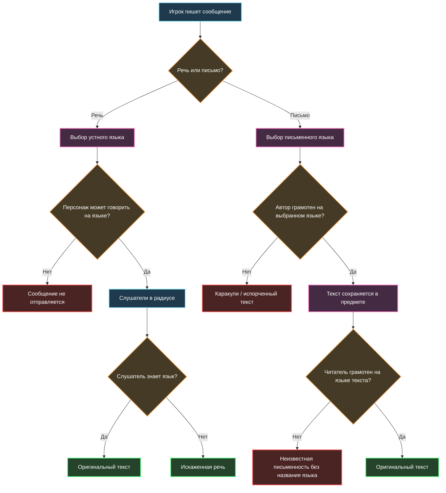

# Языки и грамотность

## 1. Концепция
Языки добавляют проверку к обычной речи и письму.

В MVP у персонажа для каждого языка есть два независимых бинарных признака:

1. **Знает / не знает язык** — определяет возможность говорить и понимать устную речь.
2. **Грамотен / неграмотен на языке** — определяет возможность читать и писать на нем.

Промежуточных уровней владения языком в MVP нет. Когда персонаж говорит или пишет, текст получает тег выбранного языка. Дальше игра проверяет каждого получателя отдельно:

1. Знает язык - видит нормальный текст.
2. Не знает язык - видит замененный текст.
3. Не слышит говорящего - не получает сообщение.
4. Неграмотен на языке - не может нормально читать или писать на нем, даже если понимает его устную форму.

Язык не должен работать как кнопка "секретный чат". Это часть персонажа: на нем говорят дома, пишут
записки, читают объявления и пытаются понять чужаков.

---

## 2. Игровой цикл

### Этап 1: Стартовые языки персонажа
*Языки появляются у персонажа до начала раунда: от расы, происхождения, профессии и образования.*

1. При создании персонажа игра определяет **родной язык** и стартовую грамотность отдельно.
2. Затем добавляются дополнительные языки:
    * от расы;
    * от культуры/поселения;
    * от образования;
    * от отдельных особенностей роли, если они нужны.
3. Если персонаж знает только один язык, он говорит на нем по умолчанию.
4. Если персонаж знает несколько языков, в чате появляется выбор языка.

#### Пример
| Персонаж | Родной язык | Дополнительные языки | Почему |
| :--- | :--- | :--- | :--- |
| Человек | Человеческий (общий) | — | Базовое общение большинства. |
| Гоблин | Гоблинский | Человеческий (общий), только если его дает происхождение, образование или роль | Родная речь гоблинов. |
| Эльф | Эльфийский | Человеческий (общий), только если его дает происхождение, образование или роль | Родная речь эльфов. |
| Дворф | Дворфийский | — | Дворфийский — вариант человеческого общего, а не отдельный языковой барьер. |

---

### Этап 2: Выбор языка в разговоре
*Игрок решает, на каком языке говорит прямо сейчас.*

1. Игрок открывает чат.
2. Рядом с полем ввода выбран текущий язык.
3. Если нужно, игрок меняет язык через переключатель.
4. Игрок отправляет сообщение.
5. Игра показывает сообщение всем, кто его услышал, но текст для каждого слушателя зависит от знания языка.

#### Правила выбора
| Ситуация | Поведение |
| :--- | :--- |
| Персонаж знает 1 язык | Переключатель скрыт или заблокирован. |
| Персонаж знает 2+ языка | Доступен список языков. |
| Игрок пытается выбрать неизвестный язык | Выбор невозможен. |
| Персонаж потерял возможность говорить | Сообщение не отправляется. |
| Персонаж под эффектом немоты/оглушения | Используются обычные правила речи SS14. |

---

### Этап 3: Восприятие речи
*Один говорящий, одно сообщение, но разные слушатели видят разный результат.*

| Слушатель | Что видит в чате |
| :--- | :--- |
| Знает язык | Исходный текст. |
| Не знает язык | Искаженный текст в стиле языка. |
| Не знает язык, но слышит речь | Понимает, что слышит неизвестный язык, но не получает его название. |
| Стоит за стеной/дверью/шумоизоляцией | Текст дополнительно ухудшается или не доходит. |
| Призрак/наблюдатель | Видит исходный текст, если правила режима это разрешают. |

#### Пример
Фраза говорящего: `Они прячут ключ под алтарем.`

| Слушатель | Знает язык? | Результат |
| :--- | :--- | :--- |
| Союзник | Да | `Они прячут ключ под алтарем.` |
| Случайный крестьянин | Нет | `Ана лоррах келх тад аршем.` |
| Стражник за дверью | Нет + плохо слышит | `Ана ... келх ...` |

---

## 3. Письменность и грамотность

### Этап 1: Письмо
*Текст в книге, записке или на табличке хранит язык, а не просто строку.*

1. Игрок берет предмет для письма.
2. Выбирает язык письма.
3. Игра проверяет отдельный признак грамотности на выбранном языке.
4. Если персонаж грамотен на языке, текст записывается на предмет; иначе нормальная запись невозможна.

#### Результаты письма
| Автор | Условие | Итог |
| :--- | :--- | :--- |
| Грамотен на выбранном языке | — | Текст записан нормально. |
| Неграмотен на выбранном языке | — | Нормальная запись невозможна; отображаются каракули. |

### Этап 2: Чтение
*Читатель видит текст в зависимости от грамотности и знания языка.*

| Знает устный язык | Грамотен на языке текста | Что видит |
| :--- | :--- | :--- |
| Да | Да | Оригинальный текст. |
| Нет | Да | Оригинальный текст; грамотность не дает понимания устной речи. |
| Да | Нет | Каракули, даже если речь языка понятна. |
| Нет | Нет | Неизвестную письменность без названия языка и без исходного текста. |

#### Важное правило
Понимать устную речь и уметь читать письмо — разные навыки. Персонаж может говорить на человеческом общем, но не уметь читать объявление или записку.

---

## 4. Границы MVP

В MVP язык и грамотность выдаются до раунда: расой, происхождением, образованием или ролью.
Учителя, словари, обучение во время раунда и промежуточные уровни остаются на потом.

Практические состояния исчерпываются двумя независимыми проверками:

| Проверка | Да | Нет |
| :--- | :--- | :--- |
| Знает устный язык | Может говорить на нем и понимает речь | Не может выбрать его для речи и получает искаженный текст |
| Грамотен на письменном языке | Может читать и писать на нем | Видит каракули и не может создать нормальный текст |

---

## 5. Графическое представление

```mermaid
graph TD
    classDef actor fill:#1e3a4c,stroke:#8be9fd,stroke-width:2px,color:#fff;
    classDef check fill:#453a25,stroke:#ffb86c,stroke-width:2px,color:#fff;
    classDef result fill:#25422a,stroke:#50fa7b,stroke-width:2px,color:#fff;
    classDef fail fill:#4a2323,stroke:#ff5555,stroke-width:2px,color:#fff;
    classDef item fill:#442a42,stroke:#ff79c6,stroke-width:2px,color:#fff;

    Start["Игрок пишет сообщение"]:::actor --> Mode{"Речь или письмо?"}:::check

    Mode -- "Речь" --> SelectSpeech["Выбор устного языка"]:::item
    SelectSpeech --> CanSpeak{"Персонаж может говорить на языке?"}:::check
    CanSpeak -- "Нет" --> SpeechFail["Сообщение не отправляется"]:::fail
    CanSpeak -- "Да" --> Hearers["Слушатели в радиусе"]:::actor
    Hearers --> KnowSpeech{"Слушатель знает язык?"}:::check
    KnowSpeech -- "Да" --> ClearSpeech["Оригинальный текст"]:::result
    KnowSpeech -- "Нет" --> BadSpeech["Искаженная речь"]:::result

    Mode -- "Письмо" --> SelectWriting["Выбор письменного языка"]:::item
    SelectWriting --> AuthorLit{"Автор грамотен на выбранном языке?"}:::check
    AuthorLit -- "Нет" --> BadWriting["Каракули / испорченный текст"]:::fail
    AuthorLit -- "Да" --> Book["Текст сохраняется в предмете"]:::item
    Book --> ReaderLit{"Читатель грамотен на языке текста?"}:::check
    ReaderLit -- "Нет" --> Scribbles["Неизвестная письменность без названия языка"]:::fail
    ReaderLit -- "Да" --> ClearBook["Оригинальный текст"]:::result
```

---

## 6. База языков

### 6.1. Основные языки
*Таблица нужна для контента, баланса и постановки задач программистам.*

| Язык | Кто знает на старте | Где используется | Речь для незнающих | Письменность |
| :--- | :--- | :--- | :--- | :--- |
| **Человеческий (общий)** | Люди, большинство образованных персонажей | Быт, торговля, объявления, общие документы | Базовый читаемый/слышимый язык | Простая письменность. |
| **Гоблинский** | Гоблины, отдельные переводчики | Общение гоблинов, торг, ругань, внутренние разговоры | Резкие короткие слова | Простые угловатые знаки. |
| **Эльфийский** | Эльфы, редкие ученые/переводчики | Общение эльфов, книги, письма, культурные тексты | Мягкие протяжные слоги | Изящная письменность. |
| **Дворфийский** | Дворфы, персонажи с дворфийским происхождением | Общение дворфов, ремесленные записи, клановые пометки | Вариант человеческого общего: взаимно понятен и не создает отдельный языковой барьер | Вариант общей письменности с дворфийским стилем; грамотность остается отдельной проверкой. |

### 6.2. Параметры языка
| Параметр | Для чего нужен |
| :--- | :--- |
| Название | Что показывать знающим язык. |
| Цвет | Быстрая визуальная привязка в чате. |
| Иконка | Маленький знак языка в UI. |
| Набор замен | Как выглядит непонятная речь. |
| Шрифт речи | Легкая стилизация понятного сообщения. |
| Шрифт письма | Вид книг, грамот, табличек. |
| Доступность | Кто может получить язык на старте. |
| Распознавание | В MVP незнающий персонаж распознает только факт неизвестного языка; его название не раскрывается. |

---

## 7. Визуальные эффекты

### 7.1. Чат
| Состояние | Визуал |
| :--- | :--- |
| Язык понятен | Обычный текст, цвет языка, опциональная метка языка. |
| Язык неизвестен | Текст заменен на псевдоязык. Персонаж распознает речь как неизвестный язык, но название языка не раскрывается. |

### 7.2. Книги и документы
| Состояние | Визуал |
| :--- | :--- |
| Читатель понимает текст | Обычный читаемый текст. |
| Читатель знает устный язык, но неграмотен на нем | Каракули/пятна/непонятные строки. |
| Читатель грамотен на языке, но не знает его устную форму | Обычный читаемый текст; устная речь остается непонятной. |
| Читатель не знает язык и неграмотен на нем | Чужая письменность с сохранением структуры строк, без названия языка. |
| Текст испорчен | Пропуски, кляксы, стертые места. |

---

## 8. Требования к системе

### Обязательные правила
1. Нельзя говорить на языке, который персонаж не знает.
2. Нельзя нормально читать или писать на языке, если персонаж не грамотен на нем.
3. Знание устного языка не дает грамотность автоматически, и грамотность не дает знание устной речи автоматически.
4. Оригинал устной речи доступен только знающему язык, а оригинал письменного текста — только грамотному на языке текста.
5. Админы и логи должны иметь доступ к оригинальному тексту.
6. Искажение речи должно быть стабильным и узнаваемым для каждого языка.
7. Базовые правила слышимости чата применяются до проверки понимания языка.
8. Незнающий персонаж распознает факт чужой речи или письменности, но UI не раскрывает название неизвестного языка.
9. Дворфийский считается вариантом человеческого общего и не создает отдельный барьер понимания; различие сохраняется как название и стиль.
10. Обучение языкам и грамотности во время раунда не входит в MVP.

### Ожидаемое поведение
| Проверка | Ожидаемый результат |
| :--- | :--- |
| Игрок говорит на известном языке рядом с союзником | Союзник читает оригинал. |
| Игрок говорит на известном языке рядом с чужаком | Чужак видит искаженный текст. |
| Игрок пытается выбрать неизвестный язык | Сообщение не отправляется. |
| Неграмотный открывает книгу на родном языке | Видит каракули. |
| Персонаж открывает книгу на языке, на котором он неграмотен | Видит неизвестную письменность без исходного текста. |
| Незнающий слышит или видит неизвестный язык | Распознает, что язык неизвестен, но не видит его названия. |
| Знающий человеческий общий слышит дворфийский | Понимает исходный текст; отдельного языкового барьера нет. |
| Знающий устный язык, но неграмотный на нем, открывает книгу | Видит каракули и не получает исходный текст. |
| Гоблин или эльф без дополнительного источника пытается выбрать человеческий общий | Выбор невозможен: человеческий общий не выдается этим расам автоматически. |

---

## 9. Вопросы после MVP

Эти вопросы не блокируют MVP:

1. Должны ли животные и монстры иметь свои языки или отдельную систему звуков?
2. Нужны ли акценты поверх языков?
3. Какие профессии получают грамотность на старте?

## Реализация
