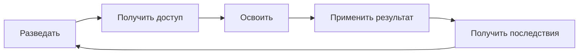

> **ПЕРЕРАБОТАНО** — игровой цикл отделен от структуры раунда.

# Основной игровой цикл

## Что здесь описано

Игровой цикл показывает не расписание раунда, а повторяющуюся связь между решением игрока и
ответом мира. Результат одного действия должен создавать новую возможность, потребность или
конфликт и тем самым запускать следующий виток.

В качестве ориентира используется принцип 4X-стратегий: исследование открывает пространство для
развития, развитие дает новые способы влиять на мир, а применение силы или влияния меняет
обстановку. Для Respiral этот принцип сокращен до масштаба персонажа и трехчасового раунда.
Расширением считается не только захват территории, но и получение доступа к ресурсу, маршруту,
рабочему месту, информации или людям.

## Основной цикл

1. **Разведать.** Узнать о потребности, ресурсе, угрозе или намерении другой группы.
2. **Получить доступ.** Договориться, занять место, открыть маршрут, приобрести инструмент или
   устранить препятствие.
3. **Освоить.** Превратить доступ в полезный результат: товар, укрепление, знание, услугу,
   политическое решение или подготовленную позицию.
4. **Применить.** Использовать результат для торговли, защиты, экспедиции, давления, помощи или
   выполнения цели.
5. **Получить последствия.** Мир отвечает истощением запасов, новой информацией, изменением
   отношений, сопротивлением противника или открытием следующей возможности.
6. **Начать новый виток.** Изменившаяся ситуация снова требует разведки и выбора направления.

Цикл не обязывает персонажа проходить все этапы лично. Один игрок может найти месторождение,
другой договориться о доступе, третий переработать сырье, а четвертый использовать результат.
Именно передача результата связывает персонажей и группы.

## Как цикл выглядит в игре

| Ситуация | Разведать | Получить доступ | Освоить | Применить | Последствие |
| :--- | :--- | :--- | :--- | :--- | :--- |
| Кузница | Узнать о нехватке оружия | Получить руду, топливо и кузницу | Выковать заказ | Вооружить группу или продать | Изменился баланс сил, возник новый спрос |
| Экспедиция | Получить сведения о руинах | Найти путь и подготовить отряд | Исследовать место и забрать находку | Использовать или обменять добычу | Открыта новая зона, разбужена угроза или появился спор о добыче |
| Политика | Узнать интересы другой стороны | Добиться встречи или рычага давления | Подготовить сделку, закон или союз | Изменить доступы и отношения | Появились обязательства, противники и новые возможности |
| Внешняя фракция | Найти слабое место или нужный ресурс | Закрепиться на территории либо заключить договор | Создать базу и снабжение | Торговать, защищать интерес или наступать | Другие силы отвечают союзом, санкциями, нападением или уступками |

## Масштаб цикла

Один и тот же цикл работает на трех уровнях:

- **Персонаж** получает доступ к конкретному ресурсу, человеку или действию.
- **Группа** организует производство, маршрут, оборону или политический план.
- **Фракция** расширяет присутствие, снабжение и влияние внутри города или за его пределами.

Уровни вложены друг в друга. Личная находка может изменить план группы, а решение фракции создает
новые задачи для отдельных персонажей.

## Что поддерживает цикл

### Ограниченный доступ

Ценным является не только сам ресурс, но и возможность до него добраться. Доступ ограничивают
расстояние, опасность, инструменты, знания, право собственности и отношения между группами.

### Преобразование

Сырье и информация не должны сразу решать задачу. Между находкой и применением находятся перевозка,
обработка, проверка, переговоры или подготовка.

### Наблюдаемые последствия

Применение результата меняет мир: предмет переходит к другому владельцу, маршрут становится
безопаснее, группа усиливается, запас истощается, закон меняет поведение или противник отвечает.
Если результат не влияет на дальнейшие решения, цикл обрывается.

### Несколько способов продолжить

Потеря доступа не должна оставлять единственный путь. Игрок может искать замену, менять союзника,
рисковать в другой зоне, снижать качество результата или переходить к конфликту.

## Требования к игровому циклу

- Каждая крупная система должна участвовать хотя бы в двух соседних этапах цикла.
- Полученный результат должен быть нужен самому игроку, другой группе или следующему этапу.
- У важного ресурса есть как минимум два способа получить доступ.
- Развитие группы создает новые расходы, риски или противодействие, а не только линейное усиление.
- Внешние фракции проходят тот же цикл без обязательной привязки к Зульфусу.
- Неудача меняет доступные решения и возвращает игрока к разведке, а не останавливает игру.

## Реализация
